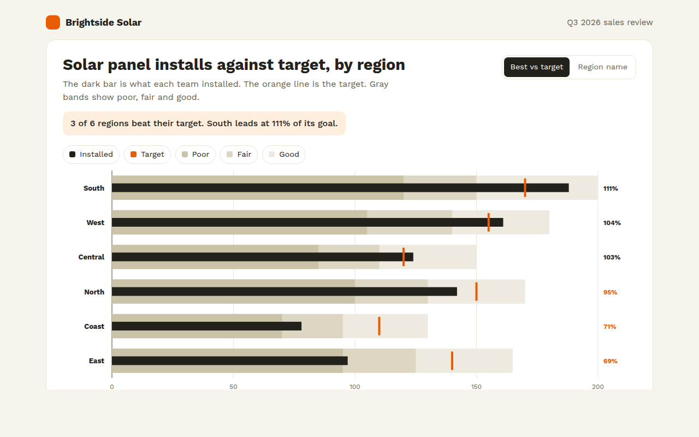

# Bullet Chart in HTML, CSS and JavaScript (Free)



**Live demo:** https://mmrahmanbappi.github.io/100-free-data-charts/01-comparison/009-bullet-chart/demo.html
**Details and code:** https://mmrahmanbappi.github.io/100-free-data-charts/01-comparison/009-bullet-chart/

Free bullet chart made with HTML, CSS and vanilla JavaScript for KPIs and goals. Actual, target and ranges in one row. Download one file.

## What is a bullet chart?

A bullet chart shows a result, a target and how good the result is, all in one row. A dark bar shows the actual value, a short line shows the target, and gray bands behind show ranges like poor, fair and good.

It was designed by Stephen Few as a small, honest replacement for dashboard gauges. You can stack many bullet charts in the space of one gauge, so a whole sales team fits on a single screen.

## At a glance

- **Best for:** Goals, targets and KPIs on dashboards
- **Data you need:** Actual, target and 2 or 3 range limits per row
- **Skip it when:** Showing trends. Pair it with a line chart.
- **Made with:** HTML, CSS and vanilla JavaScript. No library.

## When to use it

- Sales against quota by rep or region
- Budget spent against budget planned
- Website goals like sign ups against target
- Project progress against the plan

## What you get

- Three gray range bands behind each bar
- An orange target mark that is easy to spot
- Percent of target written at the end of every row
- Rows under target get an orange percent
- Sort by best against target or by region name
- Tooltips, keyboard support and a data table

## How the code works

```js
const regions = [['South', 188, 170, [120, 150, 200]], ['East', 97, 140, [95, 125, 165]]];
const x = v => 90 + v / 200 * 450;
const bands = ['#cbc3a8', '#dcd6c2', '#eeeadf'];

regions.forEach(([name, actual, target, ranges], row) => {
  const y = 20 + row * 60;
  [...ranges].reverse().forEach((r, i) => drawRect(90, y, x(r) - 90, 40, bands[2 - i]));
  drawRect(90, y + 13, x(actual) - 90, 14, '#22211b');     // actual
  drawLine(x(target), y + 5, x(target), y + 35, '#e85d04', 4); // target
});
```

## How to use

1. **Download the file.** Click Download HTML file above. You get one file called bullet-chart.html with everything inside.
2. **Change the data.** Open the file in any code editor and find the DATA list near the bottom. Replace the names and numbers with your own.
3. **Change the colors and text.** Colors are at the top of the style tag. The title, subtitle and main point are plain HTML near the top of the body.
4. **Put it online.** Upload the file to any host, such as GitHub Pages, Netlify or your own server, or paste it into your site. There is no build step.

## License

MIT. Free for personal and commercial use.
