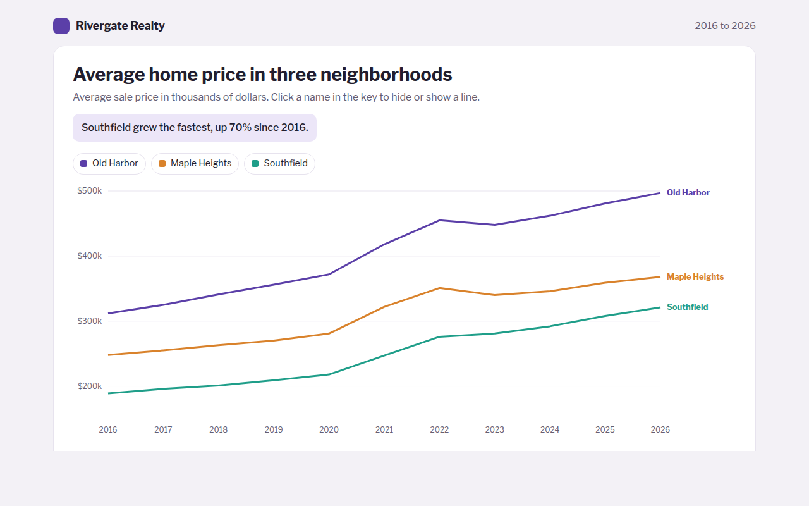

# Multi Line Chart in HTML, CSS and JavaScript (Free)



**Live demo:** https://mmrahmanbappi.github.io/70-free-data-charts/02-trends-over-time/012-multi-line-chart/demo.html
**Details and code:** https://mmrahmanbappi.github.io/70-free-data-charts/02-trends-over-time/012-multi-line-chart/

Free multi line chart made with HTML, CSS and vanilla JavaScript. Labels at the end of each line, crosshair with all values, toggles. One file to download.

## What is a multi line chart?

A multi line chart shows two or more lines on the same axes so you can compare how several things changed over the same time. Each line has its own color.

It answers questions like: which neighborhood grew faster, and did they all dip in the same year? Putting the name at the end of each line saves the reader from looking back and forth at a key.

## At a glance

- **Best for:** Comparing 2 to 5 trends over the same time
- **Data you need:** A date and one number per series for each point
- **Skip it when:** More than 5 lines. It turns into spaghetti.
- **Made with:** HTML, CSS and vanilla JavaScript. No library.

## When to use it

- Prices in several areas or stores
- Your product against competitors
- This year, last year and the year before by month
- Traffic from several channels over time

## What you get

- Three lines with names written right at the end of each line
- A crosshair that lists every value for the chosen year, biggest first
- Click a name in the key to hide or show a line
- The axis zooms to fit only the lines that are showing
- On phones the end labels move into the key
- Arrow key support and a full data table

## How the code works

```js
const years = [2016, 2018, 2020, 2022, 2024, 2026];
const series = [
  { name: 'Old Harbor', color: '#5b3fa8', values: [312, 341, 372, 455, 462, 497] },
  { name: 'Southfield', color: '#1f9e89', values: [189, 201, 218, 276, 292, 321] }
];
const x = i => 50 + i * 90, y = v => 280 - (v - 150) / 350 * 260;

series.forEach(s => {
  const d = s.values.map((v, i) => (i ? 'L' : 'M') + x(i) + ',' + y(v)).join('');
  make('path', { d, fill: 'none', stroke: s.color, 'stroke-width': 3 });
  const last = s.values.length - 1;
  drawText(x(last) + 10, y(s.values[last]) + 4, s.name);
});
```

## How to use

1. **Download the file.** Click Download HTML file above. You get one file called multi-line-chart.html with everything inside.
2. **Change the data.** Open the file in any code editor and find the DATA list near the bottom. Replace the names and numbers with your own.
3. **Change the colors and text.** Colors are at the top of the style tag. The title, subtitle and main point are plain HTML near the top of the body.
4. **Put it online.** Upload the file to any host, such as GitHub Pages, Netlify or your own server, or paste it into your site. There is no build step.

## License

MIT. Free for personal and commercial use.
