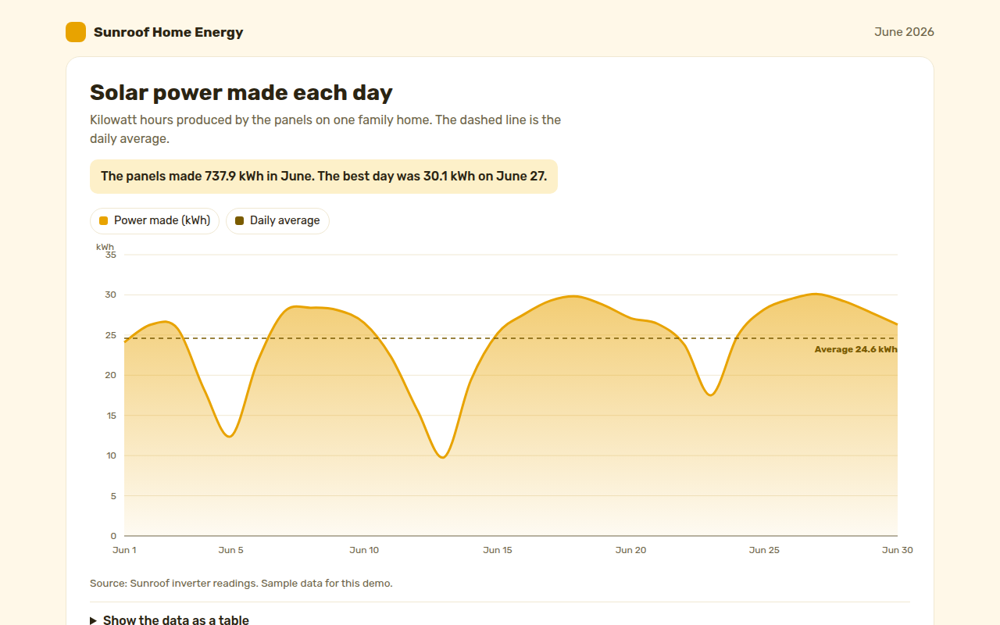

# Area Chart in HTML, CSS and JavaScript (Free)



**Live demo:** https://mmrahmanbappi.github.io/100-free-data-charts/02-trends-over-time/013-area-chart/demo.html
**Details and code:** https://mmrahmanbappi.github.io/100-free-data-charts/02-trends-over-time/013-area-chart/

Free area chart made with HTML, CSS and vanilla JavaScript. Gradient fill, average line, crosshair and keyboard support. One file to download.

## What is a area chart?

An area chart is a line chart with the space under the line filled in. The filled shape shows volume, so it works well for amounts that pile up, like energy made, water used or money earned.

The fill makes the chart easier to read at a glance and gives a stronger sense of how much, not only which way. A soft gradient keeps the shape light so the line on top stays sharp.

## At a glance

- **Best for:** One amount over time where volume matters
- **Data you need:** A date and a number for each point in time
- **Skip it when:** Several overlapping series. The fills hide each other.
- **Made with:** HTML, CSS and vanilla JavaScript. No library.

## When to use it

- Energy made or used each day
- Website visits or revenue over time
- Water, fuel or data usage
- Any total that builds up over a period

## What you get

- A gradient fill made with an SVG linearGradient
- A dashed daily average line with its value written on it
- A crosshair that says how far each day is above or below average
- Cloudy days are flagged in the tooltip
- The area reveals from left to right on load
- Arrow key support and a data table

## How the code works

```js
const values = [24.1, 26.3, 25.8, 18.2, 12.4, 21.7, 27.9];
const x = i => 40 + i * 90, y = v => 280 - v / 35 * 260;
const edge = values.map((v, i) => x(i) + ',' + y(v));

make('path', {
  d: 'M' + edge.join('L') + 'L' + x(values.length - 1) + ',280L' + x(0) + ',280Z',
  fill: '#e8a300', 'fill-opacity': 0.3
});
make('path', { d: 'M' + edge.join('L'), fill: 'none', stroke: '#e8a300', 'stroke-width': 3 });
```

## How to use

1. **Download the file.** Click Download HTML file above. You get one file called area-chart.html with everything inside.
2. **Change the data.** Open the file in any code editor and find the DATA list near the bottom. Replace the names and numbers with your own.
3. **Change the colors and text.** Colors are at the top of the style tag. The title, subtitle and main point are plain HTML near the top of the body.
4. **Put it online.** Upload the file to any host, such as GitHub Pages, Netlify or your own server, or paste it into your site. There is no build step.

## License

MIT. Free for personal and commercial use.
