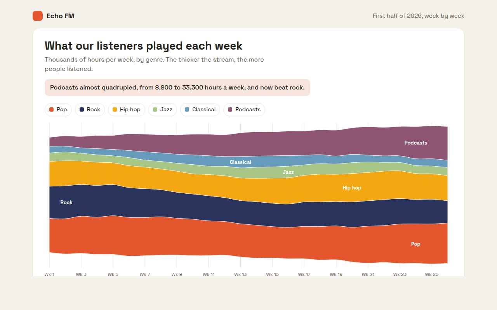

# Streamgraph in HTML, CSS and JavaScript (Free)



**Live demo:** https://mmrahmanbappi.github.io/70-free-data-charts/02-trends-over-time/015-streamgraph/demo.html
**Details and code:** https://mmrahmanbappi.github.io/70-free-data-charts/02-trends-over-time/015-streamgraph/

Free streamgraph made with HTML, CSS and vanilla JavaScript. Flowing layers centered on a middle line, labels inside the streams, crosshair. One file to download.

## What is a streamgraph?

A streamgraph is a stacked area chart that flows around a center line instead of sitting on the bottom. Each colored stream is one category, and its thickness shows how big it was at each moment.

It is made for seeing rises and falls across many categories at once. It gives up exact totals in exchange for a clear picture of which streams grow, shrink or take over, like podcasts overtaking rock.

## At a glance

- **Best for:** Many categories changing over time
- **Data you need:** A date and one number per category for each point
- **Skip it when:** When people need exact numbers. Use lines or bars.
- **Made with:** HTML, CSS and vanilla JavaScript. No library.

## When to use it

- Music, film or book genres over time
- Topics people search or talk about each week
- Product categories in an online shop over a year
- Stories for reports and magazines where the shape is the point

## What you get

- Six layers centered on a middle line so the chart is balanced
- Genre names placed inside each stream where it is thickest
- A crosshair that lists every genre for the chosen week, biggest first
- Smooth curves that match exactly between layers
- A slow reveal from left to right on load
- Arrow key support and a full data table

## How the code works

```js
const weeks = 5;
const streams = [
  { color: '#e4572e', values: [34, 36, 35, 38, 37] },
  { color: '#29335c', values: [30, 29, 28, 27, 26] },
  { color: '#8e5572', values: [9, 12, 15, 19, 22] }
];
const totals = Array.from({ length: weeks }, (v, i) => streams.reduce((a, s) => a + s.values[i], 0));
const x = i => 40 + i * 130, y = v => 160 - v * 1.6;
let below = totals.map(t => -t / 2); // center on the middle line

streams.forEach(s => {
  const top = below.map((b, i) => b + s.values[i]);
  const up = top.map((v, i) => x(i) + ',' + y(v));
  const down = below.map((v, i) => x(i) + ',' + y(v)).reverse();
  make('path', { d: 'M' + up.join('L') + 'L' + down.join('L') + 'Z', fill: s.color });
  below = top;
});
```

## How to use

1. **Download the file.** Click Download HTML file above. You get one file called streamgraph.html with everything inside.
2. **Change the data.** Open the file in any code editor and find the DATA list near the bottom. Replace the names and numbers with your own.
3. **Change the colors and text.** Colors are at the top of the style tag. The title, subtitle and main point are plain HTML near the top of the body.
4. **Put it online.** Upload the file to any host, such as GitHub Pages, Netlify or your own server, or paste it into your site. There is no build step.

## License

MIT. Free for personal and commercial use.
