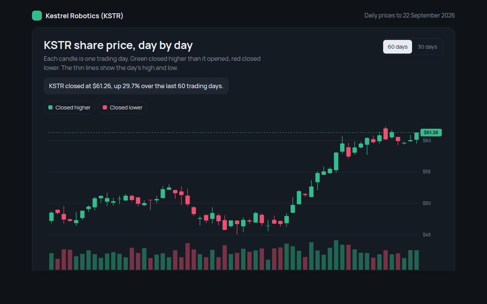

# Candlestick Chart in HTML, CSS and JavaScript (Free)



**Live demo:** https://mmrahmanbappi.github.io/70-free-data-charts/02-trends-over-time/018-candlestick-chart/demo.html
**Details and code:** https://mmrahmanbappi.github.io/70-free-data-charts/02-trends-over-time/018-candlestick-chart/

Free candlestick chart made with HTML, CSS and vanilla JavaScript. Open, high, low, close and volume with a crosshair and range switch. One file to download.

## What is a candlestick chart?

A candlestick chart shows four prices for each day: where the price opened, how high and low it went, and where it closed. The thick body runs from open to close, and the thin lines, called wicks, show the high and the low.

Green candles closed higher than they opened and red candles closed lower. Traders read runs of candles to see buying and selling pressure, and the volume bars below show how busy each day was.

## At a glance

- **Best for:** Prices that move within each day or period
- **Data you need:** Open, high, low and close for each day, plus volume
- **Skip it when:** Audiences who do not trade. A line chart is clearer.
- **Made with:** HTML, CSS and vanilla JavaScript. No library.

## When to use it

- Stock, fund and crypto prices
- Currency exchange rates
- Commodity prices like gold or oil
- Any price with a daily range

## What you get

- Candles with bodies and wicks drawn in SVG
- Volume bars under the price in the same colors
- A crosshair showing open, high, low, close, change and volume
- A 30 day and 60 day switch
- The latest price marked on the right side
- Trading days only, with weekends skipped automatically

## How the code works

```js
const days = [[48.1, 49.0, 47.6, 48.8], [48.8, 49.5, 48.2, 48.4], [48.4, 50.2, 48.3, 50.0]];
const y = p => 280 - (p - 47) / 4 * 260;

days.forEach(([open, high, low, close], i) => {
  const x = 60 + i * 40;
  const color = close >= open ? '#2fbf8f' : '#f0506e';
  drawLine(x, y(high), x, y(low), color, 1.5);                  // wick
  drawRect(x - 10, y(Math.max(open, close)), 20,
    Math.max(1, Math.abs(y(open) - y(close))), color);          // body
});
```

## How to use

1. **Download the file.** Click Download HTML file above. You get one file called candlestick-chart.html with everything inside.
2. **Change the data.** Open the file in any code editor and find the DATA list near the bottom. Replace the names and numbers with your own.
3. **Change the colors and text.** Colors are at the top of the style tag. The title, subtitle and main point are plain HTML near the top of the body.
4. **Put it online.** Upload the file to any host, such as GitHub Pages, Netlify or your own server, or paste it into your site. There is no build step.

## License

MIT. Free for personal and commercial use.
