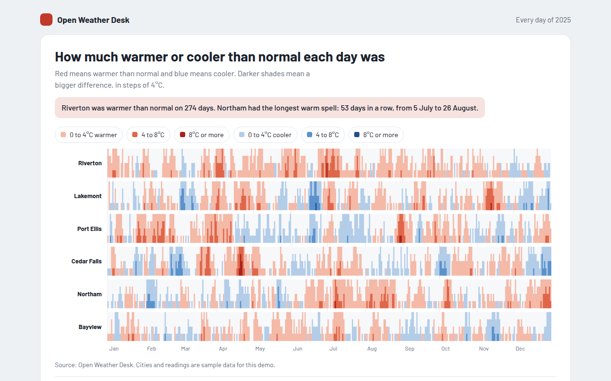

# Horizon Chart in HTML, CSS and JavaScript (Free)



**Live demo:** https://mmrahmanbappi.github.io/100-free-data-charts/02-trends-over-time/020-horizon-chart/demo.html
**Details and code:** https://mmrahmanbappi.github.io/100-free-data-charts/02-trends-over-time/020-horizon-chart/

Free horizon chart made with HTML, CSS and vanilla JavaScript. Six cities and 365 days of data in a small space, with a crosshair. One file to download.

## What is a horizon chart?

A horizon chart packs a long time series into a thin strip by folding the values into colored bands. Small differences are light, bigger ones are darker, warm values are red and cool values are blue.

Because each row is so short, you can stack many series and compare them day by day, like six cities over a whole year. It takes a minute to learn, then it becomes one of the most useful charts for dense data.

## At a glance

- **Best for:** Many long series compared in little space
- **Data you need:** A value above or below a baseline for each day
- **Skip it when:** Readers who need a chart they understand instantly.
- **Made with:** HTML, CSS and vanilla JavaScript. No library.

## When to use it

- Temperature against normal for many cities
- Server load or response times for many machines
- Stock returns for many companies
- Any daily reading for many sensors or places

## What you get

- 365 days for six cities drawn as solid SVG paths, not thousands of shapes
- Three shades each for warmer and cooler, in steps of 4 degrees
- A crosshair that reads every city for the chosen day
- Month lines so you can find a date fast
- On phones the city names move above each row
- A summary table with warm days, cool days and extremes

## How the code works

```js
const values = [1, 3, 6, 9, 5, 2, -1, -4, -7, -3, 0, 2]; // above or below normal
const band = 4, rowH = 40, base = 50, w = 30;
const warm = ['#f4b9a7', '#e0664a', '#a8231a'], cool = ['#b3cde8', '#5b92cc', '#1f4f8c'];

values.forEach((v, i) => {
  const shades = v >= 0 ? warm : cool;
  for (let k = 0; k < 3; k++) {
    const part = Math.max(0, Math.min(band, Math.abs(v) - k * band)) / band * rowH;
    if (part > 0) drawRect(20 + i * w, base - part, w, part, shades[k]);
  }
});
```

## How to use

1. **Download the file.** Click Download HTML file above. You get one file called horizon-chart.html with everything inside.
2. **Change the data.** Open the file in any code editor and find the DATA list near the bottom. Replace the names and numbers with your own.
3. **Change the colors and text.** Colors are at the top of the style tag. The title, subtitle and main point are plain HTML near the top of the body.
4. **Put it online.** Upload the file to any host, such as GitHub Pages, Netlify or your own server, or paste it into your site. There is no build step.

## License

MIT. Free for personal and commercial use.
