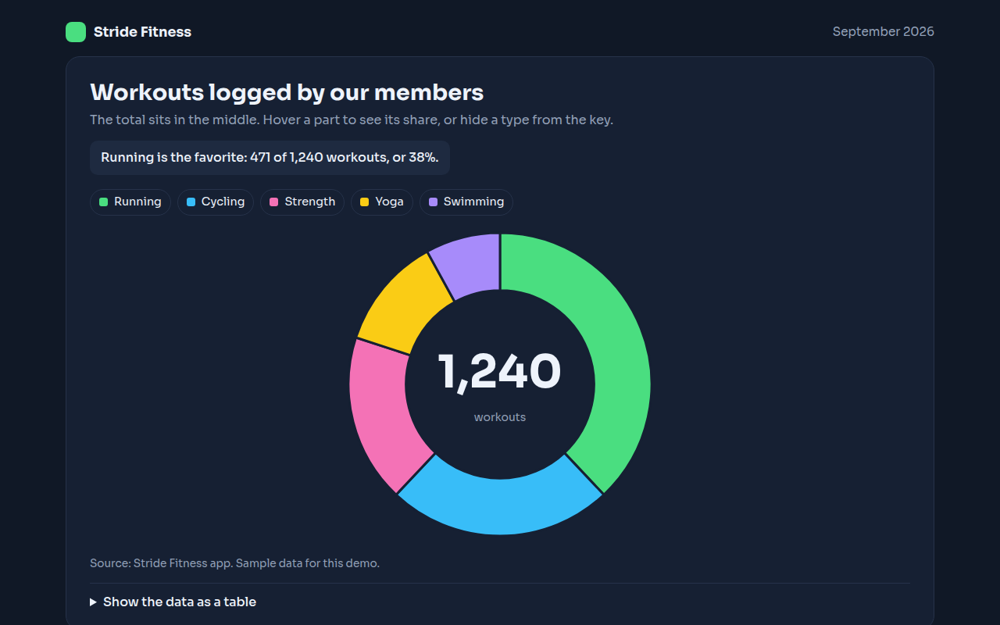

# Donut Chart in HTML, CSS and JavaScript (Free)



**Live demo:** https://mmrahmanbappi.github.io/100-free-data-charts/03-part-to-whole/022-donut-chart/demo.html
**Details and code:** https://mmrahmanbappi.github.io/100-free-data-charts/03-part-to-whole/022-donut-chart/

Free donut chart made with HTML, CSS and vanilla JavaScript. Total in the middle, hover details, toggles and keyboard support. One file to download.

## What is a donut chart?

A donut chart is a pie chart with a hole in the middle. The ring shows the parts of a whole, and the empty center is a handy place for the total or for details about the part you point at.

Because people read the length of the ring rather than the size of a wedge, many find donut charts a little easier to compare than pies. They also look lighter on dashboards.

## At a glance

- **Best for:** A few shares with the total shown in the middle
- **Data you need:** A name and a count for each part
- **Skip it when:** More than 6 parts. The ring gets too busy.
- **Made with:** HTML, CSS and vanilla JavaScript. No library.

## When to use it

- Dashboard summaries with a total
- Workout, task or ticket types
- Budget or time split into a few parts
- App screens with little space

## What you get

- A ring drawn with SVG arc paths
- The total in the center changes to the share of the part you hover
- Hide any part from the key and the ring rebuilds
- Thick card colored gaps between parts
- Dark theme with bright colors
- Keyboard support and a data table

## How the code works

```js
const parts = [['Running', 471, '#4ade80'], ['Cycling', 298, '#38bdf8'], ['Strength', 223, '#f472b6']];
const total = parts.reduce((a, p) => a + p[1], 0);
const cx = 200, cy = 150, r = 120, inner = 75;
let start = 0;
const pt = (rad, a) => (cx + rad * Math.sin(a)) + ',' + (cy - rad * Math.cos(a));

parts.forEach(([name, n, color]) => {
  const end = start + n / total * Math.PI * 2, big = end - start > Math.PI ? 1 : 0;
  make('path', { fill: color, d: 'M' + pt(r, start) + 'A' + r + ',' + r + ' 0 ' + big + ' 1 ' + pt(r, end) +
    'L' + pt(inner, end) + 'A' + inner + ',' + inner + ' 0 ' + big + ' 0 ' + pt(inner, start) + 'Z' });
  start = end;
});
drawText(cx, cy + 6, total, 'middle');
```

## How to use

1. **Download the file.** Click Download HTML file above. You get one file called donut-chart.html with everything inside.
2. **Change the data.** Open the file in any code editor and find the DATA list near the bottom. Replace the names and numbers with your own.
3. **Change the colors and text.** Colors are at the top of the style tag. The title, subtitle and main point are plain HTML near the top of the body.
4. **Put it online.** Upload the file to any host, such as GitHub Pages, Netlify or your own server, or paste it into your site. There is no build step.

## License

MIT. Free for personal and commercial use.
