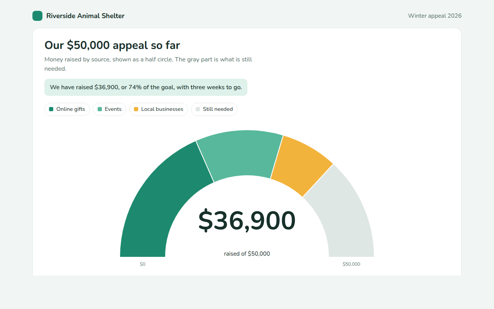

# Semi Donut Chart in HTML, CSS and JavaScript (Free)



**Live demo:** https://mmrahmanbappi.github.io/70-free-data-charts/03-part-to-whole/023-semi-donut-chart/demo.html
**Details and code:** https://mmrahmanbappi.github.io/70-free-data-charts/03-part-to-whole/023-semi-donut-chart/

Free semi donut chart made with HTML, CSS and vanilla JavaScript. A half circle progress chart with parts and a goal. One file to download.

## What is a semi donut chart?

A semi donut chart, or half donut, is a donut chart cut in half. The ring runs from left to right over the top, which makes it look like a gauge and works well for progress toward a goal.

Each colored part shows how much one source added, and a gray part shows what is still missing. The big number in the middle tells the main story at a glance.

## At a glance

- **Best for:** Progress toward a goal, split by source
- **Data you need:** A goal and an amount for each part
- **Skip it when:** Data that is not a share of a fixed total.
- **Made with:** HTML, CSS and vanilla JavaScript. No library.

## When to use it

- Fundraising and donation drives
- Sales toward a monthly target
- Storage or budget used against a limit
- Seats filled in a hall or class

## What you get

- A half ring drawn from left to right over the top
- A gray part for the money still needed
- The amount in the middle counts up as the ring fills
- Start and goal values at each end
- Tooltips with each share of the goal
- Keyboard support and a data table

## How the code works

```js
const goal = 50000;
const parts = [[18400, '#1d8a6f'], [11200, '#58b89b'], [7300, '#f2b33d']];
parts.push([goal - parts.reduce((a, p) => a + p[0], 0), '#dfe7e4']); // still needed
const cx = 200, cy = 200, r = 150, inner = 95;
const pt = (rad, a) => (cx + rad * Math.sin(a)) + ',' + (cy - rad * Math.cos(a));
let start = -Math.PI / 2; // 9 o clock

parts.forEach(([amount, color]) => {
  const end = start + amount / goal * Math.PI;
  make('path', { fill: color, d: 'M' + pt(r, start) + 'A' + r + ',' + r + ' 0 0 1 ' + pt(r, end) +
    'L' + pt(inner, end) + 'A' + inner + ',' + inner + ' 0 0 0 ' + pt(inner, start) + 'Z' });
  start = end;
});
```

## How to use

1. **Download the file.** Click Download HTML file above. You get one file called semi-donut-chart.html with everything inside.
2. **Change the data.** Open the file in any code editor and find the DATA list near the bottom. Replace the names and numbers with your own.
3. **Change the colors and text.** Colors are at the top of the style tag. The title, subtitle and main point are plain HTML near the top of the body.
4. **Put it online.** Upload the file to any host, such as GitHub Pages, Netlify or your own server, or paste it into your site. There is no build step.

## License

MIT. Free for personal and commercial use.
