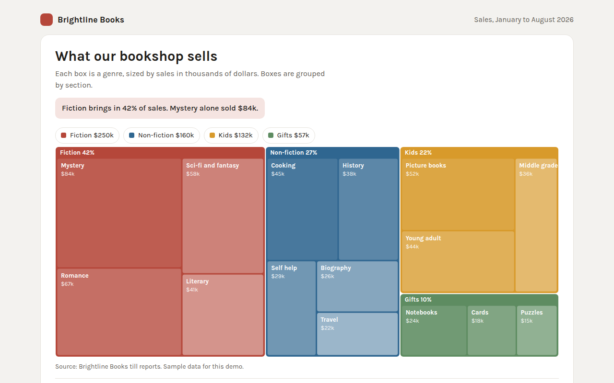

# Treemap in HTML, CSS and JavaScript (Free)



**Live demo:** https://mmrahmanbappi.github.io/70-free-data-charts/03-part-to-whole/024-treemap/demo.html
**Details and code:** https://mmrahmanbappi.github.io/70-free-data-charts/03-part-to-whole/024-treemap/

Free treemap made with HTML, CSS and vanilla JavaScript. Nested boxes sized by value with a squarified layout written from scratch. One file to download.

## What is a treemap?

A treemap shows parts of a whole as boxes, where the size of each box matches its value. Boxes can sit inside bigger boxes, so a treemap shows groups and the items inside them at the same time.

It uses every pixel of space, which makes it great for data with many items. The squarified layout used here keeps boxes close to square, so they are easier to compare and to label.

## At a glance

- **Best for:** Many items grouped into categories
- **Data you need:** A group, a name and a value for each item
- **Skip it when:** Small differences that must be compared exactly.
- **Made with:** HTML, CSS and vanilla JavaScript. No library.

## When to use it

- Sales by category and product
- Budget by department and project
- Disk or storage use by folder
- Market size by sector and company

## What you get

- A squarified treemap layout in about 20 lines of JavaScript
- Two levels: sections and the genres inside them
- Each section has its own color with lighter shades for genres
- Labels show only where they fit
- Tooltips with the share of the whole shop
- Keyboard support and a full data table

## How the code works

```js
// Slice a rectangle into strips, one box per item (simple treemap)
const items = [['Mystery', 84], ['Romance', 67], ['Cooking', 45], ['Travel', 22]];
const total = items.reduce((a, i) => a + i[1], 0);
let x = 0, y = 0, w = 600, h = 300;

items.forEach(([name, value], i) => {
  const share = value / items.slice(i).reduce((a, it) => a + it[1], 0);
  if (w >= h) { const bw = w * share; drawRect(x, y, bw - 2, h - 2, '#b5473a'); drawText(x + 8, y + 20, name); x += bw; w -= bw; }
  else { const bh = h * share; drawRect(x, y, w - 2, bh - 2, '#b5473a'); drawText(x + 8, y + 20, name); y += bh; h -= bh; }
});
```

## How to use

1. **Download the file.** Click Download HTML file above. You get one file called treemap.html with everything inside.
2. **Change the data.** Open the file in any code editor and find the DATA list near the bottom. Replace the names and numbers with your own.
3. **Change the colors and text.** Colors are at the top of the style tag. The title, subtitle and main point are plain HTML near the top of the body.
4. **Put it online.** Upload the file to any host, such as GitHub Pages, Netlify or your own server, or paste it into your site. There is no build step.

## License

MIT. Free for personal and commercial use.
