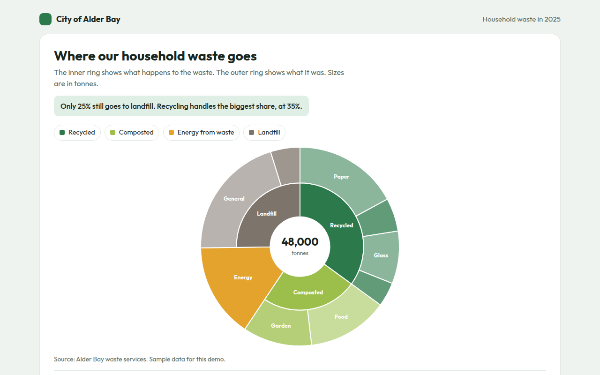

# Sunburst Chart in HTML, CSS and JavaScript (Free)



**Live demo:** https://mmrahmanbappi.github.io/100-free-data-charts/03-part-to-whole/025-sunburst-chart/demo.html
**Details and code:** https://mmrahmanbappi.github.io/100-free-data-charts/03-part-to-whole/025-sunburst-chart/

Free sunburst chart made with HTML, CSS and vanilla JavaScript. Two rings of nested data with details in the center on hover. One file to download.

## What is a sunburst chart?

A sunburst chart shows nested data as rings. The inner ring holds the main groups, and each outer ring splits those groups into smaller parts. The angle of each piece shows its share of the whole.

It is like a pie chart with extra layers. You can see the big split first and then follow any piece outward to see what it is made of, like recycled waste splitting into paper, plastic, glass and metal.

## At a glance

- **Best for:** Two or three levels of nested shares
- **Data you need:** A group, a part and a value for each item
- **Skip it when:** Comparing sizes in the outer ring exactly.
- **Made with:** HTML, CSS and vanilla JavaScript. No library.

## When to use it

- Waste, energy or water broken down by type
- Budget by department and team
- Website traffic by channel and source
- Survey answers by group and subgroup

## What you get

- Two rings drawn with SVG arc paths
- A piece with no parts can fill both rings
- The center shows the total, then the share of whatever you point at
- Names inside pieces that have enough room
- The rings sweep open on load
- Keyboard support and a full data table

## How the code works

```js
const groups = [
  { color: '#2c7a4b', kids: [8200, 2600, 4100, 1900] },
  { color: '#7d746b', kids: [9800, 2300] }
];
const total = groups.flatMap(g => g.kids).reduce((a, b) => a + b, 0);
const cx = 200, cy = 150;
const pt = (r, a) => (cx + r * Math.sin(a)) + ',' + (cy - r * Math.cos(a));
const arc = (r0, r1, a0, a1, fill) => make('path', { fill, stroke: '#fff', d: 'M' + pt(r1, a0) + 'A' + r1 + ',' + r1 + ' 0 ' + (a1 - a0 > Math.PI ? 1 : 0) + ' 1 ' + pt(r1, a1) + 'L' + pt(r0, a1) + 'A' + r0 + ',' + r0 + ' 0 ' + (a1 - a0 > Math.PI ? 1 : 0) + ' 0 ' + pt(r0, a0) + 'Z' });
let a = 0;

groups.forEach(g => {
  const sum = g.kids.reduce((s, v) => s + v, 0);
  arc(40, 90, a, a + sum / total * Math.PI * 2, g.color);   // inner ring
  g.kids.forEach(v => { const b = a + v / total * Math.PI * 2; arc(92, 140, a, b, g.color); a = b; }); // outer ring
});
```

## How to use

1. **Download the file.** Click Download HTML file above. You get one file called sunburst-chart.html with everything inside.
2. **Change the data.** Open the file in any code editor and find the DATA list near the bottom. Replace the names and numbers with your own.
3. **Change the colors and text.** Colors are at the top of the style tag. The title, subtitle and main point are plain HTML near the top of the body.
4. **Put it online.** Upload the file to any host, such as GitHub Pages, Netlify or your own server, or paste it into your site. There is no build step.

## License

MIT. Free for personal and commercial use.
