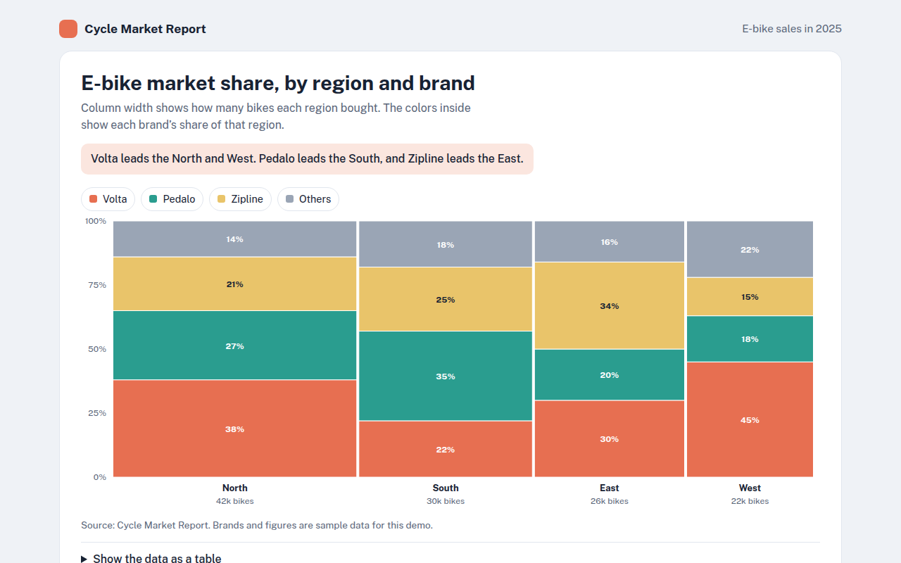

# Marimekko Chart in HTML, CSS and JavaScript (Free)



**Live demo:** https://mmrahmanbappi.github.io/100-free-data-charts/03-part-to-whole/027-marimekko-chart/demo.html
**Details and code:** https://mmrahmanbappi.github.io/100-free-data-charts/03-part-to-whole/027-marimekko-chart/

Free Marimekko chart made with HTML, CSS and vanilla JavaScript. Variable width columns show market size and share at once. One file to download.

## What is a marimekko chart?

A Marimekko chart, often called a Mekko chart, is a 100% stacked bar chart where each column has a different width. The width shows how big each group is, and the colors inside show the shares within it.

It answers two questions in one picture: which markets are biggest, and who leads in each one. Consultants and market researchers use it to show market share by region or segment.

## At a glance

- **Best for:** Market share across segments of different size
- **Data you need:** A size for each group and shares inside each group
- **Skip it when:** Audiences who have never seen one. Add a short guide.
- **Made with:** HTML, CSS and vanilla JavaScript. No library.

## When to use it

- Market share by region and brand
- Sales by channel and product
- Customers by age group and plan
- Budget by department and type of cost

## What you get

- Column widths set by how many bikes each region bought
- Brand shares stacked to 100% inside each column
- Percent labels inside every piece that has room
- Tooltips with the share, the number of bikes and the share of all sales
- Pieces grow into place on load
- Keyboard support and a data table

## How the code works

```js
const regions = [['North', 42, [38, 27, 21, 14]], ['South', 30, [22, 35, 25, 18]]];
const colors = ['#e76f51', '#2a9d8f', '#e9c46a', '#9aa5b5'];
const total = regions.reduce((a, r) => a + r[1], 0);
let x = 40;

regions.forEach(([name, size, shares]) => {
  const w = size / total * 520;
  let y = 280;
  shares.forEach((pct, i) => {
    const h = pct / 100 * 260;
    drawRect(x, y - h, w - 3, h - 1, colors[i]);
    y -= h;
  });
  drawText(x + w / 2, 298, name, 'middle');
  x += w;
});
```

## How to use

1. **Download the file.** Click Download HTML file above. You get one file called marimekko-chart.html with everything inside.
2. **Change the data.** Open the file in any code editor and find the DATA list near the bottom. Replace the names and numbers with your own.
3. **Change the colors and text.** Colors are at the top of the style tag. The title, subtitle and main point are plain HTML near the top of the body.
4. **Put it online.** Upload the file to any host, such as GitHub Pages, Netlify or your own server, or paste it into your site. There is no build step.

## License

MIT. Free for personal and commercial use.
