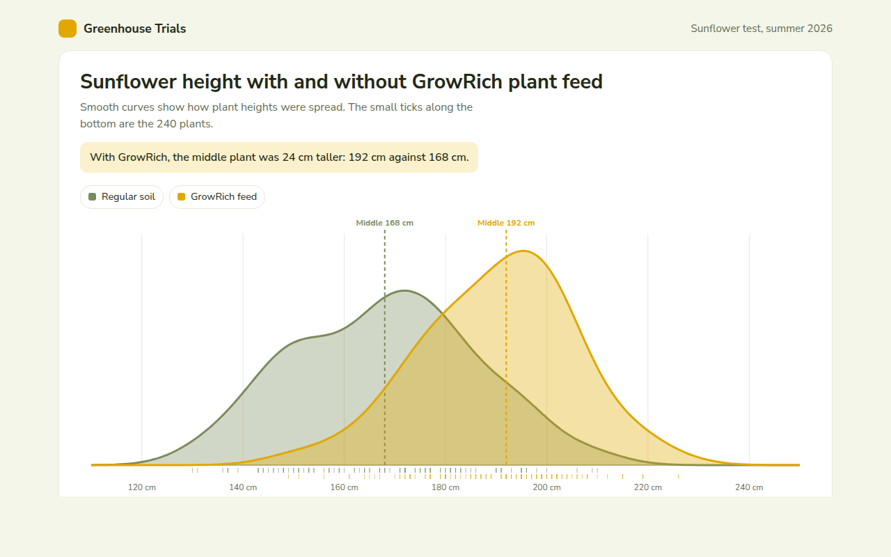

# Density Plot in HTML, CSS and JavaScript (Free)



**Live demo:** https://mmrahmanbappi.github.io/70-free-data-charts/04-distribution/034-density-plot/demo.html
**Details and code:** https://mmrahmanbappi.github.io/70-free-data-charts/04-distribution/034-density-plot/

Free density plot made with HTML, CSS and vanilla JavaScript. Two smooth distribution curves compared, with medians and a crosshair. One file to download.

## What is a density plot?

A density plot is a smooth curve that shows how a set of numbers is spread out. It is like a histogram without the steps, which makes it easy to lay two groups on top of each other and compare them.

The higher the curve, the more values sit at that point. In this example, the whole GrowRich curve sits to the right, which shows that fed plants grew taller across the board, not just on average.

## At a glance

- **Best for:** Comparing the spread of two or three groups
- **Data you need:** A list of numbers for each group
- **Skip it when:** Very small data sets. The curve can mislead.
- **Made with:** HTML, CSS and vanilla JavaScript. No library.

## When to use it

- Test results before and after a change
- Heights, weights or sizes of two groups
- Prices from two sellers
- Times for two versions of a process

## What you get

- Two smooth curves made with a density estimate in plain JavaScript
- See through fills so both shapes stay visible
- Dashed median lines with labels
- Small ticks along the bottom for every single plant
- A crosshair that tells you what share of each group is taller than a height
- Arrow key support and a data table

## How the code works

```js
const heights = [162, 171, 158, 180, 167, 175, 149, 169, 184, 166];
const bw = 7;
const xs = Array.from({ length: 80 }, (v, i) => 120 + i * 100 / 79);
const density = xs.map(x => heights.reduce((a, h) => a + Math.exp(-0.5 * ((x - h) / bw) ** 2), 0));
const max = Math.max(...density);
const pts = xs.map((x, i) => ((x - 120) * 5.6 + 20) + ',' + (280 - density[i] / max * 240));

make('path', { d: 'M20,280L' + pts.join('L') + 'L580,280Z', fill: '#e0a800', 'fill-opacity': 0.35 });
make('path', { d: 'M' + pts.join('L'), fill: 'none', stroke: '#e0a800', 'stroke-width': 3 });
```

## How to use

1. **Download the file.** Click Download HTML file above. You get one file called density-plot.html with everything inside.
2. **Change the data.** Open the file in any code editor and find the DATA list near the bottom. Replace the names and numbers with your own.
3. **Change the colors and text.** Colors are at the top of the style tag. The title, subtitle and main point are plain HTML near the top of the body.
4. **Put it online.** Upload the file to any host, such as GitHub Pages, Netlify or your own server, or paste it into your site. There is no build step.

## License

MIT. Free for personal and commercial use.
