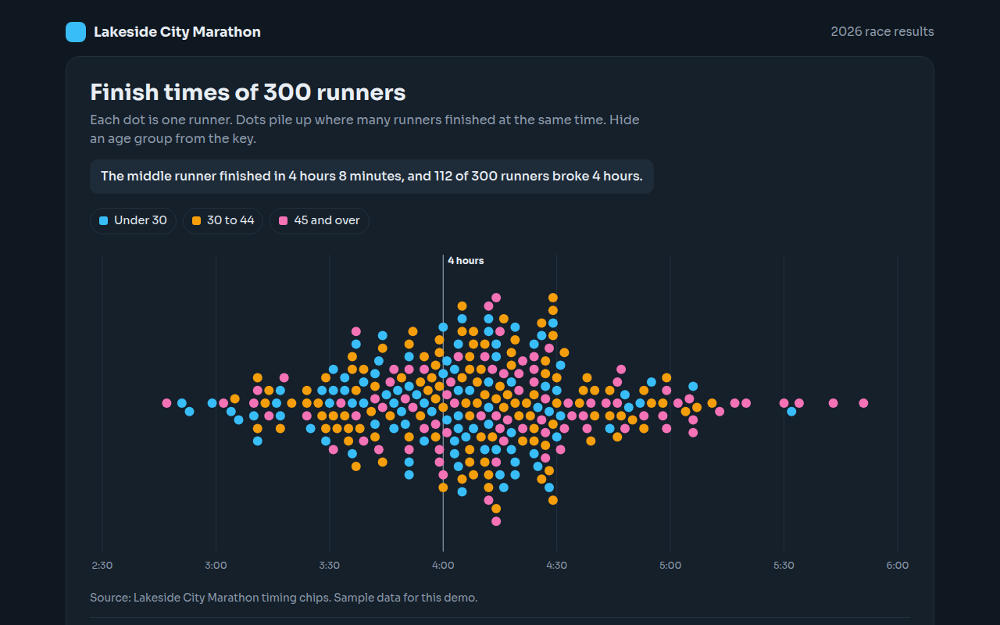

# Beeswarm Plot in HTML, CSS and JavaScript (Free)



**Live demo:** https://mmrahmanbappi.github.io/100-free-data-charts/04-distribution/036-beeswarm-plot/demo.html
**Details and code:** https://mmrahmanbappi.github.io/100-free-data-charts/04-distribution/036-beeswarm-plot/

Free beeswarm plot made with HTML, CSS and vanilla JavaScript. Every data point shown without overlap, colored by group. One file to download.

## What is a beeswarm plot?

A beeswarm plot shows every single data point as a dot, placed along an axis and nudged sideways so no two dots overlap. Where many values are close together, the dots pile up into a swarm.

It gives you the shape of a histogram and the detail of every point at the same time. People like it because each dot is a real person, order or event they can point at.

## At a glance

- **Best for:** Showing every value while keeping the shape
- **Data you need:** A list of numbers, up to a few hundred
- **Skip it when:** Thousands of points. Use a histogram.
- **Made with:** HTML, CSS and vanilla JavaScript. No library.

## When to use it

- Race or exam results
- Prices of every product in a range
- Survey answers where each person matters
- Stories about people, like ages of members

## What you get

- 300 dots placed without overlap by a simple layout in plain JavaScript
- Dots colored by age group
- Hide an age group from the key and the swarm rebuilds
- A line marking four hours
- Times shown as hours and minutes
- A summary table for each age group

## How the code works

```js
const times = [238, 241, 239, 250, 244, 262, 240, 246, 243, 255];
const x = t => 40 + (t - 200) * 7, r = 6, mid = 150;
const placed = [];

times.slice().sort((a, b) => a - b).forEach(t => {
  let y = mid;
  for (let k = 1; placed.some(p => Math.hypot(p[0] - x(t), p[1] - y) < r * 2); k++) {
    y = mid + (k % 2 ? 1 : -1) * Math.ceil(k / 2) * r;   // try above, then below
  }
  placed.push([x(t), y]);
  drawCircle(x(t), y, r, '#38bdf8');
});
```

## How to use

1. **Download the file.** Click Download HTML file above. You get one file called beeswarm-plot.html with everything inside.
2. **Change the data.** Open the file in any code editor and find the DATA list near the bottom. Replace the names and numbers with your own.
3. **Change the colors and text.** Colors are at the top of the style tag. The title, subtitle and main point are plain HTML near the top of the body.
4. **Put it online.** Upload the file to any host, such as GitHub Pages, Netlify or your own server, or paste it into your site. There is no build step.

## License

MIT. Free for personal and commercial use.
