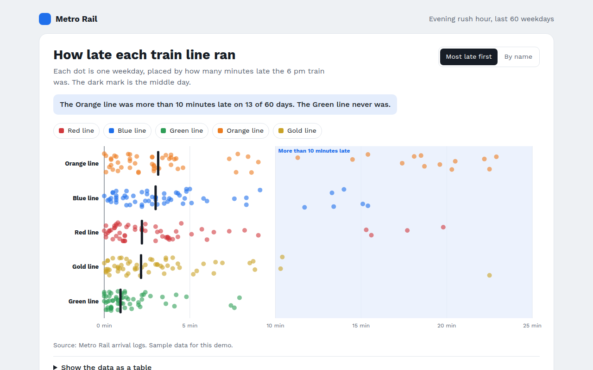

# Strip Plot in HTML, CSS and JavaScript (Free)



**Live demo:** https://mmrahmanbappi.github.io/100-free-data-charts/04-distribution/037-strip-plot/demo.html
**Details and code:** https://mmrahmanbappi.github.io/100-free-data-charts/04-distribution/037-strip-plot/

Free strip plot made with HTML, CSS and vanilla JavaScript. Every point in each group shown as a dot, with the median marked. One file to download.

## What is a strip plot?

A strip plot shows every value in each group as a dot along a line, one row per group. The dots are spread out a little at random, called jitter, so they do not sit exactly on top of each other.

It is the most honest way to show small and medium data sets, because nothing is hidden or summed up. You see the usual values, the bad days and the gaps all at once.

## At a glance

- **Best for:** Every value for a few groups, up to about 100 each
- **Data you need:** A list of numbers for each group
- **Skip it when:** Very large groups. Dots turn into a blur.
- **Made with:** HTML, CSS and vanilla JavaScript. No library.

## When to use it

- Delays or response times by route
- Scores for each player or class
- Daily sales by store
- Any data where the bad days matter

## What you get

- One row per train line with 60 jittered dots
- A dark mark for the middle day on each line
- A shaded area for days more than 10 minutes late
- Sort by most late or by name
- Hover any dot to see the day and delay
- A table with middle, average and bad days

## How the code works

```js
const lines = [['Orange', [3.1, 12.4, 1.8, 5.6, 18.2, 2.9]], ['Green', [0.8, 1.2, 0.4, 2.1, 1.0, 0.6]]];
const x = min => 110 + min * 18;

lines.forEach(([name, delays], row) => {
  const y = 40 + row * 60;
  drawText(100, y + 4, name, 'end');
  delays.forEach(d => drawCircle(x(d), y + (Math.random() - 0.5) * 30, 5, '#1f6feb'));
});
```

## How to use

1. **Download the file.** Click Download HTML file above. You get one file called strip-plot.html with everything inside.
2. **Change the data.** Open the file in any code editor and find the DATA list near the bottom. Replace the names and numbers with your own.
3. **Change the colors and text.** Colors are at the top of the style tag. The title, subtitle and main point are plain HTML near the top of the body.
4. **Put it online.** Upload the file to any host, such as GitHub Pages, Netlify or your own server, or paste it into your site. There is no build step.

## License

MIT. Free for personal and commercial use.
