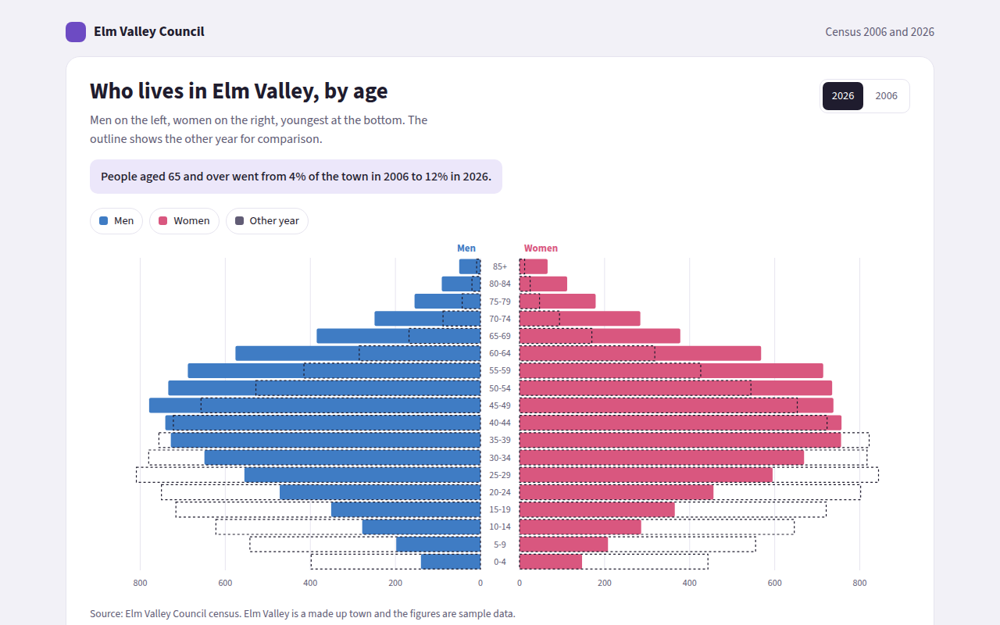

# Population Pyramid in HTML, CSS and JavaScript (Free)



**Live demo:** https://mmrahmanbappi.github.io/70-free-data-charts/04-distribution/038-population-pyramid/demo.html
**Details and code:** https://mmrahmanbappi.github.io/70-free-data-charts/04-distribution/038-population-pyramid/

Free population pyramid made with HTML, CSS and vanilla JavaScript. Two sided age chart with a year switch and comparison outline. One file to download.

## What is a population pyramid?

A population pyramid shows how many people there are in each age group, with men on one side and women on the other. The youngest are at the bottom and the oldest at the top.

Its shape tells a story. A wide base means many children, a straight column means a steady population, and a wide top means an ageing town. Comparing two years shows how a place has changed.

## At a glance

- **Best for:** The age and sex make up of a population
- **Data you need:** A count of men and women for each age group
- **Skip it when:** Data with no age groups.
- **Made with:** HTML, CSS and vanilla JavaScript. No library.

## When to use it

- Towns, cities and countries
- Staff of a company by age
- Members of a club or customers of a shop
- Planning schools, housing or health services

## What you get

- Men and women on opposite sides of a center line
- A switch between 2006 and 2026
- A dashed outline of the other year for a direct comparison
- Age groups written in the middle
- Bars grow outward from the center on load
- Tooltips with both years, and a full data table

## How the code works

```js
const ages = ['0-19', '20-39', '40-59', '60-79', '80+'];
const men = [640, 820, 700, 420, 90], women = [610, 800, 720, 480, 150];
const mid = 300, scale = 0.3, rowH = 40;

ages.slice().reverse().forEach((age, i) => {
  const k = ages.length - 1 - i, y = 20 + i * rowH;
  drawRect(mid - 30 - men[k] * scale, y, men[k] * scale, rowH - 6, '#3f7cc4');
  drawRect(mid + 30, y, women[k] * scale, rowH - 6, '#d9577f');
  drawText(mid, y + 22, age, 'middle');
});
```

## How to use

1. **Download the file.** Click Download HTML file above. You get one file called population-pyramid.html with everything inside.
2. **Change the data.** Open the file in any code editor and find the DATA list near the bottom. Replace the names and numbers with your own.
3. **Change the colors and text.** Colors are at the top of the style tag. The title, subtitle and main point are plain HTML near the top of the body.
4. **Put it online.** Upload the file to any host, such as GitHub Pages, Netlify or your own server, or paste it into your site. There is no build step.

## License

MIT. Free for personal and commercial use.
