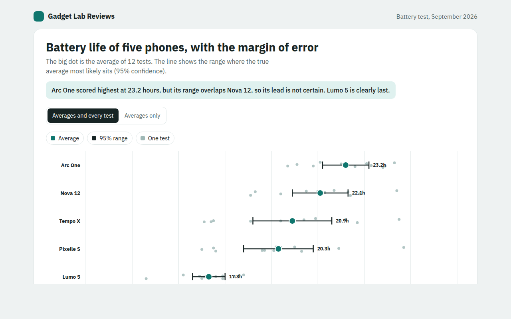

# Error Bar Chart in HTML, CSS and JavaScript (Free)



**Live demo:** https://mmrahmanbappi.github.io/70-free-data-charts/04-distribution/039-error-bars/demo.html
**Details and code:** https://mmrahmanbappi.github.io/70-free-data-charts/04-distribution/039-error-bars/

Free error bar chart made with HTML, CSS and vanilla JavaScript. Averages with 95% confidence intervals and every test shown. One file to download.

## What is a error bar chart?

An error bar chart shows an average for each group plus a line that shows how sure we are about it. The longer the line, the less certain the average. Here the line is a 95% confidence interval.

It stops people from reading too much into small differences. If two lines overlap a lot, the test cannot really say which group is better, even if one average is a little higher.

## At a glance

- **Best for:** Averages from tests or samples, with their uncertainty
- **Data you need:** An average and a margin of error for each group
- **Skip it when:** Data with no measure of uncertainty.
- **Made with:** HTML, CSS and vanilla JavaScript. No library.

## When to use it

- Product tests and reviews
- A and B tests on a website
- Survey results with a margin of error
- Science and lab results

## What you get

- A big dot for each average and a line with end caps for the 95% range
- Every single test shown as a faint dot behind
- A switch to hide the tests and show averages only
- Phones sorted from longest to shortest battery life
- Tooltips with the likely range and number of tests
- Keyboard support and a data table

## How the code works

```js
const phones = [['Arc One', 23.2, 1.0], ['Nova 12', 22.1, 1.2], ['Lumo 5', 17.3, 0.7]];
const x = h => 100 + (h - 12) * 30;

phones.forEach(([name, mean, margin], row) => {
  const y = 40 + row * 60;
  drawLine(x(mean - margin), y, x(mean + margin), y, '#172424', 2.5);      // range
  drawLine(x(mean - margin), y - 8, x(mean - margin), y + 8, '#172424', 2.5); // caps
  drawLine(x(mean + margin), y - 8, x(mean + margin), y + 8, '#172424', 2.5);
  drawCircle(x(mean), y, 8, '#0f766e');
  drawText(90, y + 4, name, 'end');
});
```

## How to use

1. **Download the file.** Click Download HTML file above. You get one file called error-bars.html with everything inside.
2. **Change the data.** Open the file in any code editor and find the DATA list near the bottom. Replace the names and numbers with your own.
3. **Change the colors and text.** Colors are at the top of the style tag. The title, subtitle and main point are plain HTML near the top of the body.
4. **Put it online.** Upload the file to any host, such as GitHub Pages, Netlify or your own server, or paste it into your site. There is no build step.

## License

MIT. Free for personal and commercial use.
