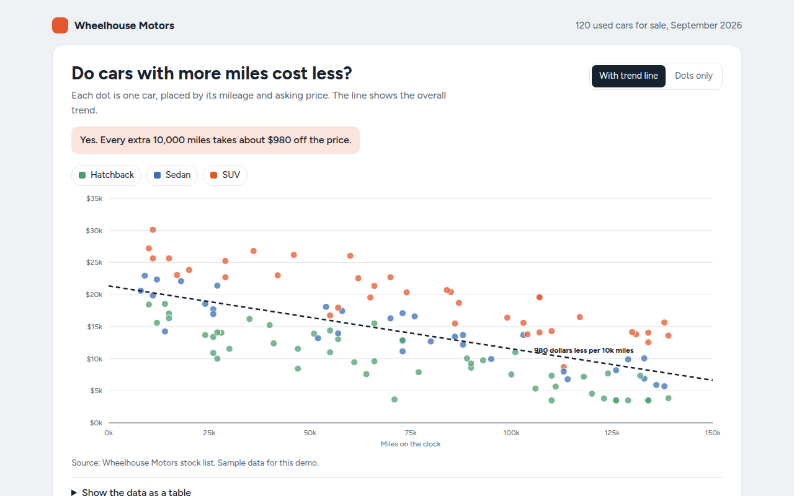

# Scatter Plot in HTML, CSS and JavaScript (Free)



**Live demo:** https://mmrahmanbappi.github.io/100-free-data-charts/05-relationships/041-scatter-plot/demo.html
**Details and code:** https://mmrahmanbappi.github.io/100-free-data-charts/05-relationships/041-scatter-plot/

Free scatter plot made with HTML, CSS and vanilla JavaScript. No library. Trend line, groups, hover and arrow key control. One file to download.

## What is a scatter plot?

A scatter plot is a chart that shows the relationship between two numbers. Each item is a dot, placed by one value across the bottom and another up the side.

The pattern of dots tells the story. Dots that slope down from left to right mean that as one number goes up, the other goes down, like car prices falling as the miles add up. A trend line sums up that pattern in one line.

## At a glance

- **Best for:** Seeing if two numbers move together
- **Data you need:** Two numbers for each item
- **Skip it when:** Data over time. Use a line chart.
- **Made with:** HTML, CSS and vanilla JavaScript. No library.

## When to use it

- Price against age, size or mileage
- Ad spend against sales
- Study hours against test scores
- Height against weight, or any two measures

## What you get

- 120 dots in three colors for hatchback, sedan and SUV
- A least squares trend line worked out in plain JavaScript
- A label on the line that says what the slope means
- Hover near a dot, or use the arrow keys, to read each car
- Hide a car type from the key and the trend line updates
- A switch to show or hide the trend line

## How the code works

```js
const cars = [[12000, 24500], [45000, 19800], [78000, 15200], [101000, 12900], [130000, 9100]];
const x = m => 40 + m / 150000 * 540, y = p => 280 - p / 35000 * 260;
cars.forEach(([miles, price]) => drawCircle(x(miles), y(price), 6, '#e4572e'));

// trend line (least squares)
const n = cars.length, mx = cars.reduce((a, c) => a + c[0], 0) / n, my = cars.reduce((a, c) => a + c[1], 0) / n;
const b = cars.reduce((a, c) => a + (c[0] - mx) * (c[1] - my), 0) / cars.reduce((a, c) => a + (c[0] - mx) ** 2, 0);
const a = my - b * mx;
drawLine(x(0), y(a), x(150000), y(a + b * 150000), '#16222e', 2, '7 5');
```

## How to use

1. **Download the file.** Click Download HTML file above. You get one file called scatter-plot.html with everything inside.
2. **Change the data.** Open the file in any code editor and find the DATA list near the bottom. Replace the names and numbers with your own.
3. **Change the colors and text.** Colors are at the top of the style tag. The title, subtitle and main point are plain HTML near the top of the body.
4. **Put it online.** Upload the file to any host, such as GitHub Pages, Netlify or your own server, or paste it into your site. There is no build step.

## License

MIT. Free for personal and commercial use.
