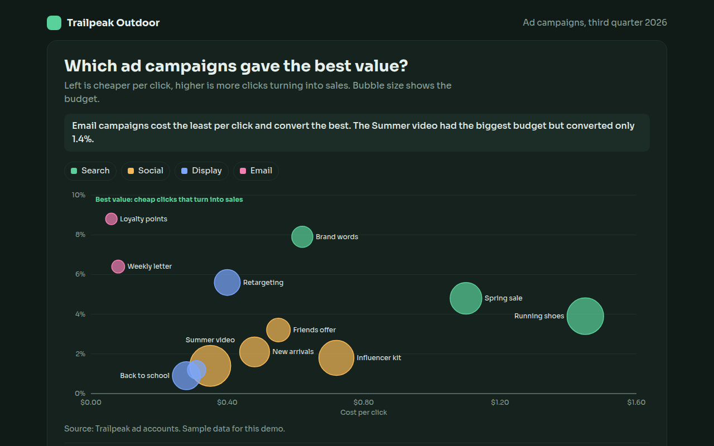

# Bubble Chart in HTML, CSS and JavaScript (Free)



**Live demo:** https://mmrahmanbappi.github.io/100-free-data-charts/05-relationships/042-bubble-chart/demo.html
**Details and code:** https://mmrahmanbappi.github.io/100-free-data-charts/05-relationships/042-bubble-chart/

Free bubble chart made with HTML, CSS and vanilla JavaScript. Three numbers per item as x, y and size, grouped by color. One file to download.

## What is a bubble chart?

A bubble chart is a scatter plot where each dot is a bubble of a different size. It shows three numbers at once: one across the bottom, one up the side and one as the size of the bubble.

Color can add a fourth piece of information, like the channel of each campaign. It is a quick way to spot items that punch above their weight, like a small email campaign that beats big video spend.

## At a glance

- **Best for:** Comparing items on three numbers at once
- **Data you need:** Three numbers for each item, plus an optional group
- **Skip it when:** More than about 30 bubbles. It gets crowded.
- **Made with:** HTML, CSS and vanilla JavaScript. No library.

## When to use it

- Marketing campaigns by cost, results and budget
- Countries by income, health and population
- Products by price, rating and sales
- Projects by cost, value and team size

## What you get

- Bubble area, not width, matches the budget so sizes are honest
- Four colors for search, social, display and email
- Labels that move to find space and hide only when there is none
- A note on the chart that says where the best value is
- Hover or use the arrow keys to read each campaign
- Hide a channel from the key

## How the code works

```js
const campaigns = [['Loyalty points', 0.06, 8.8, 1200], ['Spring sale', 1.10, 4.8, 9000], ['Summer video', 0.35, 1.4, 15000]];
const x = cpc => 40 + cpc / 1.6 * 540, y = cr => 280 - cr / 10 * 260;

campaigns.forEach(([name, cpc, conv, budget]) => {
  const r = Math.sqrt(budget) * 0.3; // area matches the budget
  drawCircle(x(cpc), y(conv), r, '#5ad19a');
  drawText(x(cpc) + r + 5, y(conv) + 4, name);
});
```

## How to use

1. **Download the file.** Click Download HTML file above. You get one file called bubble-chart.html with everything inside.
2. **Change the data.** Open the file in any code editor and find the DATA list near the bottom. Replace the names and numbers with your own.
3. **Change the colors and text.** Colors are at the top of the style tag. The title, subtitle and main point are plain HTML near the top of the body.
4. **Put it online.** Upload the file to any host, such as GitHub Pages, Netlify or your own server, or paste it into your site. There is no build step.

## License

MIT. Free for personal and commercial use.
