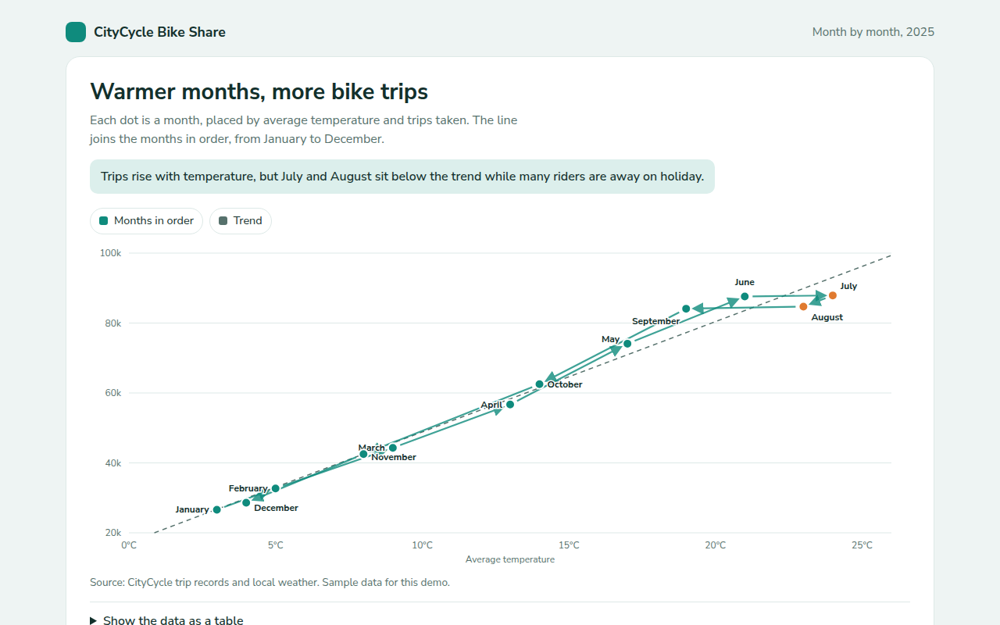

# Connected Scatter Plot in HTML, CSS and JavaScript (Free)



**Live demo:** https://mmrahmanbappi.github.io/100-free-data-charts/05-relationships/045-connected-scatter-plot/demo.html
**Details and code:** https://mmrahmanbappi.github.io/100-free-data-charts/05-relationships/045-connected-scatter-plot/

Free connected scatter plot made with HTML, CSS and vanilla JavaScript. Two measures over time joined in order, with a trend line. One file to download.

## What is a connected scatter plot?

A connected scatter plot is a scatter plot where the dots are joined in time order. Each dot is one moment, placed by two measures, and the line shows the path from one moment to the next.

It shows how two things moved together over time. In this example, trips climb with temperature through spring, dip below the trend during the summer holidays, then come back down in autumn.

## At a glance

- **Best for:** Two measures that change together over time
- **Data you need:** Two numbers for each point in time
- **Skip it when:** Audiences new to charts. Label the path clearly.
- **Made with:** HTML, CSS and vanilla JavaScript. No library.

## When to use it

- Sales against price month by month
- Trips or visitors against temperature
- Two economic measures over the years
- Speed against distance during a race

## What you get

- Twelve months joined by arrows so the order is clear
- Month names beside every dot
- A dashed trend line to compare each month against
- July and August marked in a second color
- Tooltips that say how far above or below the trend each month was
- Arrow key support and a data table

## How the code works

```js
const temp = [3, 9, 17, 24, 19, 8], trips = [27, 44, 74, 88, 84, 43];
const names = ['Jan', 'Mar', 'May', 'Jul', 'Sep', 'Nov'];
const x = t => 40 + t / 26 * 540, y = n => 280 - (n - 20) / 80 * 260;
const pts = temp.map((t, i) => [x(t), y(trips[i])]);

make('path', { d: 'M' + pts.map(p => p.join(',')).join('L'), fill: 'none', stroke: '#0f8b7d', 'stroke-width': 2 });
pts.forEach((p, i) => { drawCircle(p[0], p[1], 6, '#0f8b7d'); drawText(p[0] + 10, p[1] + 4, names[i]); });
```

## How to use

1. **Download the file.** Click Download HTML file above. You get one file called connected-scatter-plot.html with everything inside.
2. **Change the data.** Open the file in any code editor and find the DATA list near the bottom. Replace the names and numbers with your own.
3. **Change the colors and text.** Colors are at the top of the style tag. The title, subtitle and main point are plain HTML near the top of the body.
4. **Put it online.** Upload the file to any host, such as GitHub Pages, Netlify or your own server, or paste it into your site. There is no build step.

## License

MIT. Free for personal and commercial use.
