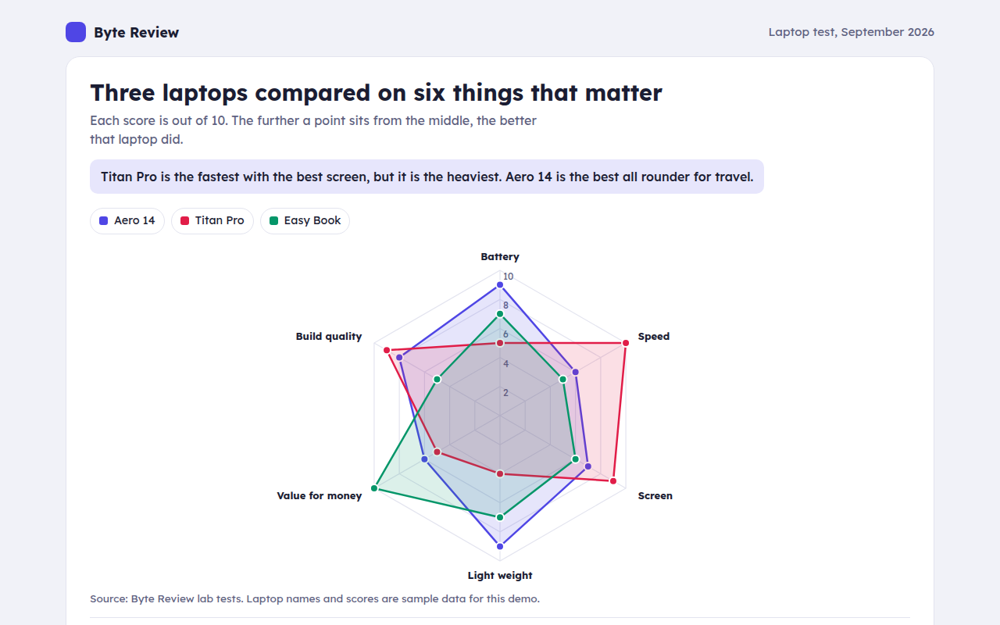

# Radar Chart in HTML, CSS and JavaScript (Free)



**Live demo:** https://mmrahmanbappi.github.io/100-free-data-charts/05-relationships/048-radar-chart/demo.html
**Details and code:** https://mmrahmanbappi.github.io/100-free-data-charts/05-relationships/048-radar-chart/

Free radar chart made with HTML, CSS and vanilla JavaScript. Compare several items across many scores, with toggles and tooltips. One file to download.

## What is a radar chart?

A radar chart, also called a spider chart, shows several scores on axes that spread out from a center, like spokes on a wheel. Each item is a shape joining its scores, and bigger shapes mean higher scores.

The shape shows strengths and weak spots at a glance. A spiky shape is great at a few things and weak at others, while a round shape is a good all rounder.

## At a glance

- **Best for:** Comparing 2 or 3 items across 5 to 8 scores
- **Data you need:** A score on the same scale for each feature
- **Skip it when:** Many items. Shapes pile up and hide each other.
- **Made with:** HTML, CSS and vanilla JavaScript. No library.

## When to use it

- Product comparisons and reviews
- Player or team skills
- Survey scores across several topics
- Staff or course feedback

## What you get

- Six axes with rings at 2, 4, 6, 8 and 10
- See through shapes so all three laptops stay visible
- A dot for each score with its own tooltip and Tab stop
- Hide a laptop from the key
- Shapes grow out from the center on load
- Short axis names on phones

## How the code works

```js
const axes = ['Battery', 'Speed', 'Screen', 'Weight', 'Value', 'Build'];
const scores = [9, 6, 7, 9, 6, 8];
const cx = 200, cy = 160, R = 120;
const at = (r, i) => [cx + r * Math.sin(i / axes.length * Math.PI * 2), cy - r * Math.cos(i / axes.length * Math.PI * 2)];

axes.forEach((a, i) => { const [x, y] = at(R, i); drawLine(cx, cy, x, y, '#e3e4ef'); drawText(...at(R + 16, i), a, 'middle'); });
make('polygon', { points: scores.map((s, i) => at(R * s / 10, i).join(',')).join(' '), fill: '#4f46e5', 'fill-opacity': 0.2, stroke: '#4f46e5', 'stroke-width': 2 });
```

## How to use

1. **Download the file.** Click Download HTML file above. You get one file called radar-chart.html with everything inside.
2. **Change the data.** Open the file in any code editor and find the DATA list near the bottom. Replace the names and numbers with your own.
3. **Change the colors and text.** Colors are at the top of the style tag. The title, subtitle and main point are plain HTML near the top of the body.
4. **Put it online.** Upload the file to any host, such as GitHub Pages, Netlify or your own server, or paste it into your site. There is no build step.

## License

MIT. Free for personal and commercial use.
