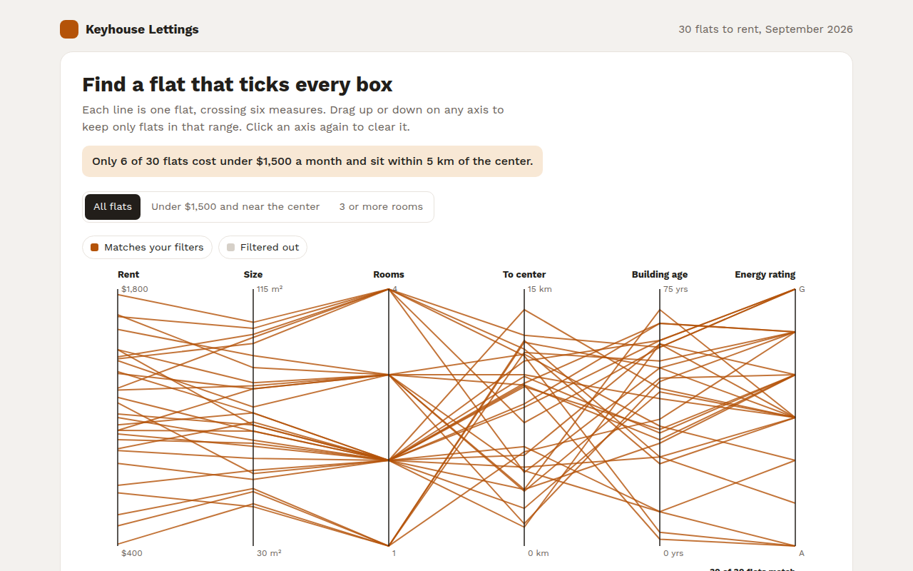

# Parallel Coordinates Chart in HTML, CSS and JavaScript (Free)



**Live demo:** https://mmrahmanbappi.github.io/100-free-data-charts/05-relationships/049-parallel-coordinates/demo.html
**Details and code:** https://mmrahmanbappi.github.io/100-free-data-charts/05-relationships/049-parallel-coordinates/

Free parallel coordinates chart made with HTML, CSS and vanilla JavaScript. Filter many items across many measures by dragging on the axes. One file to download.

## What is a parallel coordinates chart?

A parallel coordinates chart shows many measures side by side as vertical axes. Each item is a line that crosses every axis at its value, so you can follow one flat across rent, size, rooms, distance and more.

Its real power is filtering. Drag on an axis to keep only the items in that range, and the rest fade away. It turns a big table into a tool for finding the few options that tick every box.

## At a glance

- **Best for:** Filtering many items across many measures
- **Data you need:** Several numbers for each item
- **Skip it when:** Readers who need a quick, simple picture.
- **Made with:** HTML, CSS and vanilla JavaScript. No library.

## When to use it

- Choosing a flat, car or laptop from many options
- Comparing products on many specs
- Finding patterns in survey or sensor data
- Screening candidates, suppliers or stocks

## What you get

- Six axes, each with its own scale and units
- Drag up or down on any axis to filter, click to clear
- Quick filter buttons for common searches
- A live count of how many flats match
- Hover any line to see every value for that flat
- Short axis names on phones and a full data table

## How the code works

```js
const axes = [['Rent', 400, 1800], ['Size', 30, 115], ['Km to center', 0, 15]];
const flats = [[1450, 62, 3.2], [980, 41, 9.5], [1720, 98, 1.4]];
const x = i => 60 + i * 240, y = (v, [, lo, hi]) => 280 - (v - lo) / (hi - lo) * 250;

axes.forEach((a, i) => { drawLine(x(i), 30, x(i), 280, '#221e1a', 1.5); drawText(x(i), 20, a[0], 'middle'); });
flats.forEach(f => {
  const pts = f.map((v, i) => x(i) + ',' + y(v, axes[i]));
  make('path', { d: 'M' + pts.join('L'), fill: 'none', stroke: '#b45309', 'stroke-width': 2 });
});
```

## How to use

1. **Download the file.** Click Download HTML file above. You get one file called parallel-coordinates.html with everything inside.
2. **Change the data.** Open the file in any code editor and find the DATA list near the bottom. Replace the names and numbers with your own.
3. **Change the colors and text.** Colors are at the top of the style tag. The title, subtitle and main point are plain HTML near the top of the body.
4. **Put it online.** Upload the file to any host, such as GitHub Pages, Netlify or your own server, or paste it into your site. There is no build step.

## License

MIT. Free for personal and commercial use.
