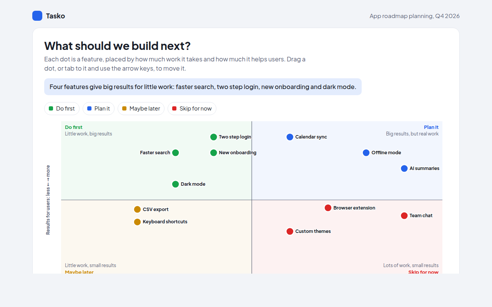

# Quadrant Chart in HTML, CSS and JavaScript (Free)



**Live demo:** https://mmrahmanbappi.github.io/70-free-data-charts/05-relationships/050-quadrant-chart/demo.html
**Details and code:** https://mmrahmanbappi.github.io/70-free-data-charts/05-relationships/050-quadrant-chart/

Free quadrant chart made with HTML, CSS and vanilla JavaScript. A priority matrix with draggable points and keyboard control. One file to download.

## What is a quadrant chart?

A quadrant chart is a scatter plot split into four boxes by two lines. Each box is a group with its own meaning, like do first, plan it, maybe later and skip for now.

It is the chart behind the effort and impact matrix used by product and project teams. Placing every idea on one grid makes it easy to agree on what to do next, and dragging the dots makes it a working planning tool.

## At a glance

- **Best for:** Sorting items into four clear groups
- **Data you need:** Two scores for each item
- **Skip it when:** Data where the dividing lines have no real meaning.
- **Made with:** HTML, CSS and vanilla JavaScript. No library.

## When to use it

- Product roadmaps and feature planning
- Task lists by urgency and importance
- Suppliers by cost and quality
- Customers by value and growth

## What you get

- Four tinted areas with titles and short explanations
- Drag any dot to a new place and its group updates
- Tab to a dot and move it with the arrow keys
- Labels that move to avoid overlapping
- The data table updates as you move dots
- Tooltips with both scores and the group

## How the code works

```js
const features = [['Faster search', 3, 8], ['Offline mode', 8, 8], ['CSV export', 2, 4.4], ['Team chat', 9, 4]];
const x = v => 40 + v * 54, y = v => 290 - v * 27;
const groups = ['#16a34a', '#2563eb', '#ca8a04', '#dc2626'];

drawLine(x(5), y(0), x(5), y(10), '#5c6377');
drawLine(x(0), y(5), x(10), y(5), '#5c6377');
features.forEach(([name, effort, impact]) => {
  const g = impact > 5 ? (effort <= 5 ? 0 : 1) : (effort <= 5 ? 2 : 3);
  drawCircle(x(effort), y(impact), 9, groups[g]);
  drawText(x(effort) + 14, y(impact) + 4, name);
});
```

## How to use

1. **Download the file.** Click Download HTML file above. You get one file called quadrant-chart.html with everything inside.
2. **Change the data.** Open the file in any code editor and find the DATA list near the bottom. Replace the names and numbers with your own.
3. **Change the colors and text.** Colors are at the top of the style tag. The title, subtitle and main point are plain HTML near the top of the body.
4. **Put it online.** Upload the file to any host, such as GitHub Pages, Netlify or your own server, or paste it into your site. There is no build step.

## License

MIT. Free for personal and commercial use.
