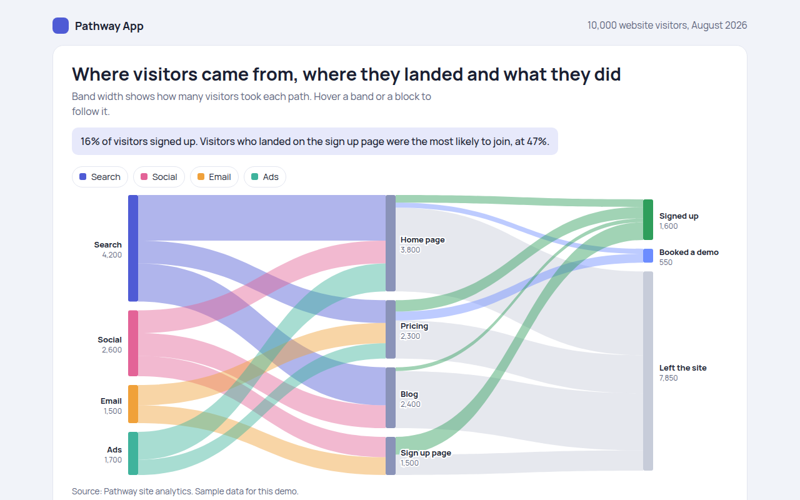

# Sankey Diagram in HTML, CSS and JavaScript (Free)



**Live demo:** https://mmrahmanbappi.github.io/100-free-data-charts/06-flow-and-network/051-sankey-diagram/demo.html
**Details and code:** https://mmrahmanbappi.github.io/100-free-data-charts/06-flow-and-network/051-sankey-diagram/

Free Sankey diagram made with HTML, CSS and vanilla JavaScript. No library. Flows between steps sized by value, with hover highlights. One file to download.

## What is a sankey diagram?

A Sankey diagram shows how an amount flows from one set of steps to the next. Blocks stand for steps, and the bands between them get wider the more of the amount takes that path.

It is the best chart for questions like: where did our visitors come from, which page did they land on, and what did they do next? The widest bands show the most common paths at a glance.

## At a glance

- **Best for:** Flows through two or more stages
- **Data you need:** A list of from, to and amount
- **Skip it when:** Flows that loop back to an earlier step.
- **Made with:** HTML, CSS and vanilla JavaScript. No library.

## When to use it

- Website visitor paths
- Energy or money flows in a system
- Budgets from income to spending
- Materials from source to product

## What you get

- A Sankey layout written in about 25 lines of JavaScript
- Bands colored by where visitors came from
- Hover a block to highlight every band that passes through it
- Hover a band to see the number and its share
- Labels with a soft outline so they stay readable over bands
- A data table with every flow

## How the code works

```js
const flows = [['Search', 'Home', 1800], ['Search', 'Blog', 1500], ['Social', 'Home', 900]];
const left = { Search: [20, 200], Social: [240, 60] };   // y and height of each block
const right = { Home: [40, 160], Blog: [220, 90] };
const used = {}, filled = {};
const scale = 0.06;

flows.forEach(([from, to, n]) => {
  const w = n * scale;
  const y1 = left[from][0] + (used[from] || 0), y2 = right[to][0] + (filled[to] || 0);
  used[from] = (used[from] || 0) + w; filled[to] = (filled[to] || 0) + w;
  make('path', { d: 'M60,' + y1 + 'C300,' + y1 + ' 300,' + y2 + ' 540,' + y2 + 'L540,' + (y2 + w) + 'C300,' + (y2 + w) + ' 300,' + (y1 + w) + ' 60,' + (y1 + w) + 'Z', fill: '#4f5bd5', 'fill-opacity': 0.4 });
});
```

## How to use

1. **Download the file.** Click Download HTML file above. You get one file called sankey-diagram.html with everything inside.
2. **Change the data.** Open the file in any code editor and find the DATA list near the bottom. Replace the names and numbers with your own.
3. **Change the colors and text.** Colors are at the top of the style tag. The title, subtitle and main point are plain HTML near the top of the body.
4. **Put it online.** Upload the file to any host, such as GitHub Pages, Netlify or your own server, or paste it into your site. There is no build step.

## License

MIT. Free for personal and commercial use.
