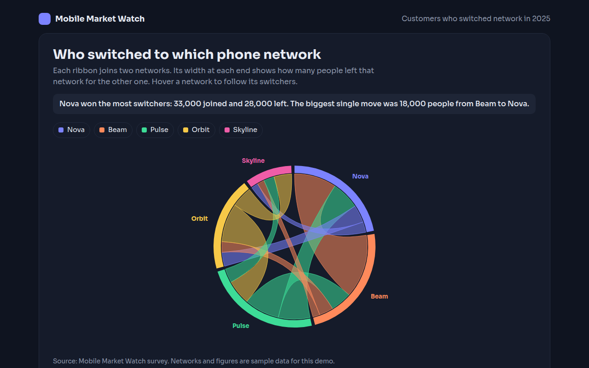

# Chord Diagram in HTML, CSS and JavaScript (Free)



**Live demo:** https://mmrahmanbappi.github.io/70-free-data-charts/06-flow-and-network/052-chord-diagram/demo.html
**Details and code:** https://mmrahmanbappi.github.io/70-free-data-charts/06-flow-and-network/052-chord-diagram/

Free chord diagram made with HTML, CSS and vanilla JavaScript. Two way flows between groups shown as ribbons, with hover highlights. One file to download.

## What is a chord diagram?

A chord diagram arranges groups around a circle and joins them with ribbons. Each ribbon shows the flow between two groups, and its width at each end shows how much went in that direction.

It is made for two way flows, like customers switching between phone networks or people moving between cities. You can see at once who gains, who loses and which pairs swap the most.

## At a glance

- **Best for:** Two way flows between a handful of groups
- **Data you need:** A table of how much moved from each group to each other group
- **Skip it when:** More than about 8 groups. It turns into a tangle.
- **Made with:** HTML, CSS and vanilla JavaScript. No library.

## When to use it

- Customers switching between brands
- People moving between cities or countries
- Trade between regions
- Messages or calls between teams

## What you get

- Arcs sized by how many people left each network
- Ribbons drawn with SVG curves through the center
- Each ribbon colored by the network that won the bigger share
- Hover a network to highlight its ribbons and see its net gain
- Hover a ribbon to see the numbers in both directions
- A full from and to table

## How the code works

```js
const names = ['Nova', 'Beam', 'Pulse'];
const m = [[0, 12, 8], [18, 0, 6], [9, 10, 0]];
const cx = 200, cy = 160, r = 120;
const total = m.flat().reduce((a, b) => a + b, 0);
const pt = a => (cx + r * Math.sin(a)) + ',' + (cy - r * Math.cos(a));
let a = 0; const spans = [];

m.forEach((row, i) => { spans.push(row.map(v => { const s = [a, a + v / total * Math.PI * 2]; a = s[1]; return s; })); });
for (let i = 0; i < 3; i++) for (let j = i + 1; j < 3; j++) {
  const [s, t] = [spans[i][j], spans[j][i]];
  make('path', { fill: '#7c83ff', 'fill-opacity': 0.5, d: 'M' + pt(s[0]) + 'A' + r + ',' + r + ' 0 0 1 ' + pt(s[1]) + 'Q' + cx + ',' + cy + ' ' + pt(t[0]) + 'A' + r + ',' + r + ' 0 0 1 ' + pt(t[1]) + 'Q' + cx + ',' + cy + ' ' + pt(s[0]) + 'Z' });
}
```

## How to use

1. **Download the file.** Click Download HTML file above. You get one file called chord-diagram.html with everything inside.
2. **Change the data.** Open the file in any code editor and find the DATA list near the bottom. Replace the names and numbers with your own.
3. **Change the colors and text.** Colors are at the top of the style tag. The title, subtitle and main point are plain HTML near the top of the body.
4. **Put it online.** Upload the file to any host, such as GitHub Pages, Netlify or your own server, or paste it into your site. There is no build step.

## License

MIT. Free for personal and commercial use.
