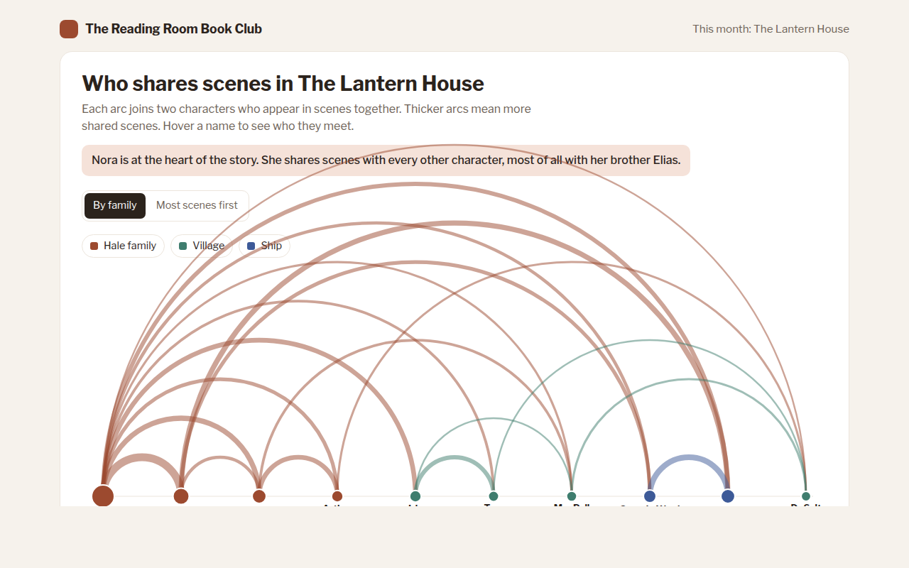

# Arc Diagram in HTML, CSS and JavaScript (Free)



**Live demo:** https://mmrahmanbappi.github.io/70-free-data-charts/06-flow-and-network/053-arc-diagram/demo.html
**Details and code:** https://mmrahmanbappi.github.io/70-free-data-charts/06-flow-and-network/053-arc-diagram/

Free arc diagram made with HTML, CSS and vanilla JavaScript. Connections between items drawn as arcs above a line, with hover focus. One file to download.

## What is a arc diagram?

An arc diagram puts items in a row along a line and joins connected items with curved arcs above it. Thicker arcs mean stronger links, and bigger dots mean items with more connections.

It is a tidy way to show a network when the order of the items matters, like characters grouped by family. Because every item sits on one line, labels never collide the way they can in a tangled network graph.

## At a glance

- **Best for:** Small networks where order or grouping matters
- **Data you need:** A list of items and a list of links with strengths
- **Skip it when:** Large networks with hundreds of links.
- **Made with:** HTML, CSS and vanilla JavaScript. No library.

## When to use it

- Characters in a book, play or film
- Songs or chapters that share themes
- Teams that work together
- Stations or stops with direct links

## What you get

- Arcs drawn with SVG arc paths above a single line
- Arc width by number of shared scenes, dot size by total scenes
- Arcs draw themselves on load
- Hover a character to light up only their arcs
- Sort by family or by most scenes
- Tilted names on phones and a data table

## How the code works

```js
const people = ['Nora', 'Elias', 'Ruth', 'Iris', 'Tom'];
const links = [[0, 1, 14], [0, 2, 9], [0, 3, 8], [3, 4, 7], [1, 2, 5]];
const x = i => 60 + i * 120, base = 260;

links.forEach(([a, b, n]) => {
  const r = (x(b) - x(a)) / 2;
  make('path', { d: 'M' + x(a) + ',' + base + 'A' + r + ',' + r + ' 0 0 1 ' + x(b) + ',' + base, fill: 'none', stroke: '#9c4a2f', 'stroke-width': 1 + n * 0.7, 'stroke-opacity': 0.5 });
});
people.forEach((p, i) => { drawCircle(x(i), base, 8, '#9c4a2f'); drawText(x(i), base + 26, p, 'middle'); });
```

## How to use

1. **Download the file.** Click Download HTML file above. You get one file called arc-diagram.html with everything inside.
2. **Change the data.** Open the file in any code editor and find the DATA list near the bottom. Replace the names and numbers with your own.
3. **Change the colors and text.** Colors are at the top of the style tag. The title, subtitle and main point are plain HTML near the top of the body.
4. **Put it online.** Upload the file to any host, such as GitHub Pages, Netlify or your own server, or paste it into your site. There is no build step.

## License

MIT. Free for personal and commercial use.
