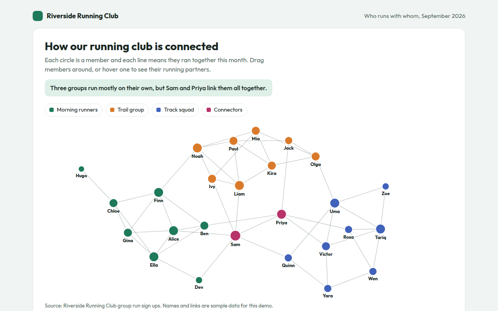

# Network Graph in HTML, CSS and JavaScript (Free)



**Live demo:** https://mmrahmanbappi.github.io/100-free-data-charts/06-flow-and-network/054-network-graph/demo.html
**Details and code:** https://mmrahmanbappi.github.io/100-free-data-charts/06-flow-and-network/054-network-graph/

Free force directed network graph made with HTML, CSS and vanilla JavaScript. Draggable nodes, groups and hover highlights. One file to download.

## What is a network graph?

A network graph shows things as dots, called nodes, and the links between them as lines. A force directed layout pushes all nodes apart and pulls linked nodes together, so tight groups form on their own.

It reveals the shape of a network: close knit groups, loners and the few people who link groups together. In this example, two members connect three groups that would otherwise barely meet.

## At a glance

- **Best for:** Seeing groups and key connectors in a network
- **Data you need:** A list of items and a list of links
- **Skip it when:** Very large networks without filtering.
- **Made with:** HTML, CSS and vanilla JavaScript. No library.

## When to use it

- Friends, members or team connections
- Websites that link to each other
- Products that are bought together
- Emails or messages between people

## What you get

- A force simulation written in about 20 lines of JavaScript
- Nodes colored by group and sized by number of partners
- Drag any member to rearrange the graph
- Hover a member to light up only their running partners
- The layout fits any screen size
- A table sorted by the most connected members

## How the code works

```js
const nodes = [{}, {}, {}, {}, {}].map(() => ({ x: 200 + Math.random() * 100, y: 150 + Math.random() * 100 }));
const links = [[0, 1], [1, 2], [2, 0], [2, 3], [3, 4]];

for (let step = 0; step < 300; step++) {
  nodes.forEach((a, i) => nodes.forEach((b, j) => {            // push apart
    if (i >= j) return;
    const dx = b.x - a.x, dy = b.y - a.y, d2 = dx * dx + dy * dy + 0.1, f = 400 / d2;
    a.x -= dx * f; a.y -= dy * f; b.x += dx * f; b.y += dy * f;
  }));
  links.forEach(([i, j]) => {                                    // pull linked nodes together
    const a = nodes[i], b = nodes[j], dx = b.x - a.x, dy = b.y - a.y, f = 0.02;
    a.x += dx * f; a.y += dy * f; b.x -= dx * f; b.y -= dy * f;
  });
}
links.forEach(([i, j]) => drawLine(nodes[i].x, nodes[i].y, nodes[j].x, nodes[j].y, '#9aa'));
nodes.forEach(n => drawCircle(n.x, n.y, 10, '#1f7a5a'));
```

## How to use

1. **Download the file.** Click Download HTML file above. You get one file called network-graph.html with everything inside.
2. **Change the data.** Open the file in any code editor and find the DATA list near the bottom. Replace the names and numbers with your own.
3. **Change the colors and text.** Colors are at the top of the style tag. The title, subtitle and main point are plain HTML near the top of the body.
4. **Put it online.** Upload the file to any host, such as GitHub Pages, Netlify or your own server, or paste it into your site. There is no build step.

## License

MIT. Free for personal and commercial use.
