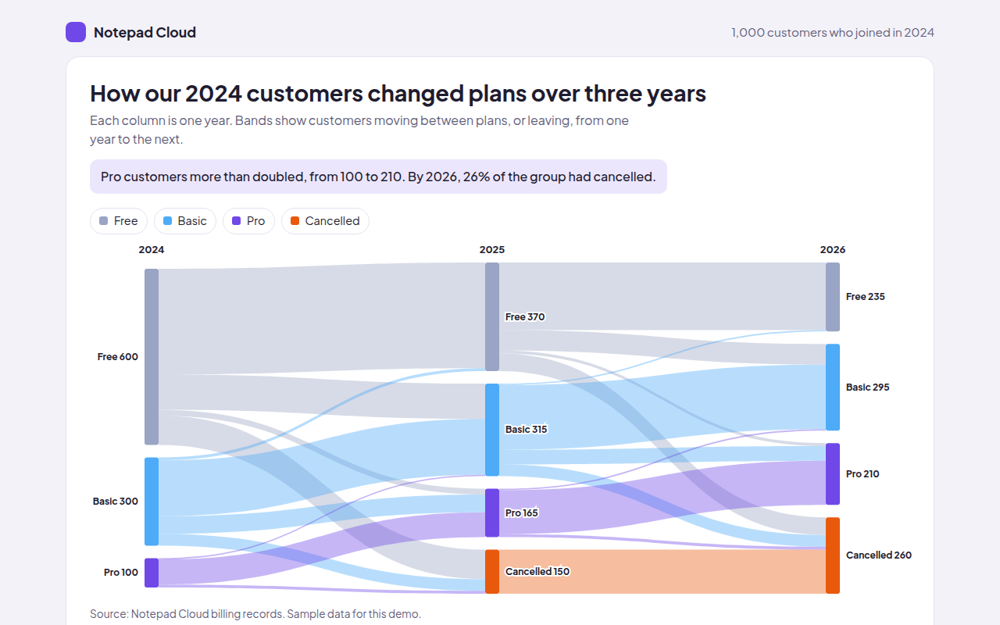

# Alluvial Diagram in HTML, CSS and JavaScript (Free)



**Live demo:** https://mmrahmanbappi.github.io/100-free-data-charts/06-flow-and-network/055-alluvial-diagram/demo.html
**Details and code:** https://mmrahmanbappi.github.io/100-free-data-charts/06-flow-and-network/055-alluvial-diagram/

Free alluvial diagram made with HTML, CSS and vanilla JavaScript. Shows how groups change over time, with hover to follow a plan. One file to download.

## What is a alluvial diagram?

An alluvial diagram shows how items move between groups over time. Each column is a point in time, blocks show the groups, and bands show items moving from one group to another between columns.

It is like a Sankey diagram where the stages are dates. It answers questions like: how many free users became paying customers, and how many of them later cancelled?

## At a glance

- **Best for:** The same items changing groups over time
- **Data you need:** Counts of items moving between groups for each step in time
- **Skip it when:** Many groups per column. Bands get too thin.
- **Made with:** HTML, CSS and vanilla JavaScript. No library.

## When to use it

- Customers moving between plans
- Students changing subjects year to year
- Voters or members changing groups
- Staff moving between teams

## What you get

- Three columns for 2024, 2025 and 2026
- Bands colored by the plan customers came from
- Hover a block to see every band that passes through it
- Hover a band to see how many stayed or moved
- Bands reveal from left to right on load
- A table of plan sizes each year

## How the code works

```js
const years = [[600, 300, 100], [370, 315, 165]];   // Free, Basic, Pro
const moves = [[0, 0, 360], [0, 1, 120], [1, 1, 190], [1, 2, 60], [2, 2, 85]];
const colors = ['#9aa4c4', '#4dabf7', '#7048e8'], k = 0.28, gap = 14;
const tops = years.map(col => { let y = 20; return col.map(v => { const t = y; y += v * k + gap; return t; }); });
const outUsed = [0, 0, 0], inUsed = [0, 0, 0];

moves.forEach(([a, b, n]) => {
  const w = n * k, y1 = tops[0][a] + outUsed[a], y2 = tops[1][b] + inUsed[b];
  outUsed[a] += w; inUsed[b] += w;
  make('path', { d: 'M80,' + y1 + 'C300,' + y1 + ' 300,' + y2 + ' 520,' + y2 + 'V' + (y2 + w) + 'C300,' + (y2 + w) + ' 300,' + (y1 + w) + ' 80,' + (y1 + w) + 'Z', fill: colors[a], 'fill-opacity': 0.45 });
});
```

## How to use

1. **Download the file.** Click Download HTML file above. You get one file called alluvial-diagram.html with everything inside.
2. **Change the data.** Open the file in any code editor and find the DATA list near the bottom. Replace the names and numbers with your own.
3. **Change the colors and text.** Colors are at the top of the style tag. The title, subtitle and main point are plain HTML near the top of the body.
4. **Put it online.** Upload the file to any host, such as GitHub Pages, Netlify or your own server, or paste it into your site. There is no build step.

## License

MIT. Free for personal and commercial use.
