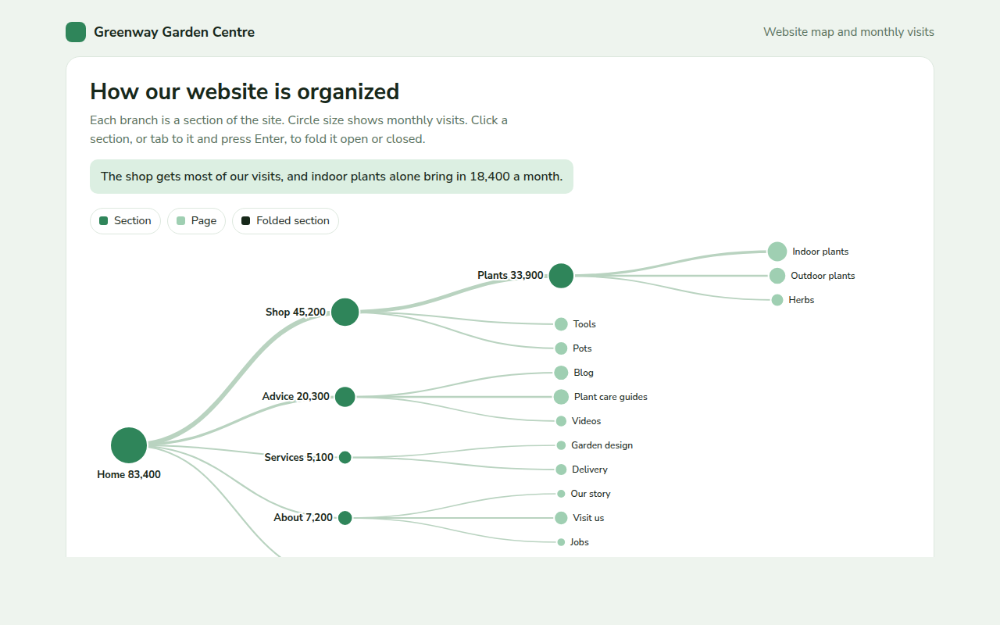

# Tree Diagram in HTML, CSS and JavaScript (Free)



**Live demo:** https://mmrahmanbappi.github.io/70-free-data-charts/06-flow-and-network/056-tree-diagram/demo.html
**Details and code:** https://mmrahmanbappi.github.io/70-free-data-charts/06-flow-and-network/056-tree-diagram/

Free collapsible tree diagram made with HTML, CSS and vanilla JavaScript. A sitemap you can fold and unfold, sized by visits. One file to download.

## What is a tree diagram?

A tree diagram shows a hierarchy as branches. It starts from one root, splits into sections, and each section splits again, just like folders on a computer or pages on a website.

Folding branches open and closed keeps big trees easy to read. Adding size to the circles, like monthly visits, turns a plain sitemap into a map of where people actually go.

## At a glance

- **Best for:** Hierarchies you want to read branch by branch
- **Data you need:** A nested list of items, with a value for each end item
- **Skip it when:** Comparing sizes exactly. Use a treemap.
- **Made with:** HTML, CSS and vanilla JavaScript. No library.

## When to use it

- Website sitemaps
- Folder and file structures
- Product categories
- Decision trees and family trees

## What you get

- A tidy tree layout that places each branch between its children
- Circle size and branch width by monthly visits
- Click or press Enter to fold and unfold sections
- Folded sections turn dark so you know they hold more
- Keyboard focus stays on the section you toggled
- A table of every page with its visits

## How the code works

```js
const tree = { name: 'Home', kids: [{ name: 'Shop', kids: [{ name: 'Plants' }, { name: 'Tools' }] }, { name: 'Advice', kids: [{ name: 'Blog' }] }] };
let row = 0;
function place(node, depth) {
  node.x = 60 + depth * 200;
  if (node.kids) { node.kids.forEach(k => place(k, depth + 1)); node.y = (node.kids[0].y + node.kids[node.kids.length - 1].y) / 2; }
  else node.y = 40 + row++ * 60;
}
place(tree, 0);
(function draw(n) {
  (n.kids || []).forEach(k => { make('path', { d: 'M' + n.x + ',' + n.y + 'C' + (n.x + 100) + ',' + n.y + ' ' + (k.x - 100) + ',' + k.y + ' ' + k.x + ',' + k.y, fill: 'none', stroke: '#b9d3c0', 'stroke-width': 2 }); draw(k); });
  drawCircle(n.x, n.y, 8, '#2f855a'); drawText(n.x + 12, n.y + 4, n.name);
})(tree);
```

## How to use

1. **Download the file.** Click Download HTML file above. You get one file called tree-diagram.html with everything inside.
2. **Change the data.** Open the file in any code editor and find the DATA list near the bottom. Replace the names and numbers with your own.
3. **Change the colors and text.** Colors are at the top of the style tag. The title, subtitle and main point are plain HTML near the top of the body.
4. **Put it online.** Upload the file to any host, such as GitHub Pages, Netlify or your own server, or paste it into your site. There is no build step.

## License

MIT. Free for personal and commercial use.
