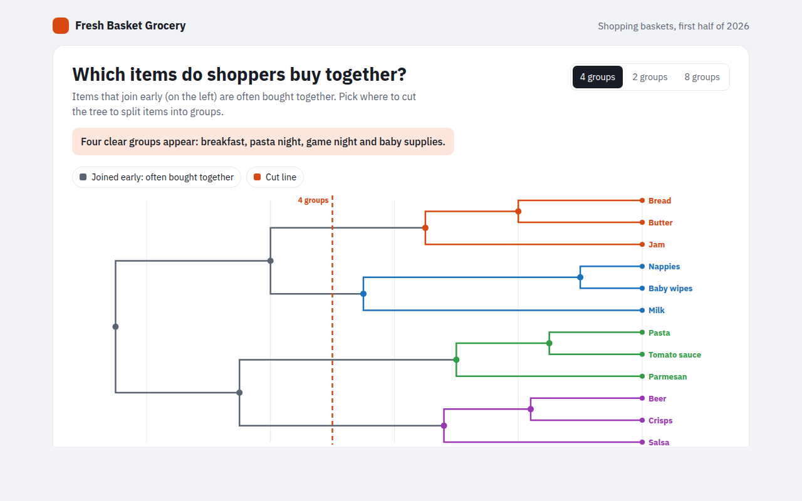

# Dendrogram in HTML, CSS and JavaScript (Free)



**Live demo:** https://mmrahmanbappi.github.io/70-free-data-charts/06-flow-and-network/057-dendrogram/demo.html
**Details and code:** https://mmrahmanbappi.github.io/70-free-data-charts/06-flow-and-network/057-dendrogram/

Free dendrogram made with HTML, CSS and vanilla JavaScript. A cluster tree with a movable cut line that colors the groups. One file to download.

## What is a dendrogram?

A dendrogram is a tree that shows how items group together by how similar they are. Items that join close to the start are very alike, and items that only join near the end have little in common.

Drawing a line across the tree splits the items into groups. Cut early and you get many small groups, cut late and you get a few big ones. It is the usual way to show the result of a clustering analysis.

## At a glance

- **Best for:** Showing groups found by similarity
- **Data you need:** The result of a clustering: which items join and at what distance
- **Skip it when:** Structures that are not based on similarity, like an org chart.
- **Made with:** HTML, CSS and vanilla JavaScript. No library.

## When to use it

- Products bought together
- Customers with similar habits
- Songs, films or books with similar features
- Survey answers or genes that behave alike

## What you get

- A cluster tree drawn with right angled lines
- A cut line with three settings: 2, 4 or 8 groups
- Groups below the cut line get their own color
- Hover a join point to see which items it holds
- The tree draws from left to right on load
- A table that lists the items in each group

## How the code works

```js
const tree = { h: 0.6, k: [{ h: 0.2, k: [{ n: 'Bread' }, { n: 'Butter' }] }, { h: 0.15, k: [{ n: 'Pasta' }, { n: 'Sauce' }] }] };
const x = h => 500 - h * 600;
let row = 0;
(function draw(n) {
  if (!n.k) { n.y = 40 + row++ * 50; n.x = x(0); drawText(n.x + 8, n.y + 4, n.n); return; }
  n.k.forEach(draw);
  n.y = (n.k[0].y + n.k[n.k.length - 1].y) / 2; n.x = x(n.h);
  n.k.forEach(c => make('path', { d: 'M' + c.x + ',' + c.y + 'H' + n.x + 'V' + n.y, fill: 'none', stroke: '#171c26', 'stroke-width': 2 }));
})(tree);
```

## How to use

1. **Download the file.** Click Download HTML file above. You get one file called dendrogram.html with everything inside.
2. **Change the data.** Open the file in any code editor and find the DATA list near the bottom. Replace the names and numbers with your own.
3. **Change the colors and text.** Colors are at the top of the style tag. The title, subtitle and main point are plain HTML near the top of the body.
4. **Put it online.** Upload the file to any host, such as GitHub Pages, Netlify or your own server, or paste it into your site. There is no build step.

## License

MIT. Free for personal and commercial use.
