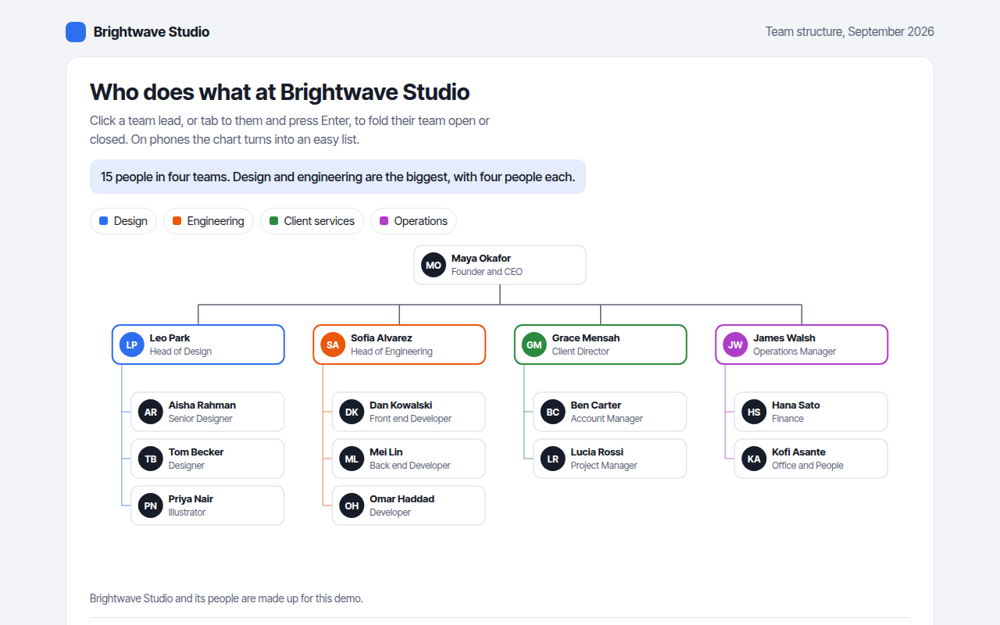

# Org Chart in HTML, CSS and JavaScript (Free)



**Live demo:** https://mmrahmanbappi.github.io/70-free-data-charts/06-flow-and-network/058-org-chart/demo.html
**Details and code:** https://mmrahmanbappi.github.io/70-free-data-charts/06-flow-and-network/058-org-chart/

Free org chart made with HTML, CSS and vanilla JavaScript. Collapsible teams, avatar initials and a phone friendly list view. One file to download.

## What is a org chart?

An org chart, short for organization chart, shows who works in a company and who reports to whom. The leader sits at the top, team leads below, and their team members below them.

A good org chart helps new staff, clients and partners find the right person fast. Folding teams keeps a big company readable, and a list view makes it work on a phone.

## At a glance

- **Best for:** People, roles and reporting lines
- **Data you need:** A name, role and manager for each person
- **Skip it when:** Very large companies without folding or search.
- **Made with:** HTML, CSS and vanilla JavaScript. No library.

## When to use it

- Company about and team pages
- Onboarding guides for new staff
- Project team structures
- Clubs, schools and volunteer groups

## What you get

- Cards with initials, name and role for every person
- Each team has its own color
- Click a team lead, or press Enter, to fold the team
- Folded teams show how many people are hidden
- Turns into an indented list on phones
- A table of everyone and who they report to

## How the code works

```js
const ceo = { n: 'Maya Okafor', r: 'CEO' };
const leads = [{ n: 'Leo Park', r: 'Design' }, { n: 'Sofia Alvarez', r: 'Engineering' }, { n: 'Grace Mensah', r: 'Clients' }];
const card = (x, y, p) => { drawRect(x, y, 150, 46, '#e4ecfd'); drawText(x + 10, y + 20, p.n); drawText(x + 10, y + 37, p.r); };

card(225, 10, ceo);
drawLine(300, 56, 300, 80, '#5c6378', 1.5);
drawLine(95, 80, 505, 80, '#5c6378', 1.5);
leads.forEach((p, i) => { const x = 20 + i * 205; drawLine(x + 75, 80, x + 75, 100, '#5c6378', 1.5); card(x, 100, p); });
```

## How to use

1. **Download the file.** Click Download HTML file above. You get one file called org-chart.html with everything inside.
2. **Change the data.** Open the file in any code editor and find the DATA list near the bottom. Replace the names and numbers with your own.
3. **Change the colors and text.** Colors are at the top of the style tag. The title, subtitle and main point are plain HTML near the top of the body.
4. **Put it online.** Upload the file to any host, such as GitHub Pages, Netlify or your own server, or paste it into your site. There is no build step.

## License

MIT. Free for personal and commercial use.
