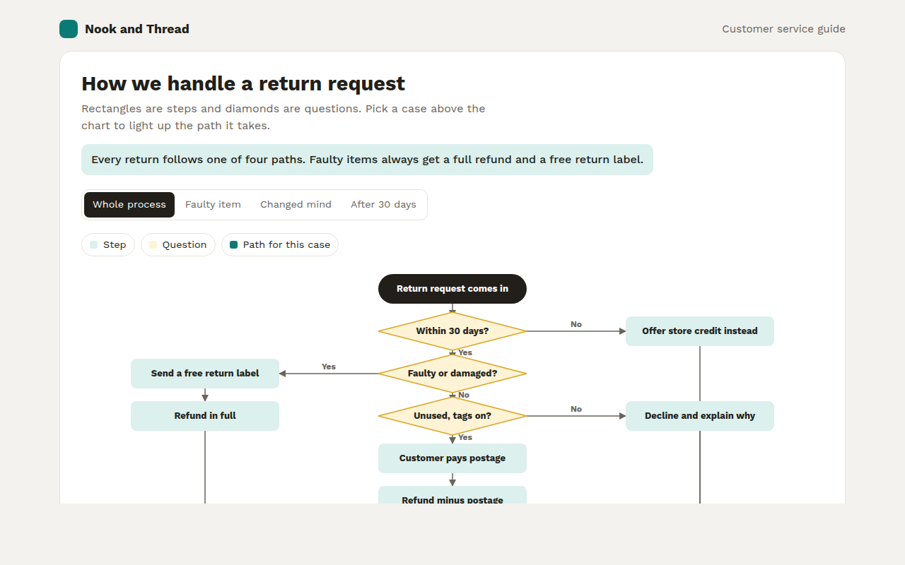

# Flowchart in HTML, CSS and JavaScript (Free)



**Live demo:** https://mmrahmanbappi.github.io/70-free-data-charts/06-flow-and-network/059-flowchart/demo.html
**Details and code:** https://mmrahmanbappi.github.io/70-free-data-charts/06-flow-and-network/059-flowchart/

Free flowchart made with HTML, CSS and vanilla JavaScript. Steps, decisions and arrows, with example cases that light up their path. One file to download.

## What is a flowchart?

A flowchart shows the steps of a process and the choices along the way. Rectangles are steps, diamonds are yes or no questions, and arrows show what happens next.

It turns a written process into something anyone can follow in seconds. Lighting up the path for a real example, like a faulty item, shows exactly what the customer and the team will go through.

## At a glance

- **Best for:** Processes with steps and decisions
- **Data you need:** A list of steps, questions and the arrows between them
- **Skip it when:** Processes with dozens of branches. Split them up.
- **Made with:** HTML, CSS and vanilla JavaScript. No library.

## When to use it

- Customer service and returns processes
- Sign up, approval and support workflows
- Troubleshooting guides
- Training material for new staff

## What you get

- Steps, questions and start and finish shapes in plain SVG
- Arrows with Yes and No labels
- Buttons that light up the path for three example cases
- The chosen path fades in step by step
- Text wraps to fit each box on any screen
- A table that writes out each path in words

## How the code works

```js
const steps = [['Request comes in', 150, 20, 'box'], ['Within 30 days?', 150, 100, 'question'], ['Refund', 150, 190, 'box']];

steps.forEach(([label, x, y, kind]) => {
  if (kind === 'question') make('polygon', { points: [[x + 90, y], [x + 180, y + 30], [x + 90, y + 60], [x, y + 30]].map(p => p.join(',')).join(' '), fill: '#fff3d6', stroke: '#d9a520' });
  else drawRect(x, y, 180, 50, '#dcf0ee');
  drawText(x + 90, y + (kind === 'question' ? 34 : 30), label, 'middle');
});
drawLine(240, 70, 240, 100, '#6a645a', 1.5);
drawLine(240, 160, 240, 190, '#6a645a', 1.5);
```

## How to use

1. **Download the file.** Click Download HTML file above. You get one file called flowchart.html with everything inside.
2. **Change the data.** Open the file in any code editor and find the DATA list near the bottom. Replace the names and numbers with your own.
3. **Change the colors and text.** Colors are at the top of the style tag. The title, subtitle and main point are plain HTML near the top of the body.
4. **Put it online.** Upload the file to any host, such as GitHub Pages, Netlify or your own server, or paste it into your site. There is no build step.

## License

MIT. Free for personal and commercial use.
