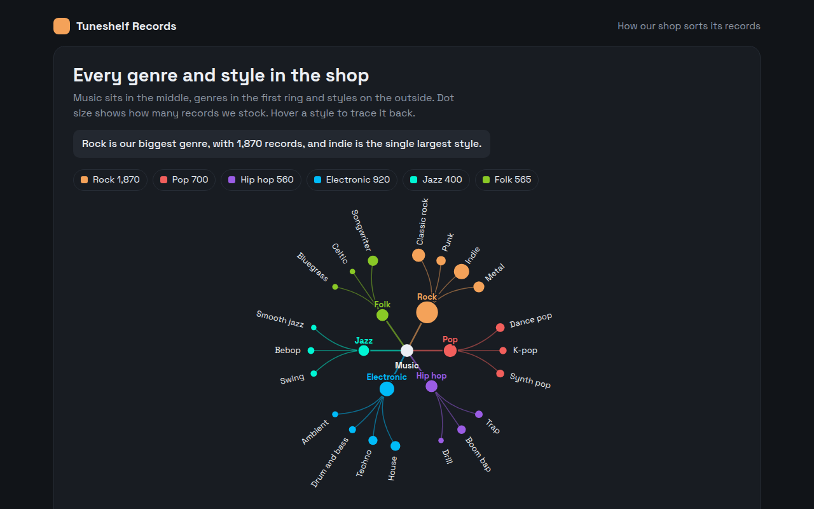

# Radial Tree in HTML, CSS and JavaScript (Free)



**Live demo:** https://mmrahmanbappi.github.io/100-free-data-charts/06-flow-and-network/060-radial-tree/demo.html
**Details and code:** https://mmrahmanbappi.github.io/100-free-data-charts/06-flow-and-network/060-radial-tree/

Free radial tree made with HTML, CSS and vanilla JavaScript. A hierarchy laid out in a circle, with path highlights on hover. One file to download.

## What is a radial tree?

A radial tree is a tree diagram wrapped into a circle. The root sits in the middle, the first level forms an inner ring, and the end items spread around the outside.

Wrapping the tree gives the outer ring far more room than a straight line would, so it can hold many end items in a compact, eye catching layout.

## At a glance

- **Best for:** Hierarchies with many end items
- **Data you need:** A nested list with a value for each end item
- **Skip it when:** When people need to scan names quickly in a list.
- **Made with:** HTML, CSS and vanilla JavaScript. No library.

## When to use it

- Music, book or film categories
- Product ranges in a shop
- Topics and subtopics of a course
- Family trees and language families

## What you get

- A tree laid out around a circle with curved branches
- Genre circles sized by records in stock
- Style labels turn to follow the circle and flip so they are never upside down
- Hover a style to trace its path back to the middle
- Dark theme with a color for each genre
- A table of every style with its stock

## How the code works

```js
const genres = [['Rock', ['Punk', 'Indie', 'Metal']], ['Jazz', ['Swing', 'Bebop']], ['Pop', ['Dance', 'K-pop']]];
const cx = 200, cy = 160, inner = 60, outer = 130;
const all = genres.flatMap(g => g[1]);
const at = (r, a) => [cx + r * Math.sin(a), cy - r * Math.cos(a)];
let i = 0;

drawCircle(cx, cy, 8, '#333');
genres.forEach(([name, styles]) => {
  const angles = styles.map(() => (i++ + 0.5) / all.length * Math.PI * 2);
  const [gx, gy] = at(inner, (angles[0] + angles[angles.length - 1]) / 2);
  drawLine(cx, cy, gx, gy, '#f4a259', 2); drawCircle(gx, gy, 6, '#f4a259');
  angles.forEach((a, k) => { const [x, y] = at(outer, a); drawLine(gx, gy, x, y, '#f4a259'); drawCircle(x, y, 4, '#f4a259'); drawText(...at(outer + 12, a), styles[k], 'middle'); });
});
```

## How to use

1. **Download the file.** Click Download HTML file above. You get one file called radial-tree.html with everything inside.
2. **Change the data.** Open the file in any code editor and find the DATA list near the bottom. Replace the names and numbers with your own.
3. **Change the colors and text.** Colors are at the top of the style tag. The title, subtitle and main point are plain HTML near the top of the body.
4. **Put it online.** Upload the file to any host, such as GitHub Pages, Netlify or your own server, or paste it into your site. There is no build step.

## License

MIT. Free for personal and commercial use.
