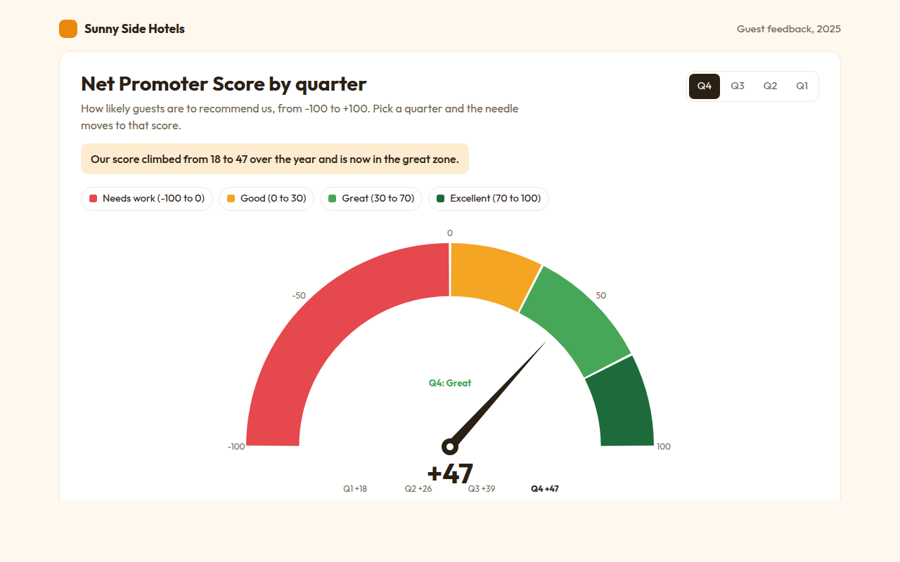

# Gauge Chart in HTML, CSS and JavaScript (Free)



**Live demo:** https://mmrahmanbappi.github.io/70-free-data-charts/07-dashboard-widgets/061-gauge-chart/demo.html
**Details and code:** https://mmrahmanbappi.github.io/70-free-data-charts/07-dashboard-widgets/061-gauge-chart/

Free gauge chart made with HTML, CSS and vanilla JavaScript. No library. Colored zones, an animated needle and a quarter switch. One file to download.

## What is a gauge chart?

A gauge chart shows one number on a dial, like the speedometer in a car. A needle points to the value, and colored zones show at a glance whether it is poor, good or great.

Gauges work well for a single score that people check often, like a Net Promoter Score or server load. The zones give the number meaning without anyone needing to know what a good score is.

## At a glance

- **Best for:** One score against clear zones
- **Data you need:** One number and the limits of each zone
- **Skip it when:** Comparing many scores. Use a bullet chart.
- **Made with:** HTML, CSS and vanilla JavaScript. No library.

## When to use it

- Customer satisfaction and NPS scores
- Server, battery or storage levels
- Sales against a monthly target
- Health or quality scores on a dashboard

## What you get

- A half circle dial with four colored zones
- A needle that swings from the last value to the new one
- The score counts up in the middle as the needle moves
- A quarter switch to compare the year
- The zone name appears in its own color
- Tooltips on each zone and a data table

## How the code works

```js
const score = 47, cx = 220, cy = 220, r = 160;
const angle = v => (-90 + (v + 100) / 200 * 180) * Math.PI / 180;   // -100 to +100 across the top
const zones = [[-100, 0, '#e5484d'], [0, 30, '#f5a524'], [30, 70, '#46a758'], [70, 100, '#1d6b3a']];
const pt = (rad, v) => (cx + rad * Math.sin(angle(v))) + ',' + (cy - rad * Math.cos(angle(v)));

zones.forEach(([a, b, color]) => make('path', { fill: color,
  d: 'M' + pt(r, a) + 'A' + r + ',' + r + ' 0 0 1 ' + pt(r, b) + 'L' + pt(r * 0.74, b) + 'A' + r * 0.74 + ',' + r * 0.74 + ' 0 0 0 ' + pt(r * 0.74, a) + 'Z' }));
make('line', { x1: cx, y1: cy, x2: pt(r * 0.7, score).split(',')[0], y2: pt(r * 0.7, score).split(',')[1], stroke: '#2a2014', 'stroke-width': 5 });
drawCircle(cx, cy, 10, '#2a2014');
```

## How to use

1. **Download the file.** Click Download HTML file above. You get one file called gauge-chart.html with everything inside.
2. **Change the data.** Open the file in any code editor and find the DATA list near the bottom. Replace the names and numbers with your own.
3. **Change the colors and text.** Colors are at the top of the style tag. The title, subtitle and main point are plain HTML near the top of the body.
4. **Put it online.** Upload the file to any host, such as GitHub Pages, Netlify or your own server, or paste it into your site. There is no build step.

## License

MIT. Free for personal and commercial use.
