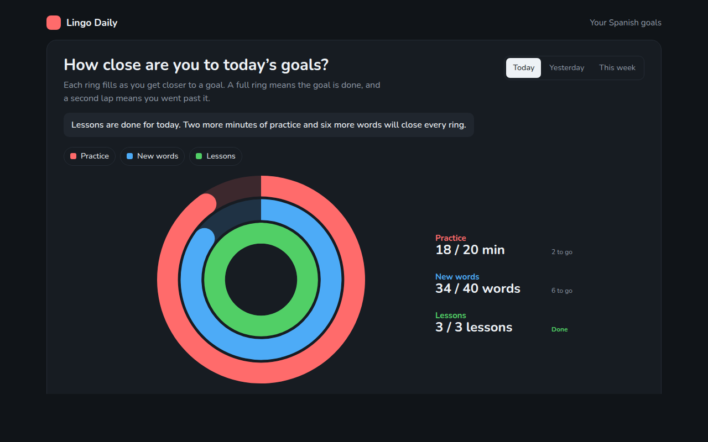

# Progress Ring Chart in HTML, CSS and JavaScript (Free)



**Live demo:** https://mmrahmanbappi.github.io/70-free-data-charts/07-dashboard-widgets/062-progress-ring/demo.html
**Details and code:** https://mmrahmanbappi.github.io/70-free-data-charts/07-dashboard-widgets/062-progress-ring/

Free progress ring chart made with HTML, CSS and vanilla JavaScript. Concentric goal rings that fill up, with day and week views. One file to download.

## What is a progress ring chart?

A progress ring shows how close you are to a goal as a ring that fills up. An empty ring means you have not started, a full ring means the goal is done, and a second lap means you went past it.

Stacking a few rings inside each other shows several goals at once in a small space. People love closing rings, which is why fitness and learning apps use them to keep users coming back.

## At a glance

- **Best for:** Progress toward two to four goals
- **Data you need:** A current value and a target for each goal
- **Skip it when:** Comparing sizes between goals. Use bars.
- **Made with:** HTML, CSS and vanilla JavaScript. No library.

## When to use it

- Daily goals in fitness, learning or health apps
- Project or course completion
- Fundraising or savings progress
- Team targets on a dashboard

## What you get

- Three rings inside each other, each with its own color
- Rings fill up with a rounded end cap
- Goals past 100% show a second lap
- A switch between today, yesterday and this week
- Big numbers and what is left to go beside the rings
- Tooltips and a data table

## How the code works

```js
const goals = [[18, 20, '#ff6b6b'], [34, 40, '#4dabf7'], [3, 3, '#51cf66']];
const cx = 160, cy = 160, width = 28;
const pt = (r, a) => (cx + r * Math.sin(a)) + ',' + (cy - r * Math.cos(a));

goals.forEach(([done, target, color], i) => {
  const r = 130 - i * (width + 6), a = Math.min(done / target, 0.9999) * Math.PI * 2;
  make('circle', { cx, cy, r, fill: 'none', stroke: color, 'stroke-opacity': 0.2, 'stroke-width': width });
  make('path', { d: 'M' + pt(r, 0) + 'A' + r + ',' + r + ' 0 ' + (a > Math.PI ? 1 : 0) + ' 1 ' + pt(r, a), fill: 'none', stroke: color, 'stroke-width': width, 'stroke-linecap': 'round' });
});
```

## How to use

1. **Download the file.** Click Download HTML file above. You get one file called progress-ring.html with everything inside.
2. **Change the data.** Open the file in any code editor and find the DATA list near the bottom. Replace the names and numbers with your own.
3. **Change the colors and text.** Colors are at the top of the style tag. The title, subtitle and main point are plain HTML near the top of the body.
4. **Put it online.** Upload the file to any host, such as GitHub Pages, Netlify or your own server, or paste it into your site. There is no build step.

## License

MIT. Free for personal and commercial use.
