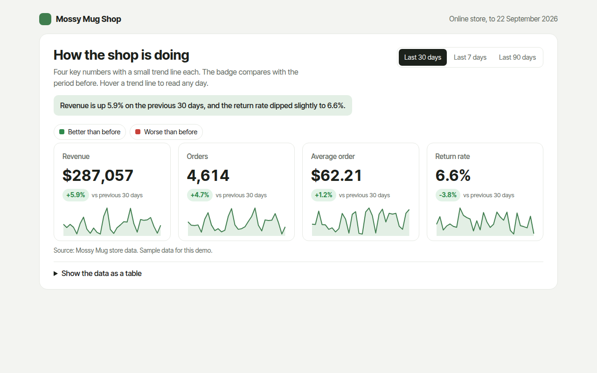

# KPI Cards with Sparklines in HTML, CSS and JavaScript (Free)



**Live demo:** https://mmrahmanbappi.github.io/70-free-data-charts/07-dashboard-widgets/063-kpi-cards/demo.html
**Details and code:** https://mmrahmanbappi.github.io/70-free-data-charts/07-dashboard-widgets/063-kpi-cards/

Free KPI cards with sparklines made with HTML, CSS and vanilla JavaScript. Big numbers, change badges and mini charts with a range switch. One file to download.

## What is a kpi cards with sparklines?

KPI cards show the few numbers that matter most, each on its own card with a big value, a badge for the change since last period and a tiny trend line. KPI stands for key performance indicator.

They sit at the top of most dashboards because they answer the first question anyone asks: how are we doing right now? The badge color tells you if the change is good or bad, which is not always the same as up or down.

## At a glance

- **Best for:** The top numbers at the head of a dashboard
- **Data you need:** A daily value for each measure over two periods
- **Skip it when:** Showing more than about six cards. Pick what matters.
- **Made with:** HTML, CSS and vanilla JavaScript. No library.

## When to use it

- Online shop and app dashboards
- Weekly or monthly reports
- Team and project dashboards
- Finance and sales summaries

## What you get

- Four cards in a grid that stacks on phones
- Change badges in green or red, with return rate treated as better when it falls
- A sparkline in every card with hover values for each day
- A switch between 7, 30 and 90 days
- Every number is worked out from the daily data
- A data table with this period and the one before

## How the code works

```js
const days = [8620, 9140, 8890, 9760, 10210, 9980, 10640];
const total = days.reduce((a, b) => a + b, 0), before = 61200;
const change = (total - before) / before * 100;
const x = i => 20 + i * 36, lo = Math.min(...days), hi = Math.max(...days), y = v => 150 - (v - lo) / (hi - lo) * 40;

drawRect(10, 10, 240, 160, '#ffffff');
drawText(24, 40, 'Revenue');
drawText(24, 80, '$' + total.toLocaleString('en-US'));
drawText(24, 105, (change >= 0 ? '+' : '') + change.toFixed(1) + '% vs last week');
make('path', { d: 'M' + days.map((v, i) => x(i) + ',' + y(v)).join('L'), fill: 'none', stroke: '#3f7d4e', 'stroke-width': 2 });
```

## How to use

1. **Download the file.** Click Download HTML file above. You get one file called kpi-cards.html with everything inside.
2. **Change the data.** Open the file in any code editor and find the DATA list near the bottom. Replace the names and numbers with your own.
3. **Change the colors and text.** Colors are at the top of the style tag. The title, subtitle and main point are plain HTML near the top of the body.
4. **Put it online.** Upload the file to any host, such as GitHub Pages, Netlify or your own server, or paste it into your site. There is no build step.

## License

MIT. Free for personal and commercial use.
