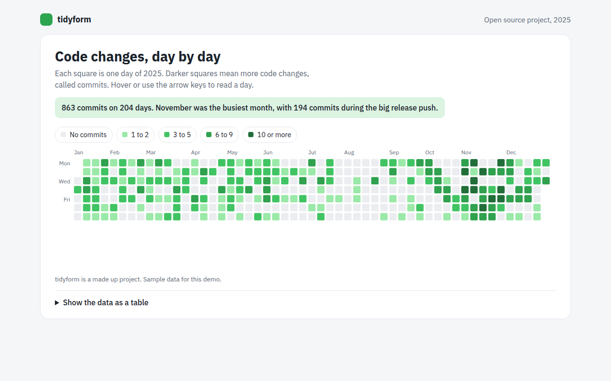

# Calendar Heatmap in HTML, CSS and JavaScript (Free)



**Live demo:** https://mmrahmanbappi.github.io/100-free-data-charts/07-dashboard-widgets/064-calendar-heatmap/demo.html
**Details and code:** https://mmrahmanbappi.github.io/100-free-data-charts/07-dashboard-widgets/064-calendar-heatmap/

Free calendar heatmap made with HTML, CSS and vanilla JavaScript. A full year of daily activity in the style of a GitHub contribution graph. One file to download.

## What is a calendar heatmap?

A calendar heatmap shows a year as a grid of small squares, one per day, arranged in weeks. The darker the square, the more activity on that day.

Most people know it from GitHub profiles. It makes habits and patterns visible: busy weeks, quiet holidays, weekends off and streaks of daily work.

## At a glance

- **Best for:** Daily activity over a whole year
- **Data you need:** A number for every day
- **Skip it when:** Data that is not daily. Use a bar or line chart.
- **Made with:** HTML, CSS and vanilla JavaScript. No library.

## When to use it

- Code commits or writing streaks
- Workouts, study or habit tracking
- Daily sales or bookings
- Support tickets or website visits by day

## What you get

- 365 squares laid out in weeks, Monday to Sunday
- Five shades from no activity to 10 or more
- Month labels across the top
- Arrow keys move day by day and week by week
- Scrolls sideways on phones so squares stay readable
- A monthly summary table

## How the code works

```js
const counts = Array.from({ length: 365 }, (v, i) => (i * 7919) % 11 > 6 ? (i * 31) % 12 : 0);
const shades = ['#ebedf0', '#9be9a8', '#40c463', '#30a14e', '#216e39'];
const level = v => v === 0 ? 0 : v <= 2 ? 1 : v <= 5 ? 2 : v <= 9 ? 3 : 4;
const firstDay = 2, size = 10; // 1 January 2025 was a Wednesday

counts.forEach((v, i) => {
  const k = i + firstDay;
  drawRect(20 + Math.floor(k / 7) * size, 20 + (k % 7) * size, size - 2, size - 2, shades[level(v)]);
});
```

## How to use

1. **Download the file.** Click Download HTML file above. You get one file called calendar-heatmap.html with everything inside.
2. **Change the data.** Open the file in any code editor and find the DATA list near the bottom. Replace the names and numbers with your own.
3. **Change the colors and text.** Colors are at the top of the style tag. The title, subtitle and main point are plain HTML near the top of the body.
4. **Put it online.** Upload the file to any host, such as GitHub Pages, Netlify or your own server, or paste it into your site. There is no build step.

## License

MIT. Free for personal and commercial use.
