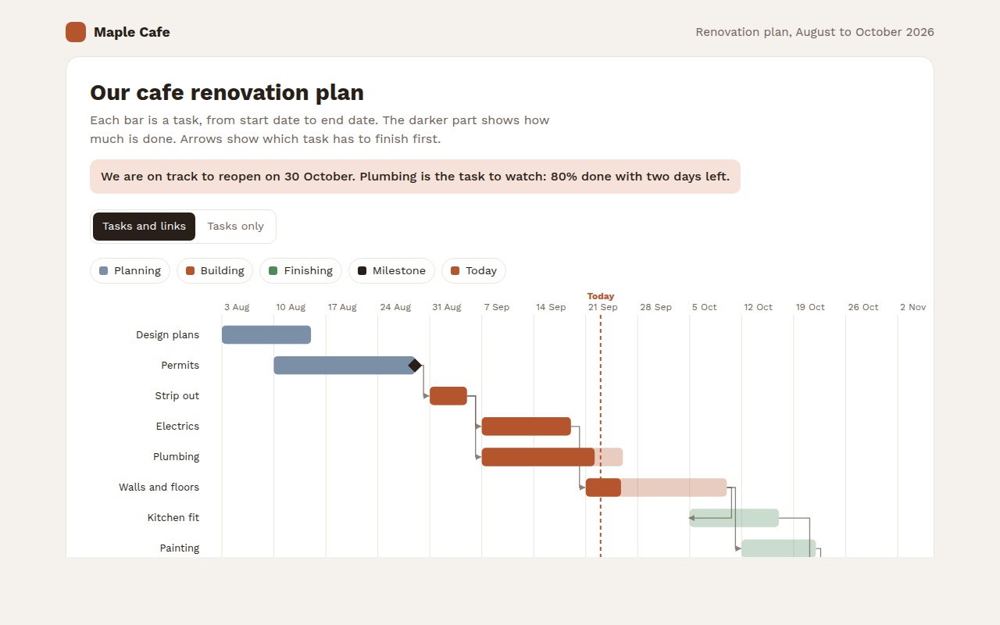

# Gantt Chart in HTML, CSS and JavaScript (Free)



**Live demo:** https://mmrahmanbappi.github.io/70-free-data-charts/07-dashboard-widgets/065-gantt-chart/demo.html
**Details and code:** https://mmrahmanbappi.github.io/70-free-data-charts/07-dashboard-widgets/065-gantt-chart/

Free Gantt chart made with HTML, CSS and vanilla JavaScript. Tasks, progress, milestones, links between tasks and a today line. One file to download.

## What is a gantt chart?

A Gantt chart shows a project plan as bars on a timeline. Each task gets a row, and its bar runs from its start date to its end date. The filled part shows how much is done.

Arrows show which tasks must finish before others can start, diamonds mark key dates, and a today line shows at a glance what is on track and what is running late.

## At a glance

- **Best for:** Project plans with dates and order
- **Data you need:** A start date, end date and progress for each task
- **Skip it when:** Hundreds of tasks. Group them into phases.
- **Made with:** HTML, CSS and vanilla JavaScript. No library.

## When to use it

- Building, renovation and event projects
- Software releases and marketing launches
- Course and training schedules
- Any plan you share with a team or client

## What you get

- Task bars with a darker part for progress
- Tasks colored by phase
- Arrows that show which task comes first
- Diamond milestones and a dashed today line
- Tooltips with days left or start date
- A switch to hide the arrows and a full task table

## How the code works

```js
const tasks = [['Permits', '2026-08-10', '2026-08-28', 100], ['Plumbing', '2026-09-07', '2026-09-25', 80], ['Painting', '2026-10-12', '2026-10-21', 0]];
const start = new Date('2026-08-01'), end = new Date('2026-11-01');
const x = d => 120 + (new Date(d) - start) / (end - start) * 460;

tasks.forEach(([name, from, to, done], i) => {
  const y = 30 + i * 40;
  drawText(110, y + 18, name, 'end');
  drawRect(x(from), y, x(to) - x(from), 24, '#f0c9b8');
  drawRect(x(from), y, (x(to) - x(from)) * done / 100, 24, '#b5552d');
});
drawLine(x('2026-09-23'), 20, x('2026-09-23'), 150, '#b5552d', 2, '5 4'); // today
```

## How to use

1. **Download the file.** Click Download HTML file above. You get one file called gantt-chart.html with everything inside.
2. **Change the data.** Open the file in any code editor and find the DATA list near the bottom. Replace the names and numbers with your own.
3. **Change the colors and text.** Colors are at the top of the style tag. The title, subtitle and main point are plain HTML near the top of the body.
4. **Put it online.** Upload the file to any host, such as GitHub Pages, Netlify or your own server, or paste it into your site. There is no build step.

## License

MIT. Free for personal and commercial use.
