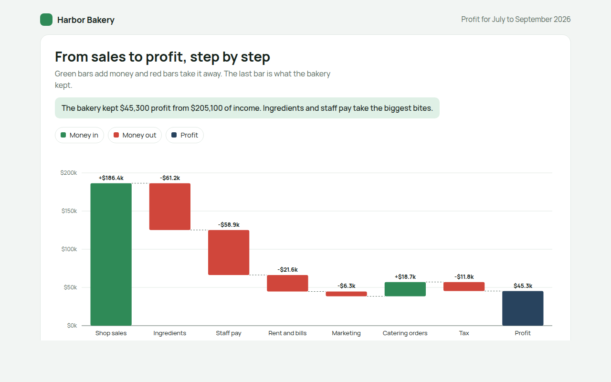

# Waterfall Chart in HTML, CSS and JavaScript (Free)



**Live demo:** https://mmrahmanbappi.github.io/70-free-data-charts/07-dashboard-widgets/066-waterfall-chart/demo.html
**Details and code:** https://mmrahmanbappi.github.io/70-free-data-charts/07-dashboard-widgets/066-waterfall-chart/

Free waterfall chart made with HTML, CSS and vanilla JavaScript. Shows how a starting value becomes a final total through gains and losses. One file to download.

## What is a waterfall chart?

A waterfall chart shows how you get from one number to another, step by step. Each bar starts where the last one ended, going up for money in and down for money out, and the final bar shows the result.

It is the clearest way to explain a profit and loss statement to people who do not read accounts. You can see at once which costs take the biggest bites out of sales.

## At a glance

- **Best for:** Explaining how a total was built up
- **Data you need:** A list of positive and negative amounts in order
- **Skip it when:** Data over time. Use a line or bar chart.
- **Made with:** HTML, CSS and vanilla JavaScript. No library.

## When to use it

- Profit and loss for a business
- Cash flow over a month or year
- Budget changes from last year to this year
- Explaining changes in headcount or stock

## What you get

- Floating bars that start where the last one ended
- Green for money in, red for money out, dark blue for the result
- Dashed lines joining each step
- Values in thousands above every bar
- Tooltips with the running total
- Tilted labels on phones and a full data table

## How the code works

```js
const steps = [['Sales', 186400], ['Ingredients', -61200], ['Staff', -58900], ['Rent', -21600]];
const y = v => 280 - v / 200000 * 260;
let total = 0;

steps.forEach(([name, v], i) => {
  const from = total, to = total + v;
  drawRect(40 + i * 110, y(Math.max(from, to)), 80, Math.abs(y(from) - y(to)), v >= 0 ? '#2f8a57' : '#d0463b');
  drawText(80 + i * 110, 298, name, 'middle');
  total = to;
});
drawRect(40 + steps.length * 110, y(total), 80, y(0) - y(total), '#28435e');
```

## How to use

1. **Download the file.** Click Download HTML file above. You get one file called waterfall-chart.html with everything inside.
2. **Change the data.** Open the file in any code editor and find the DATA list near the bottom. Replace the names and numbers with your own.
3. **Change the colors and text.** Colors are at the top of the style tag. The title, subtitle and main point are plain HTML near the top of the body.
4. **Put it online.** Upload the file to any host, such as GitHub Pages, Netlify or your own server, or paste it into your site. There is no build step.

## License

MIT. Free for personal and commercial use.
