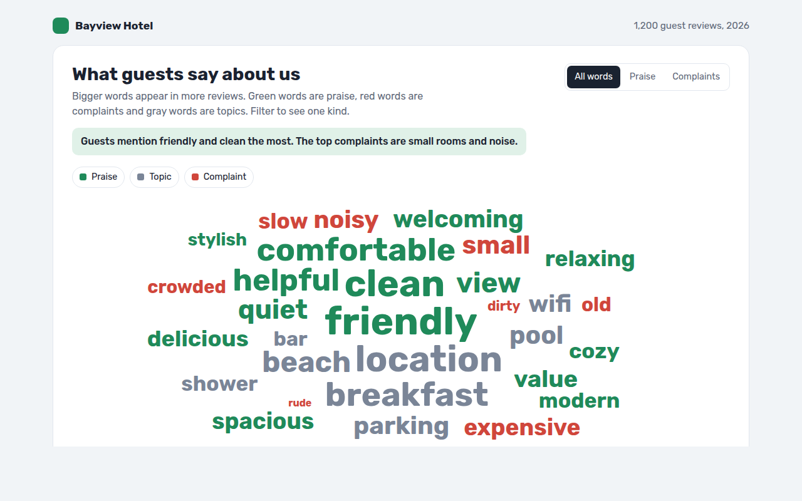

# Word Cloud in HTML, CSS and JavaScript (Free)



**Live demo:** https://mmrahmanbappi.github.io/100-free-data-charts/07-dashboard-widgets/067-word-cloud/demo.html
**Details and code:** https://mmrahmanbappi.github.io/100-free-data-charts/07-dashboard-widgets/067-word-cloud/

Free word cloud made with HTML, CSS and vanilla JavaScript. Words sized by count and colored by sentiment, with a spiral layout and filters. One file to download.

## What is a word cloud?

A word cloud shows a set of words where the size of each word matches how often it appears. The biggest words are the ones people use most.

It is a quick, friendly way to sum up a pile of text like reviews or survey answers. Coloring words by meaning, like praise and complaints, turns it from decoration into something you can act on.

## At a glance

- **Best for:** A quick feel for common words in text
- **Data you need:** A list of words with a count for each
- **Skip it when:** Exact comparisons. Use a bar chart.
- **Made with:** HTML, CSS and vanilla JavaScript. No library.

## When to use it

- Customer reviews and survey answers
- Common search terms on your site
- Topics in comments or support tickets
- Themes from workshops and interviews

## What you get

- A spiral layout that places the biggest words first without overlaps
- Word sizes measured with canvas so they fit exactly
- Green for praise, red for complaints, gray for topics
- Filters for praise and complaints only
- Every word has a tooltip and a Tab stop
- A table of every word and its count

## How the code works

```js
const words = [['friendly', 142], ['clean', 128], ['location', 118], ['small', 48], ['noisy', 41]];
const ctx = document.createElement('canvas').getContext('2d');
const placed = [], cx = 300, cy = 150;

words.forEach(([word, count]) => {
  const size = 14 + Math.sqrt(count) * 3; ctx.font = size + 'px sans-serif';
  const w = ctx.measureText(word).width, h = size;
  for (let t = 0; t < 2000; t++) {
    const x = cx + t * 0.9 * Math.cos(t * 0.35) - w / 2, y = cy + t * 0.6 * Math.sin(t * 0.35);
    if (placed.some(p => x < p.x + p.w && x + w > p.x && y - h < p.y && y > p.y - p.h)) continue;
    placed.push({ x, y, w, h });
    make('text', { x, y, 'font-size': size }).textContent = word;
    break;
  }
});
```

## How to use

1. **Download the file.** Click Download HTML file above. You get one file called word-cloud.html with everything inside.
2. **Change the data.** Open the file in any code editor and find the DATA list near the bottom. Replace the names and numbers with your own.
3. **Change the colors and text.** Colors are at the top of the style tag. The title, subtitle and main point are plain HTML near the top of the body.
4. **Put it online.** Upload the file to any host, such as GitHub Pages, Netlify or your own server, or paste it into your site. There is no build step.

## License

MIT. Free for personal and commercial use.
