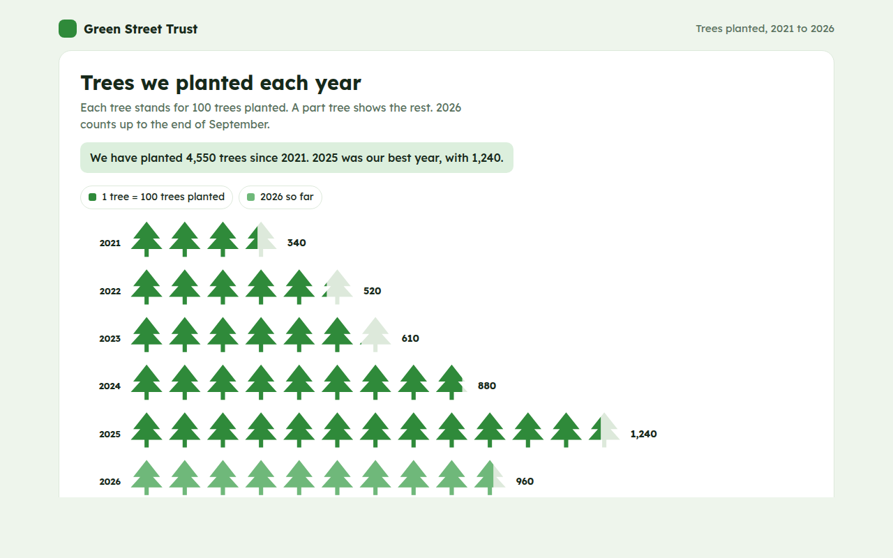

# Pictogram Chart in HTML, CSS and JavaScript (Free)



**Live demo:** https://mmrahmanbappi.github.io/70-free-data-charts/07-dashboard-widgets/068-pictogram-chart/demo.html
**Details and code:** https://mmrahmanbappi.github.io/70-free-data-charts/07-dashboard-widgets/068-pictogram-chart/

Free pictogram chart made with HTML, CSS and vanilla JavaScript. Icons stand for amounts, with part icons for the remainder. One file to download.

## What is a pictogram chart?

A pictogram chart uses rows of small icons to show amounts. Each icon stands for a fixed number, like 100 trees, and a part icon shows what is left over.

Icons make numbers feel real and memorable, which is why pictograms are popular in reports, infographics and charity updates. Counting trees is more engaging than reading a bar.

## At a glance

- **Best for:** Friendly counts for reports and infographics
- **Data you need:** A number for each group and a value per icon
- **Skip it when:** Very large ranges or precise comparisons.
- **Made with:** HTML, CSS and vanilla JavaScript. No library.

## When to use it

- Charity and impact reports
- People, homes or items counted by year
- School and community newsletters
- Infographics for social media

## What you get

- Tree icons drawn as a single SVG path, no images
- Part icons clipped to show the exact remainder
- Faint outlines behind each icon so part trees read clearly
- A lighter color for this year so far
- Icons appear one by one on load
- Totals beside every row and in the data table

## How the code works

```js
const years = [['2021', 340], ['2022', 520], ['2023', 610]];
const per = 100, size = 34;
const tree = (x, y, s) => 'M' + (x + s / 2) + ',' + y + 'L' + (x + s) + ',' + (y + s * 0.8) + 'H' + (x + s * 0.6) + 'V' + (y + s) + 'H' + (x + s * 0.4) + 'V' + (y + s * 0.8) + 'H' + x + 'Z';

years.forEach(([year, count], row) => {
  const y = 20 + row * 50;
  drawText(50, y + 24, year, 'end');
  for (let i = 0; i < count / per; i++) {
    const part = Math.min(1, count / per - i);
    make('path', { d: tree(60 + i * size, y, size - 4), fill: '#2f8a3a', 'fill-opacity': part < 1 ? 0.4 : 1 });
  }
});
```

## How to use

1. **Download the file.** Click Download HTML file above. You get one file called pictogram-chart.html with everything inside.
2. **Change the data.** Open the file in any code editor and find the DATA list near the bottom. Replace the names and numbers with your own.
3. **Change the colors and text.** Colors are at the top of the style tag. The title, subtitle and main point are plain HTML near the top of the body.
4. **Put it online.** Upload the file to any host, such as GitHub Pages, Netlify or your own server, or paste it into your site. There is no build step.

## License

MIT. Free for personal and commercial use.
