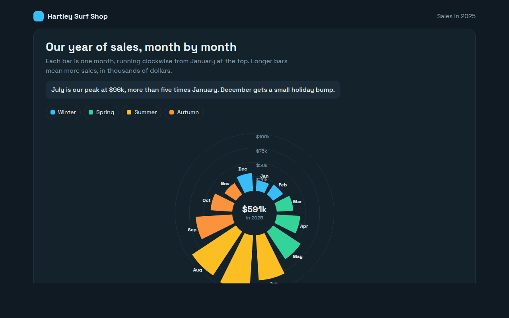

# Radial Bar Chart in HTML, CSS and JavaScript (Free)



**Live demo:** https://mmrahmanbappi.github.io/70-free-data-charts/07-dashboard-widgets/069-radial-bar-chart/demo.html
**Details and code:** https://mmrahmanbappi.github.io/70-free-data-charts/07-dashboard-widgets/069-radial-bar-chart/

Free radial bar chart made with HTML, CSS and vanilla JavaScript. Bars arranged in a circle, ideal for months or hours. One file to download.

## What is a radial bar chart?

A radial bar chart puts bars in a circle instead of a row. Each bar grows outward from the middle, and the whole set goes around like a clock.

It suits data that repeats in a cycle, like months of the year or hours of the day, because December sits right next to January again. The shape of a busy season jumps out at once.

## At a glance

- **Best for:** Values that follow a cycle, like months or hours
- **Data you need:** A value for each step of the cycle
- **Skip it when:** Exact comparisons. Outer bars look bigger than they are.
- **Made with:** HTML, CSS and vanilla JavaScript. No library.

## When to use it

- Sales or visitors by month
- Traffic or calls by hour of day
- Rainfall or temperature through the year
- Eye catching summaries for reports

## What you get

- Twelve bars drawn as SVG arc shapes around a circle
- Bars colored by season
- Rings for $25k steps with labels
- The yearly total in the middle
- Bars grow outward one after another on load
- Tooltips with each month and its share of the year

## How the code works

```js
const sales = [18, 21, 29, 41, 58, 79, 96, 92, 64, 38, 24, 31];
const cx = 200, cy = 180, inner = 40;
const pt = (r, a) => (cx + r * Math.sin(a)) + ',' + (cy - r * Math.cos(a));
const step = Math.PI * 2 / 12;

sales.forEach((v, i) => {
  const a0 = i * step + 0.03, a1 = (i + 1) * step - 0.03, outer = inner + v * 1.3;
  make('path', { fill: '#fbbf24', d: 'M' + pt(outer, a0) + 'A' + outer + ',' + outer + ' 0 0 1 ' + pt(outer, a1) + 'L' + pt(inner, a1) + 'A' + inner + ',' + inner + ' 0 0 0 ' + pt(inner, a0) + 'Z' });
});
```

## How to use

1. **Download the file.** Click Download HTML file above. You get one file called radial-bar-chart.html with everything inside.
2. **Change the data.** Open the file in any code editor and find the DATA list near the bottom. Replace the names and numbers with your own.
3. **Change the colors and text.** Colors are at the top of the style tag. The title, subtitle and main point are plain HTML near the top of the body.
4. **Put it online.** Upload the file to any host, such as GitHub Pages, Netlify or your own server, or paste it into your site. There is no build step.

## License

MIT. Free for personal and commercial use.
