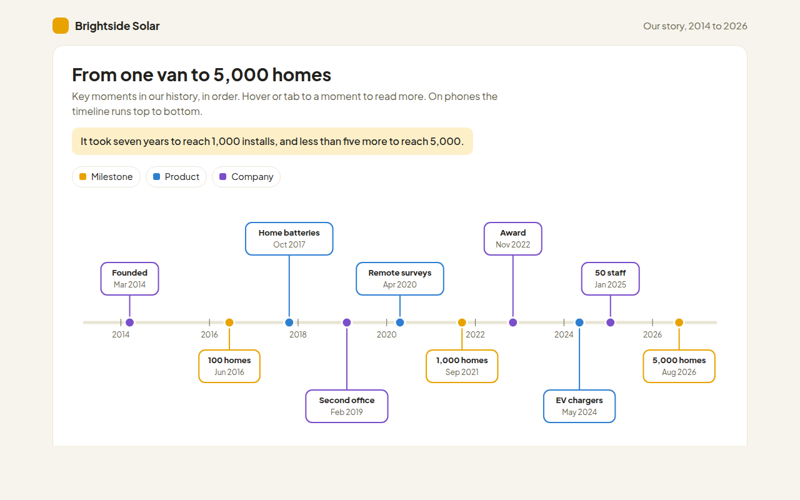

# Timeline in HTML, CSS and JavaScript (Free)



**Live demo:** https://mmrahmanbappi.github.io/100-free-data-charts/07-dashboard-widgets/070-timeline/demo.html
**Details and code:** https://mmrahmanbappi.github.io/100-free-data-charts/07-dashboard-widgets/070-timeline/

Free timeline made with HTML, CSS and vanilla JavaScript. Events in order with categories, details on hover and a phone friendly layout. One file to download.

## What is a timeline?

A timeline shows events in the order they happened, placed along a line by date. Spacing the events by real time shows fast and slow periods, not just the order.

Timelines are perfect for company histories, project stories and personal milestones. Color by category helps readers pick out the kinds of events that matter to them.

## At a glance

- **Best for:** Events in date order
- **Data you need:** A date, a title and a short note for each event
- **Skip it when:** Lots of events on the same day. Group them.
- **Made with:** HTML, CSS and vanilla JavaScript. No library.

## When to use it

- Company history and about pages
- Project milestones and launches
- Product release history
- Personal, school or family stories

## What you get

- Events placed by real date along a line
- Cards above and below the line so they never overlap
- Colors for milestones, products and company news
- Tooltips with the full story of each event
- Turns into a top to bottom list on phones
- A table of every event with its details

## How the code works

```js
const events = [[2014.2, 'Founded'], [2016.5, '100 homes'], [2021.7, '1,000 homes'], [2026.6, '5,000 homes']];
const x = year => 40 + (year - 2014) / 13 * 520, mid = 150;

drawLine(20, mid, 580, mid, '#e9e5d6', 5);
events.forEach(([year, title], i) => {
  const up = i % 2 === 0, y = up ? mid - 60 : mid + 60;
  drawLine(x(year), mid, x(year), y, '#e8a300', 2);
  drawCircle(x(year), mid, 7, '#e8a300');
  drawText(x(year), y + (up ? -6 : 16), title, 'middle');
});
```

## How to use

1. **Download the file.** Click Download HTML file above. You get one file called timeline.html with everything inside.
2. **Change the data.** Open the file in any code editor and find the DATA list near the bottom. Replace the names and numbers with your own.
3. **Change the colors and text.** Colors are at the top of the style tag. The title, subtitle and main point are plain HTML near the top of the body.
4. **Put it online.** Upload the file to any host, such as GitHub Pages, Netlify or your own server, or paste it into your site. There is no build step.

## License

MIT. Free for personal and commercial use.
