# 100 Free Data Charts

Charts you can put on any website, built with plain HTML, CSS and vanilla JavaScript. No chart library, no framework, no build step. Each chart has a live demo, a guide on when to use it and a single HTML file you can download.

**Live gallery:** https://mmrahmanbappi.github.io/100-free-data-charts/

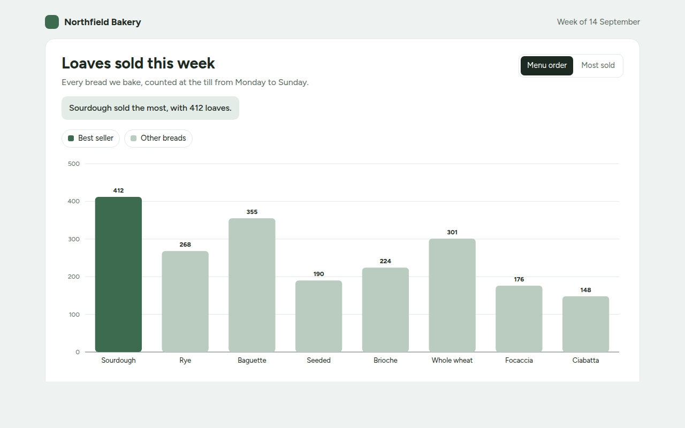

## All charts

| # | Chart | Example | Live | Preview |
|---|---|---|---|---|
| 001 | [Bar Chart](https://mmrahmanbappi.github.io/100-free-data-charts/01-comparison/001-bar-chart/) | Weekly bread sales at a bakery | [Demo](https://mmrahmanbappi.github.io/100-free-data-charts/01-comparison/001-bar-chart/demo.html) |  |
| 002 | [Grouped Bar Chart](https://mmrahmanbappi.github.io/100-free-data-charts/01-comparison/002-grouped-bar-chart/) | Cinema ticket sales for three locations per quarter | [Demo](https://mmrahmanbappi.github.io/100-free-data-charts/01-comparison/002-grouped-bar-chart/demo.html) | 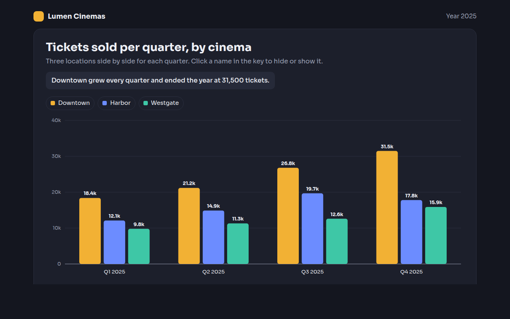 |
| 003 | [Stacked Bar Chart](https://mmrahmanbappi.github.io/100-free-data-charts/01-comparison/003-stacked-bar-chart/) | Website visits by source for an outdoor shop | [Demo](https://mmrahmanbappi.github.io/100-free-data-charts/01-comparison/003-stacked-bar-chart/demo.html) | 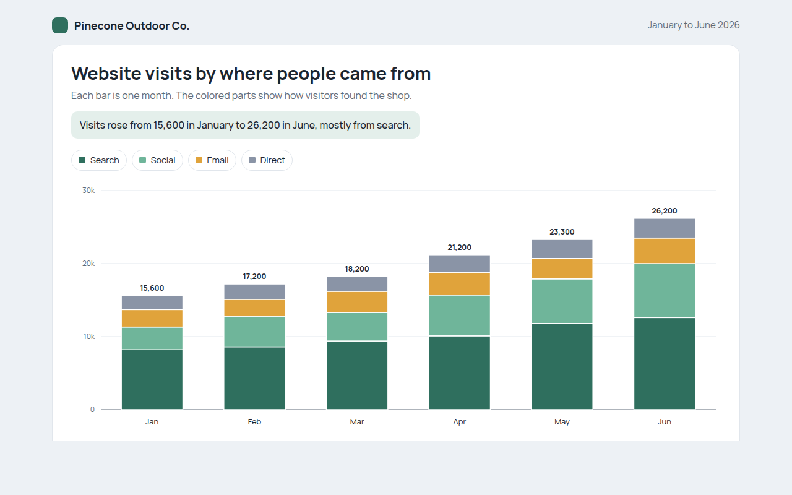 |
| 004 | [100% Stacked Bar Chart](https://mmrahmanbappi.github.io/100-free-data-charts/01-comparison/004-100-percent-stacked-bar/) | Customer survey results for five grocery stores | [Demo](https://mmrahmanbappi.github.io/100-free-data-charts/01-comparison/004-100-percent-stacked-bar/demo.html) | 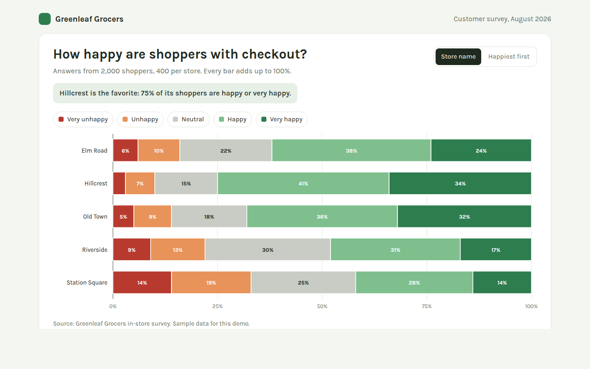 |
| 005 | [Horizontal Bar Chart](https://mmrahmanbappi.github.io/100-free-data-charts/01-comparison/005-horizontal-bar-chart/) | The most borrowed library books of the year | [Demo](https://mmrahmanbappi.github.io/100-free-data-charts/01-comparison/005-horizontal-bar-chart/demo.html) | 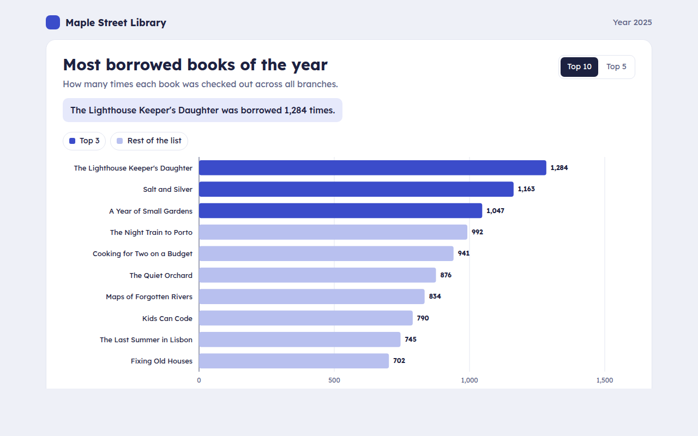 |
| 006 | [Lollipop Chart](https://mmrahmanbappi.github.io/100-free-data-charts/01-comparison/006-lollipop-chart/) | Average delivery time by city with a 24 hour target | [Demo](https://mmrahmanbappi.github.io/100-free-data-charts/01-comparison/006-lollipop-chart/demo.html) | 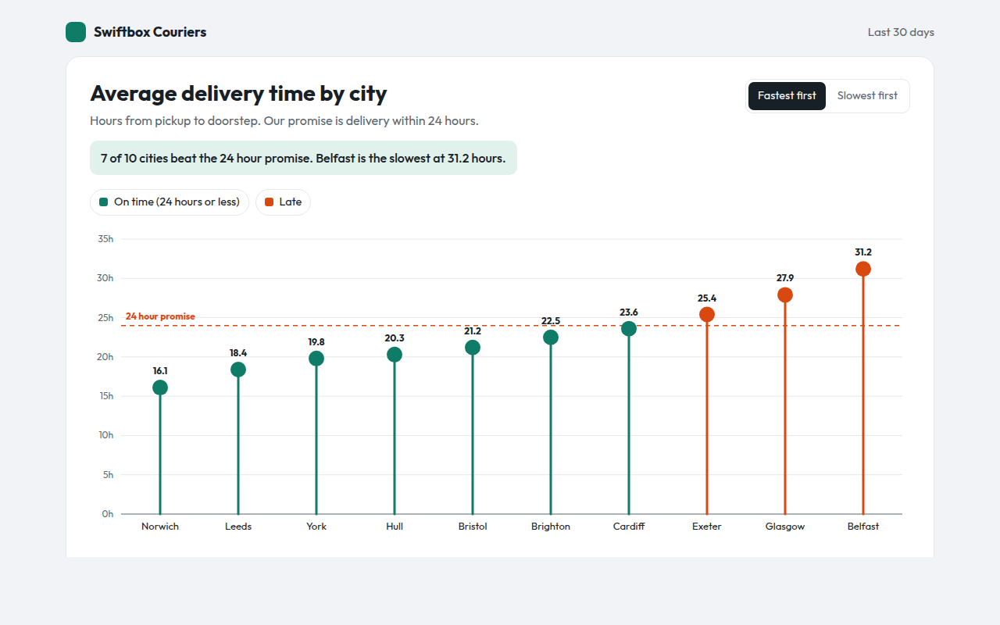 |
| 007 | [Dot Plot](https://mmrahmanbappi.github.io/100-free-data-charts/01-comparison/007-dot-plot/) | Small, medium and large latte prices in eight cities | [Demo](https://mmrahmanbappi.github.io/100-free-data-charts/01-comparison/007-dot-plot/demo.html) | 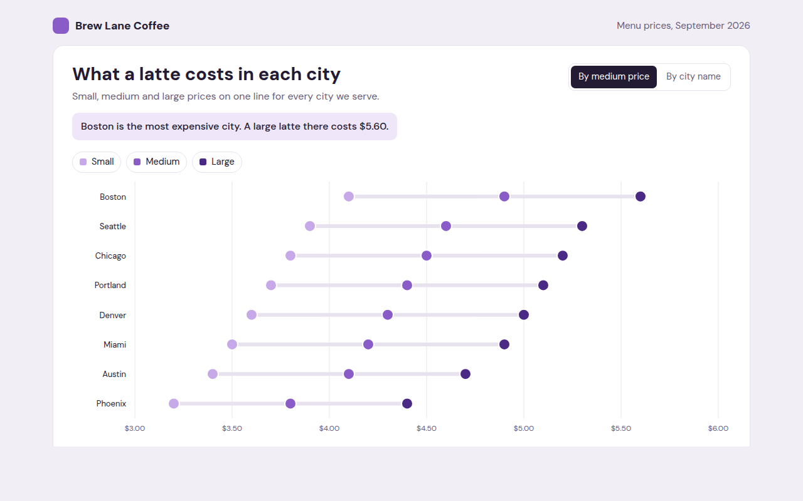 |
| 008 | [Dumbbell Chart](https://mmrahmanbappi.github.io/100-free-data-charts/01-comparison/008-dumbbell-chart/) | Commute times before and after a new tram line | [Demo](https://mmrahmanbappi.github.io/100-free-data-charts/01-comparison/008-dumbbell-chart/demo.html) | 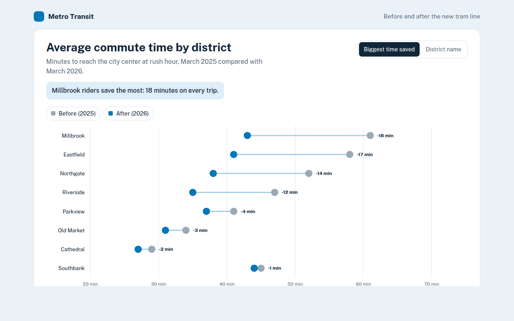 |
| 009 | [Bullet Chart](https://mmrahmanbappi.github.io/100-free-data-charts/01-comparison/009-bullet-chart/) | Solar panel installs against target for six regions | [Demo](https://mmrahmanbappi.github.io/100-free-data-charts/01-comparison/009-bullet-chart/demo.html) |  |
| 010 | [Diverging Bar Chart](https://mmrahmanbappi.github.io/100-free-data-charts/01-comparison/010-diverging-bar-chart/) | Visitor gains and losses for ten city parks | [Demo](https://mmrahmanbappi.github.io/100-free-data-charts/01-comparison/010-diverging-bar-chart/demo.html) | 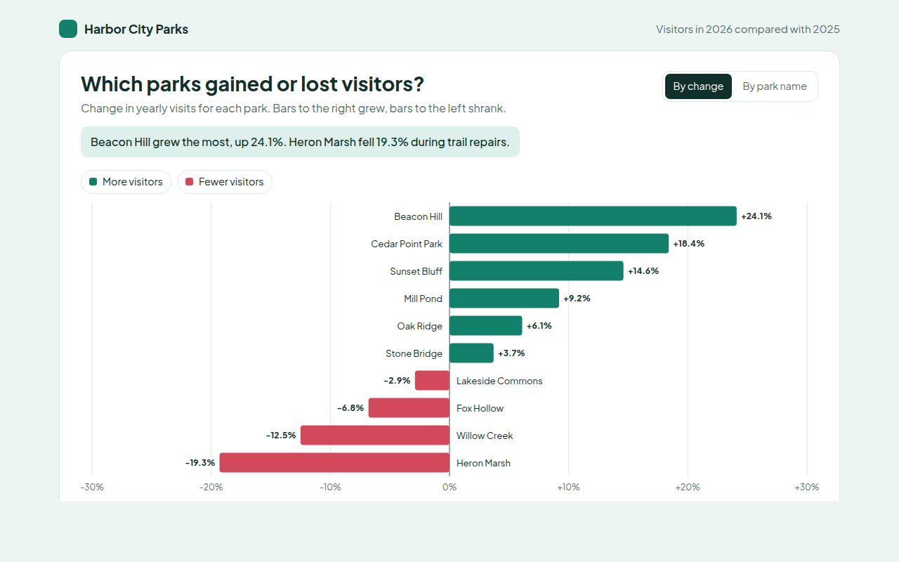 |
| 011 | [Line Chart](https://mmrahmanbappi.github.io/100-free-data-charts/02-trends-over-time/011-line-chart/) | New members each month for a yoga studio app | [Demo](https://mmrahmanbappi.github.io/100-free-data-charts/02-trends-over-time/011-line-chart/demo.html) | 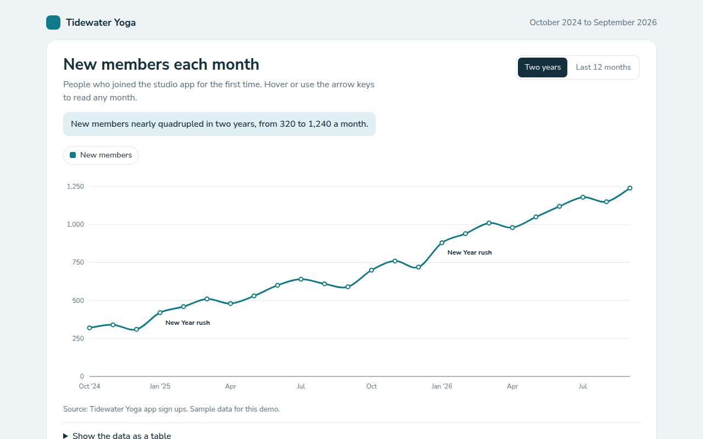 |
| 012 | [Multi Line Chart](https://mmrahmanbappi.github.io/100-free-data-charts/02-trends-over-time/012-multi-line-chart/) | Average home prices in three neighborhoods over ten years | [Demo](https://mmrahmanbappi.github.io/100-free-data-charts/02-trends-over-time/012-multi-line-chart/demo.html) |  |
| 013 | [Area Chart](https://mmrahmanbappi.github.io/100-free-data-charts/02-trends-over-time/013-area-chart/) | Solar power made each day by a family home | [Demo](https://mmrahmanbappi.github.io/100-free-data-charts/02-trends-over-time/013-area-chart/demo.html) |  |
| 014 | [Stacked Area Chart](https://mmrahmanbappi.github.io/100-free-data-charts/02-trends-over-time/014-stacked-area-chart/) | Hours watched each month on a streaming app, by device | [Demo](https://mmrahmanbappi.github.io/100-free-data-charts/02-trends-over-time/014-stacked-area-chart/demo.html) | 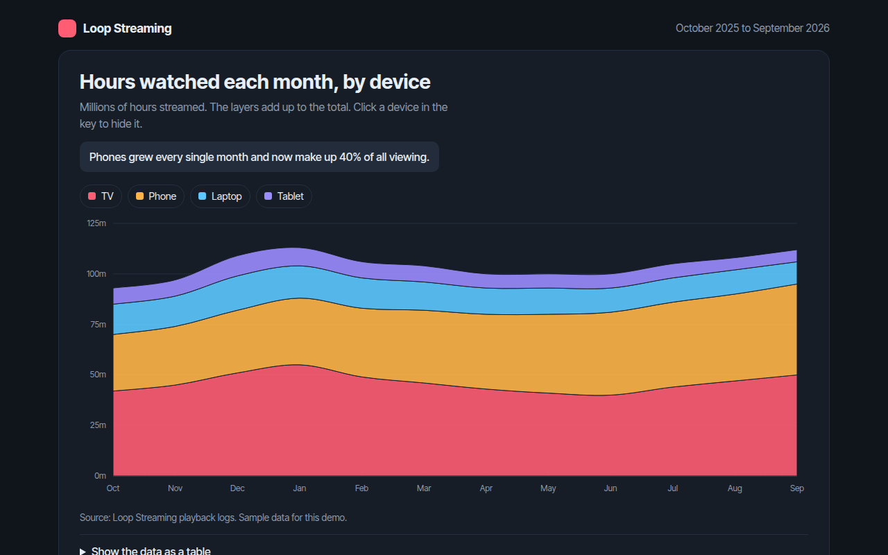 |
| 015 | [Streamgraph](https://mmrahmanbappi.github.io/100-free-data-charts/02-trends-over-time/015-streamgraph/) | Weekly listening hours by genre on a radio app | [Demo](https://mmrahmanbappi.github.io/100-free-data-charts/02-trends-over-time/015-streamgraph/demo.html) |  |
| 016 | [Step Line Chart](https://mmrahmanbappi.github.io/100-free-data-charts/02-trends-over-time/016-step-line-chart/) | The interest rate on a savings account from 2021 to 2026 | [Demo](https://mmrahmanbappi.github.io/100-free-data-charts/02-trends-over-time/016-step-line-chart/demo.html) | 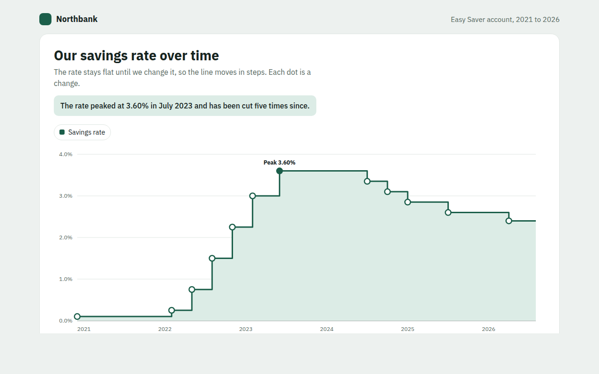 |
| 017 | [Sparkline](https://mmrahmanbappi.github.io/100-free-data-charts/02-trends-over-time/017-sparkline/) | Daily sales for six products in a shop dashboard | [Demo](https://mmrahmanbappi.github.io/100-free-data-charts/02-trends-over-time/017-sparkline/demo.html) | 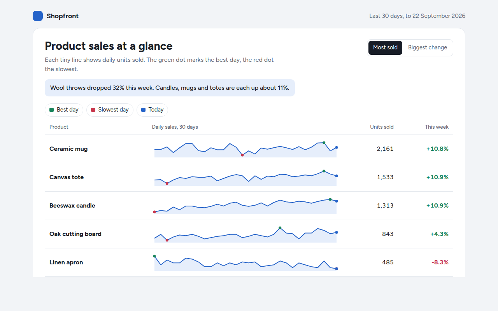 |
| 018 | [Candlestick Chart](https://mmrahmanbappi.github.io/100-free-data-charts/02-trends-over-time/018-candlestick-chart/) | Daily share prices and volume for a made up robotics company | [Demo](https://mmrahmanbappi.github.io/100-free-data-charts/02-trends-over-time/018-candlestick-chart/demo.html) |  |
| 019 | [Slope Chart](https://mmrahmanbappi.github.io/100-free-data-charts/02-trends-over-time/019-slope-chart/) | Guest ratings for eight hotels in 2025 and 2026 | [Demo](https://mmrahmanbappi.github.io/100-free-data-charts/02-trends-over-time/019-slope-chart/demo.html) | 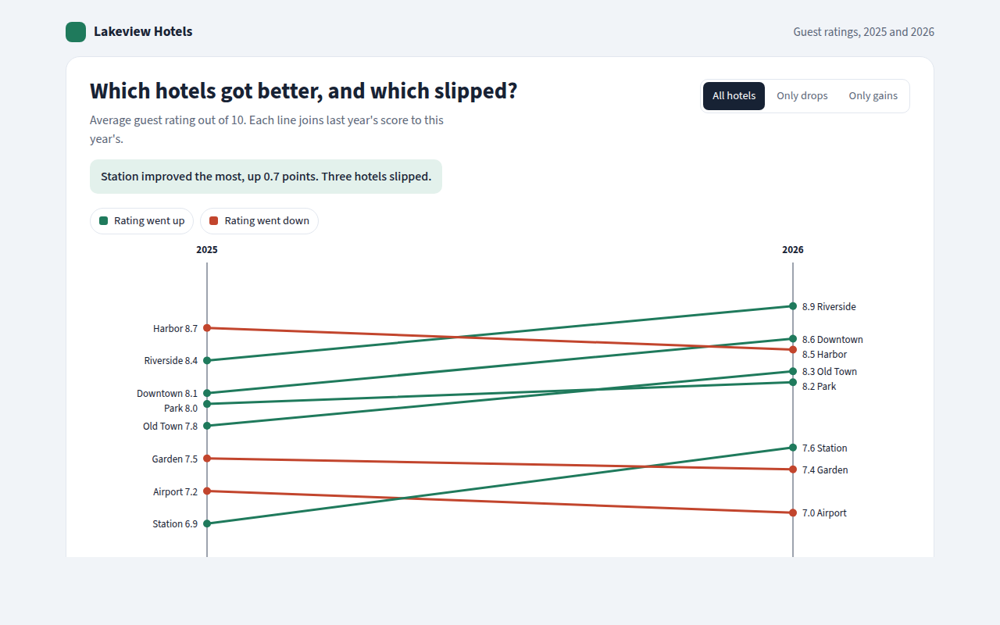 |
| 020 | [Horizon Chart](https://mmrahmanbappi.github.io/100-free-data-charts/02-trends-over-time/020-horizon-chart/) | Daily temperature above or below normal for six cities over a year | [Demo](https://mmrahmanbappi.github.io/100-free-data-charts/02-trends-over-time/020-horizon-chart/demo.html) |  |
| 021 | [Pie Chart](https://mmrahmanbappi.github.io/100-free-data-charts/03-part-to-whole/021-pie-chart/) | How customers paid at a cafe | [Demo](https://mmrahmanbappi.github.io/100-free-data-charts/03-part-to-whole/021-pie-chart/demo.html) | 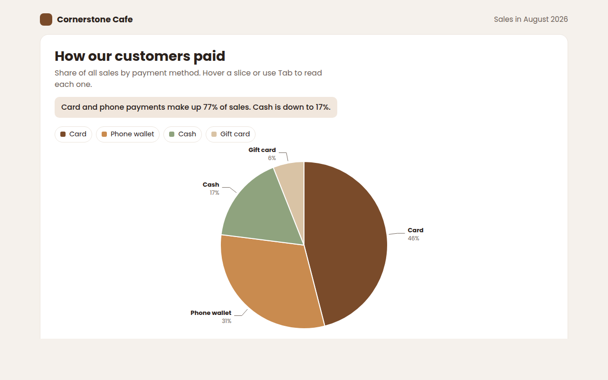 |
| 022 | [Donut Chart](https://mmrahmanbappi.github.io/100-free-data-charts/03-part-to-whole/022-donut-chart/) | Workouts logged by members of a fitness app | [Demo](https://mmrahmanbappi.github.io/100-free-data-charts/03-part-to-whole/022-donut-chart/demo.html) |  |
| 023 | [Semi Donut Chart](https://mmrahmanbappi.github.io/100-free-data-charts/03-part-to-whole/023-semi-donut-chart/) | A fundraising appeal and the money still needed | [Demo](https://mmrahmanbappi.github.io/100-free-data-charts/03-part-to-whole/023-semi-donut-chart/demo.html) |  |
| 024 | [Treemap](https://mmrahmanbappi.github.io/100-free-data-charts/03-part-to-whole/024-treemap/) | Bookshop sales by section and genre | [Demo](https://mmrahmanbappi.github.io/100-free-data-charts/03-part-to-whole/024-treemap/demo.html) |  |
| 025 | [Sunburst Chart](https://mmrahmanbappi.github.io/100-free-data-charts/03-part-to-whole/025-sunburst-chart/) | Where a city sends its household waste | [Demo](https://mmrahmanbappi.github.io/100-free-data-charts/03-part-to-whole/025-sunburst-chart/demo.html) |  |
| 026 | [Waffle Chart](https://mmrahmanbappi.github.io/100-free-data-charts/03-part-to-whole/026-waffle-chart/) | How 100 new customers found a furniture shop | [Demo](https://mmrahmanbappi.github.io/100-free-data-charts/03-part-to-whole/026-waffle-chart/demo.html) | 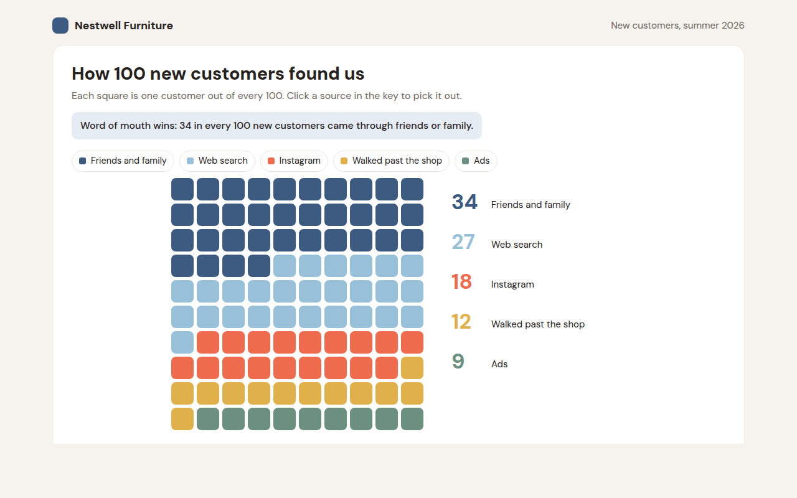 |
| 027 | [Marimekko Chart](https://mmrahmanbappi.github.io/100-free-data-charts/03-part-to-whole/027-marimekko-chart/) | E-bike market share by region and brand | [Demo](https://mmrahmanbappi.github.io/100-free-data-charts/03-part-to-whole/027-marimekko-chart/demo.html) |  |
| 028 | [Funnel Chart](https://mmrahmanbappi.github.io/100-free-data-charts/03-part-to-whole/028-funnel-chart/) | Shoppers moving from first visit to purchase in an online shop | [Demo](https://mmrahmanbappi.github.io/100-free-data-charts/03-part-to-whole/028-funnel-chart/demo.html) | 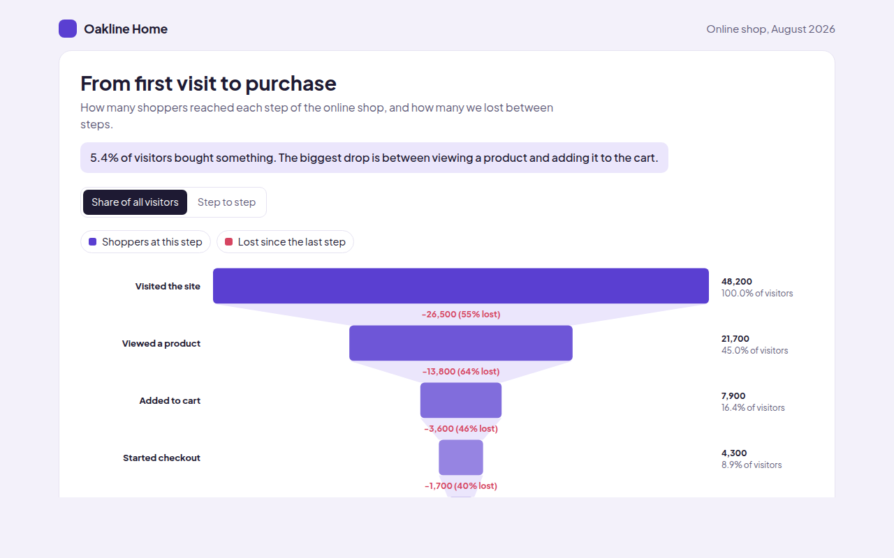 |
| 029 | [Icicle Chart](https://mmrahmanbappi.github.io/100-free-data-charts/03-part-to-whole/029-icicle-chart/) | What is filling up a laptop drive | [Demo](https://mmrahmanbappi.github.io/100-free-data-charts/03-part-to-whole/029-icicle-chart/demo.html) | 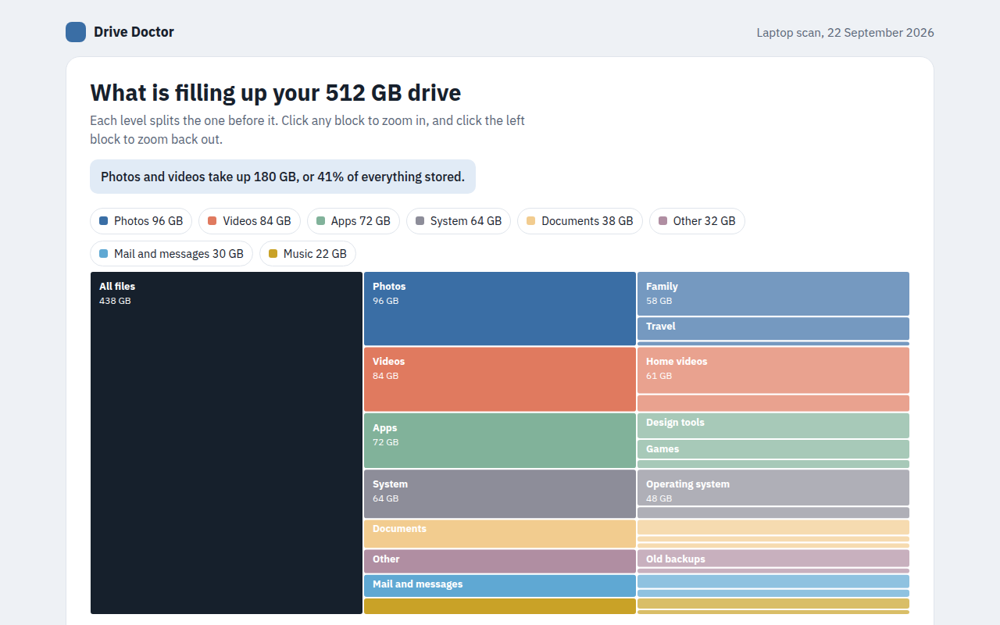 |
| 030 | [Circle Packing Chart](https://mmrahmanbappi.github.io/100-free-data-charts/03-part-to-whole/030-circle-packing/) | Staff at a food company grouped by department and team | [Demo](https://mmrahmanbappi.github.io/100-free-data-charts/03-part-to-whole/030-circle-packing/demo.html) | 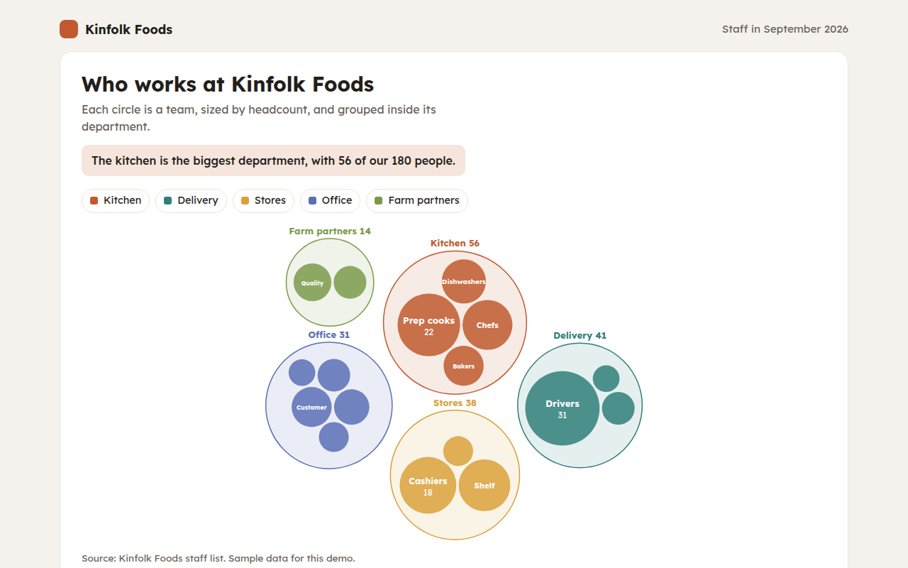 |
| 031 | [Histogram](https://mmrahmanbappi.github.io/100-free-data-charts/04-distribution/031-histogram/) | Delivery times for 600 pizza orders | [Demo](https://mmrahmanbappi.github.io/100-free-data-charts/04-distribution/031-histogram/demo.html) | 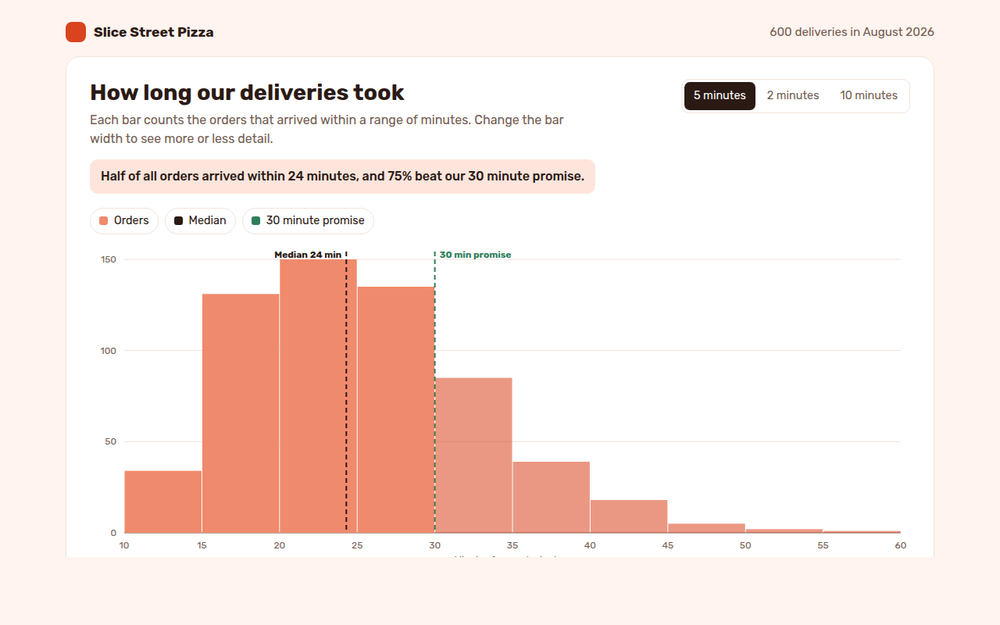 |
| 032 | [Box Plot](https://mmrahmanbappi.github.io/100-free-data-charts/04-distribution/032-box-plot/) | Monthly rent for flats in six neighborhoods | [Demo](https://mmrahmanbappi.github.io/100-free-data-charts/04-distribution/032-box-plot/demo.html) | 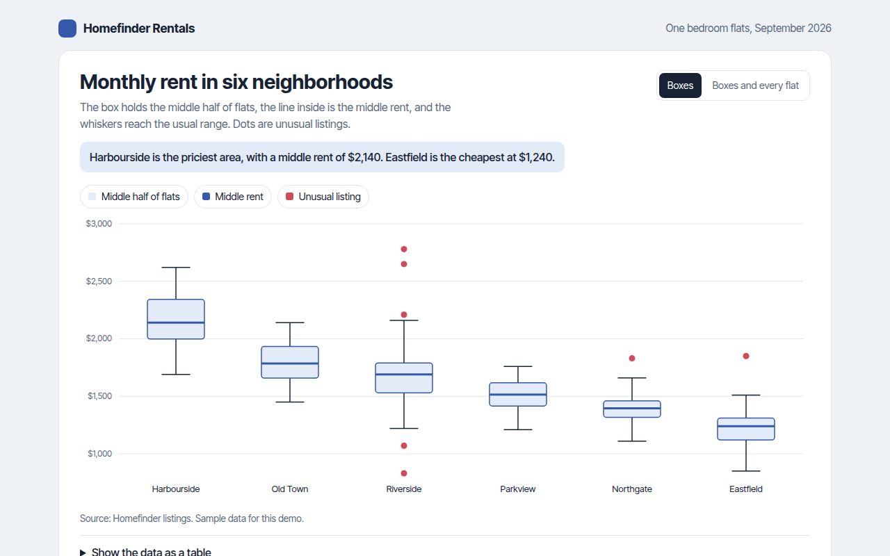 |
| 033 | [Violin Plot](https://mmrahmanbappi.github.io/100-free-data-charts/04-distribution/033-violin-plot/) | Coffee order waits at four cafes | [Demo](https://mmrahmanbappi.github.io/100-free-data-charts/04-distribution/033-violin-plot/demo.html) | 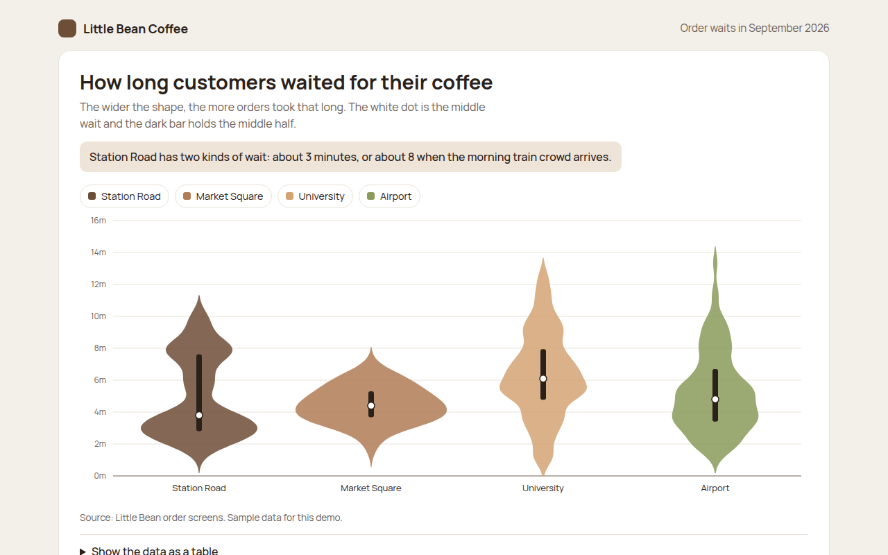 |
| 034 | [Density Plot](https://mmrahmanbappi.github.io/100-free-data-charts/04-distribution/034-density-plot/) | Sunflower heights with and without plant feed | [Demo](https://mmrahmanbappi.github.io/100-free-data-charts/04-distribution/034-density-plot/demo.html) |  |
| 035 | [Ridgeline Plot](https://mmrahmanbappi.github.io/100-free-data-charts/04-distribution/035-ridgeline-plot/) | Daily high temperatures for each month of the year | [Demo](https://mmrahmanbappi.github.io/100-free-data-charts/04-distribution/035-ridgeline-plot/demo.html) | 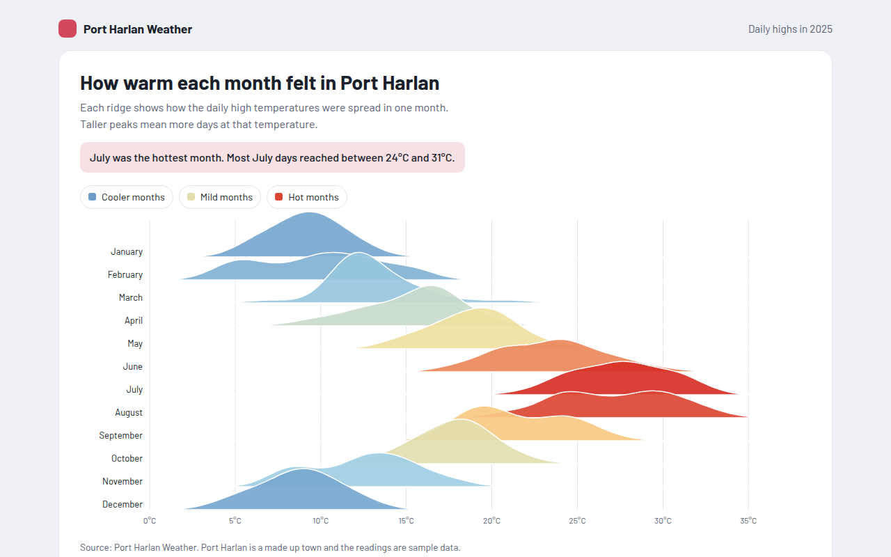 |
| 036 | [Beeswarm Plot](https://mmrahmanbappi.github.io/100-free-data-charts/04-distribution/036-beeswarm-plot/) | Finish times for 300 marathon runners | [Demo](https://mmrahmanbappi.github.io/100-free-data-charts/04-distribution/036-beeswarm-plot/demo.html) |  |
| 037 | [Strip Plot](https://mmrahmanbappi.github.io/100-free-data-charts/04-distribution/037-strip-plot/) | Train delays on five lines over 60 weekdays | [Demo](https://mmrahmanbappi.github.io/100-free-data-charts/04-distribution/037-strip-plot/demo.html) |  |
| 038 | [Population Pyramid](https://mmrahmanbappi.github.io/100-free-data-charts/04-distribution/038-population-pyramid/) | The age of a town in 2006 and 2026 | [Demo](https://mmrahmanbappi.github.io/100-free-data-charts/04-distribution/038-population-pyramid/demo.html) |  |
| 039 | [Error Bar Chart](https://mmrahmanbappi.github.io/100-free-data-charts/04-distribution/039-error-bars/) | Battery life test results for five phones | [Demo](https://mmrahmanbappi.github.io/100-free-data-charts/04-distribution/039-error-bars/demo.html) |  |
| 040 | [Cumulative Distribution Chart](https://mmrahmanbappi.github.io/100-free-data-charts/04-distribution/040-ecdf-chart/) | Page load times for three versions of a website | [Demo](https://mmrahmanbappi.github.io/100-free-data-charts/04-distribution/040-ecdf-chart/demo.html) | 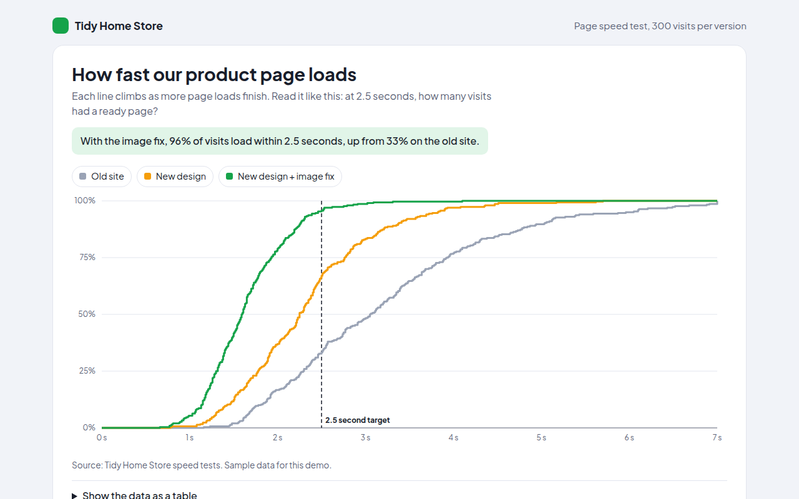 |
| 041 | [Scatter Plot](https://mmrahmanbappi.github.io/100-free-data-charts/05-relationships/041-scatter-plot/) | Used car prices against mileage | [Demo](https://mmrahmanbappi.github.io/100-free-data-charts/05-relationships/041-scatter-plot/demo.html) |  |
| 042 | [Bubble Chart](https://mmrahmanbappi.github.io/100-free-data-charts/05-relationships/042-bubble-chart/) | Ad campaigns compared on cost, conversion and budget | [Demo](https://mmrahmanbappi.github.io/100-free-data-charts/05-relationships/042-bubble-chart/demo.html) |  |
| 043 | [Heatmap](https://mmrahmanbappi.github.io/100-free-data-charts/05-relationships/043-heatmap/) | Gym check-ins by day and hour | [Demo](https://mmrahmanbappi.github.io/100-free-data-charts/05-relationships/043-heatmap/demo.html) | 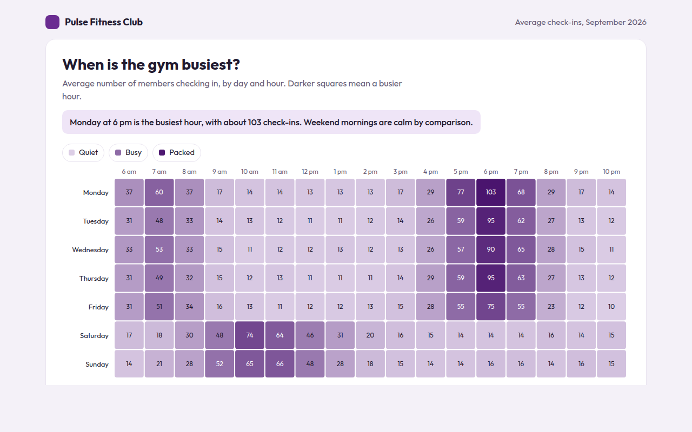 |
| 044 | [Correlation Matrix](https://mmrahmanbappi.github.io/100-free-data-charts/05-relationships/044-correlation-matrix/) | What drives daily sales at a cafe | [Demo](https://mmrahmanbappi.github.io/100-free-data-charts/05-relationships/044-correlation-matrix/demo.html) | 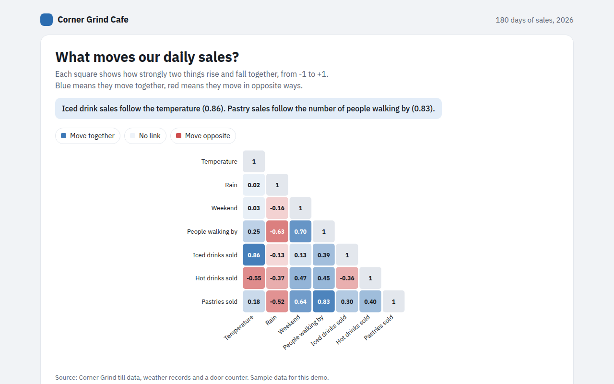 |
| 045 | [Connected Scatter Plot](https://mmrahmanbappi.github.io/100-free-data-charts/05-relationships/045-connected-scatter-plot/) | Monthly bike share trips against average temperature | [Demo](https://mmrahmanbappi.github.io/100-free-data-charts/05-relationships/045-connected-scatter-plot/demo.html) |  |
| 046 | [Hexbin Plot](https://mmrahmanbappi.github.io/100-free-data-charts/05-relationships/046-hexbin-plot/) | Distance and fare for 3,000 taxi rides | [Demo](https://mmrahmanbappi.github.io/100-free-data-charts/05-relationships/046-hexbin-plot/demo.html) | 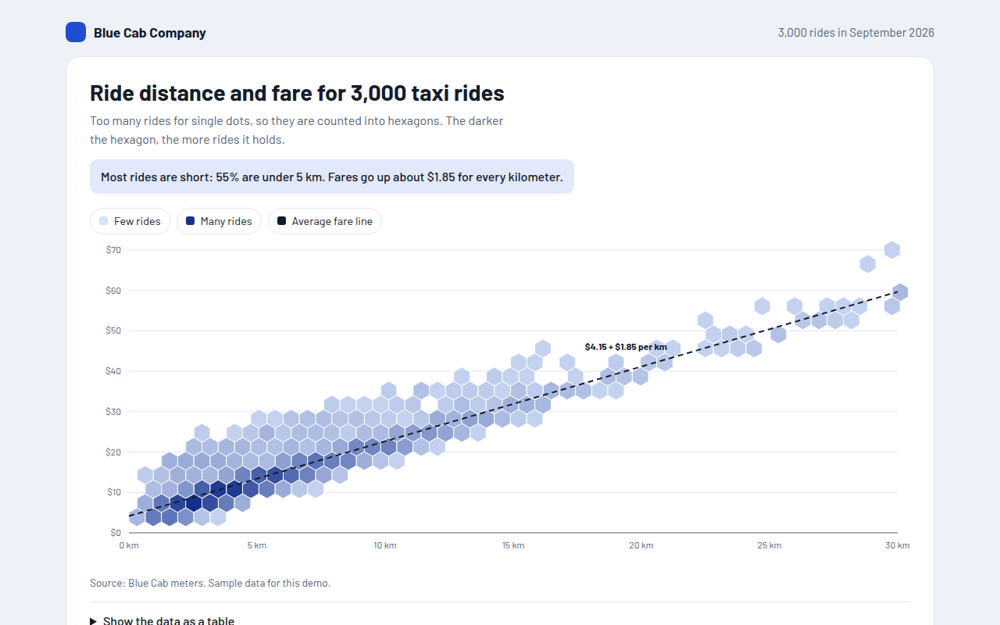 |
| 047 | [Contour Plot](https://mmrahmanbappi.github.io/100-free-data-charts/05-relationships/047-contour-plot/) | A hill walk with height lines and a trail | [Demo](https://mmrahmanbappi.github.io/100-free-data-charts/05-relationships/047-contour-plot/demo.html) | 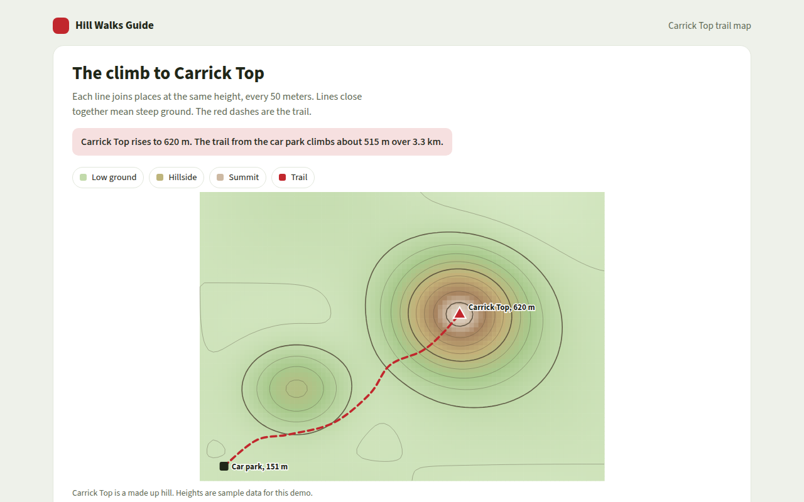 |
| 048 | [Radar Chart](https://mmrahmanbappi.github.io/100-free-data-charts/05-relationships/048-radar-chart/) | Three laptops scored on six features | [Demo](https://mmrahmanbappi.github.io/100-free-data-charts/05-relationships/048-radar-chart/demo.html) |  |
| 049 | [Parallel Coordinates Chart](https://mmrahmanbappi.github.io/100-free-data-charts/05-relationships/049-parallel-coordinates/) | Rental flats compared on six measures | [Demo](https://mmrahmanbappi.github.io/100-free-data-charts/05-relationships/049-parallel-coordinates/demo.html) |  |
| 050 | [Quadrant Chart](https://mmrahmanbappi.github.io/100-free-data-charts/05-relationships/050-quadrant-chart/) | App features sorted by effort and impact | [Demo](https://mmrahmanbappi.github.io/100-free-data-charts/05-relationships/050-quadrant-chart/demo.html) |  |

## Categories

- 1. Comparison Charts (live)
- 2. Trends Over Time (live)
- 3. Part to Whole (live)
- 4. Distribution (live)
- 5. Relationships (live)
- 6. Flow and Network (coming soon)
- 7. Dashboard Widgets (coming soon)
- 8. Maps and Globes (coming soon)
- 9. 3D Charts (coming soon)
- 10. 3D Science and Space (coming soon)

## How to use a chart

1. Open the chart folder and download `demo.html`.
2. Replace the numbers in the `DATA` list with your own.
3. Change the colors at the top of the style tag.
4. Upload it anywhere: GitHub Pages, Netlify, Vercel or your own server.

## Why no library?

Libraries are great, but for one chart on one page they add weight you do not need. These charts use SVG, which every browser already understands, and a few dozen lines of JavaScript. You can read every line and change anything.

## Build the pages yourself

The pages, READMEs and sitemap are generated from `scripts/charts.js`.

```
node scripts/build.js        # pages, READMEs, sitemap
node scripts/screenshot.js   # preview images (needs Chrome)
```

## License

MIT. Use these charts in personal and commercial projects. A star on the repo helps more people find them.
